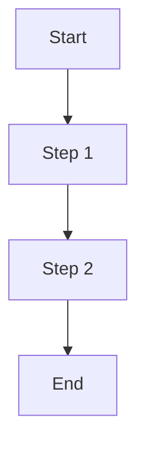

# Business Analysis Skill

Comprehensive business analysis for feature lifecycle management, requirements engineering, and product development guidance.

## Usage

```
/ba-ftr [command] [target]
```

### Commands

| Command | Description |
|---------|-------------|
| `new <feature-name>` | Create new feature specification with FTR |
| `rework <feature-name>` | Rethink, modify, or remove feature from scope |
| `maintain` | Audit and clean up BRD document |
| `ftr <feature-name>` | Generate Feature Technical Requirements |
| `scope` | Review current MVP scope and priorities |
| `impact <change>` | Analyze impact of proposed change |
| `gap` | Identify gaps between BRD and implementation |
| (no argument) | Interactive mode - ask what to do |

## Source of Truth

**Primary documents:**
- `specs/brd.md` — Business Requirements Document (canonical)
- `docs/docs/product/` — User-facing product documentation
- `docs/docs/architecture/` — Technical architecture docs

**Document hierarchy:**
1. BRD defines WHAT the system does
2. FTR bridges WHAT → HOW for specific features
3. SAD/ADRs define HOW at architecture level
4. Code implements the approved specs

## Feature Technical Requirements (FTR) Template

FTRs are stored in `specs/ftr/` directory.

**Filename:** `FTR-XXX-feature-name.md`

```markdown
# FTR-XXX: Feature Name

**Status:** Draft | Under Review | Approved | Implemented | Deprecated
**BRD Reference:** Section X.X
**Author:** [Name]
**Date:** YYYY-MM-DD
**Reviewers:** [Names]

---

## 1. Executive Summary

One paragraph describing the feature's business value and scope.

---

## 2. Business Context

### 2.1 Problem Statement
What problem does this feature solve?

### 2.2 Business Goals
- Goal 1
- Goal 2

### 2.3 Success Metrics
| Metric | Current | Target |
|--------|---------|--------|
| ... | ... | ... |

### 2.4 User Stories
As a [role], I want [capability] so that [benefit].

---

## 3. Functional Requirements

### 3.1 In Scope
- FR-XXX-001: Description
- FR-XXX-002: Description

### 3.2 Out of Scope
Explicitly list what this feature does NOT include.

### 3.3 User Flows


### 3.4 Acceptance Criteria
- [ ] AC-001: Given... When... Then...
- [ ] AC-002: Given... When... Then...

---

## 4. Non-Functional Requirements (NFR)

### 4.1 Performance
- Response time: ...
- Throughput: ...

### 4.2 Scalability
- Expected load: ...
- Growth projection: ...

### 4.3 Reliability
- Availability target: ...
- Recovery requirements: ...

### 4.4 Security
- Authentication: ...
- Authorization: ...
- Data sensitivity: ...

---

## 5. Technical Considerations

### 5.1 Affected Modules
| Module | Change Type | Complexity |
|--------|-------------|------------|
| ... | New/Modify/None | Low/Medium/High |

### 5.2 Integration Points
- External systems: ...
- Internal APIs: ...

### 5.3 Data Model Impact
- New entities: ...
- Modified entities: ...
- Migration required: Yes/No

### 5.4 Observability Requirements
- Key metrics: ...
- Log events: ...
- Alerts: ...

---

## 6. Dependencies & Risks

### 6.1 Dependencies
| ID | Dependency | Type | Status |
|----|------------|------|--------|
| DEP-001 | ... | Blocking/Informational | ... |

### 6.2 Risks
| ID | Risk | Probability | Impact | Mitigation |
|----|------|-------------|--------|------------|
| RISK-001 | ... | Low/Medium/High | ... | ... |

### 6.3 Assumptions
- ASM-001: ...

---

## 7. Implementation Guidance

### 7.1 Recommended Approach
High-level technical approach without prescribing architecture.

### 7.2 Test Strategy
- Unit tests: ...
- Integration tests: ...
- E2E tests: ...

### 7.3 Rollout Strategy
- Feature flag: Yes/No
- Phased rollout: Yes/No
- Rollback plan: ...

---

## 8. Open Questions

| ID | Question | Owner | Due Date | Resolution |
|----|----------|-------|----------|------------|
| Q-001 | ... | ... | ... | ... |

---

## 9. Approval

| Role | Name | Date | Status |
|------|------|------|--------|
| Product | ... | ... | Pending/Approved |
| Engineering | ... | ... | Pending/Approved |
| Architecture | ... | ... | Pending/Approved |

---

## Changelog

| Version | Date | Author | Changes |
|---------|------|--------|---------|
| 0.1 | ... | ... | Initial draft |
```

## Workflows

### Creating a New Feature (`new`)

1. **Discover** — Ask clarifying questions about the feature:
   - What problem does it solve?
   - Who is the target user?
   - What is the expected outcome?

2. **Contextualize** — Read and analyze:
   - Current BRD scope (specs/brd.md)
   - Related existing features
   - MVP scope constraints (BRD Section 9)

3. **Validate** — Check against project constraints:
   - Does it fit MVP scope?
   - Does it align with product goals (BRD 1.2)?
   - Does it respect existing role/mode model?

4. **Document** — Generate artifacts:
   - BRD section update (draft)
   - FTR document (specs/ftr/FTR-XXX-feature-name.md)
   - User flow diagrams

5. **Present** — Show complete proposal for HITL review:
   - Summary of what's being added
   - Impact on existing features
   - Open questions to resolve

6. **Iterate** — Refine based on feedback until approved

### Reworking a Feature (`rework`)

1. **Identify** — Locate feature in BRD and related docs

2. **Analyze** — Evaluate current state:
   - Is it implemented?
   - Is it still relevant?
   - What problems exist?

3. **Propose** — Present options:
   - **Modify**: What changes are needed?
   - **Simplify**: Can scope be reduced?
   - **Remove**: Should it be cut from scope?
   - **Defer**: Move to post-MVP?

4. **Impact** — Assess consequences:
   - Affected user flows
   - Dependencies (other features that rely on this)
   - Implementation effort saved/added

5. **Document** — Update all affected docs:
   - BRD section modifications
   - FTR status update (if exists)
   - Deprecation notice (if removing)

6. **Present** — Show change proposal for approval

### Maintaining BRD (`maintain`)

1. **Audit** — Scan BRD for issues:
   - Inconsistencies between sections
   - Outdated information
   - Missing requirements
   - Duplicate content
   - Unclear language

2. **Cross-reference** — Check alignment with:
   - Implementation status
   - Architecture decisions (ADRs)
   - Product documentation

3. **Prioritize** — Rank issues by severity:
   - Critical: Contradictions, missing critical info
   - Major: Clarity issues, outdated content
   - Minor: Style, formatting, typos

4. **Propose** — Present cleanup plan:
   - List of changes with rationale
   - Grouped by section

5. **Apply** — Make approved changes incrementally

### Generating FTR (`ftr`)

1. **Locate** — Find feature in BRD

2. **Extract** — Pull requirements from:
   - BRD functional requirements
   - Capabilities matrix
   - User flows
   - Existing implementation (if any)

3. **Analyze** — Derive technical considerations:
   - Affected modules (based on backend structure)
   - Integration points
   - Data model impact
   - Observability needs

4. **Generate** — Create FTR using template

5. **Validate** — Ensure alignment with:
   - BRD requirements
   - Architecture constraints
   - MVP scope

6. **Present** — Show FTR for review before writing

## Rules

### General Principles
- **Proposal-based only** — All changes require explicit user approval
- **Document, don't invent** — Extract requirements from existing sources, don't create new features unilaterally
- **MVP discipline** — Respect scope boundaries defined in BRD Section 9
- **Traceability** — Every requirement must link back to BRD

### BRD Maintenance
- Never delete requirements without explicit approval
- Mark removed items as "Deferred" or "Deprecated" with rationale
- Preserve version history in commit messages
- Keep formatting consistent with existing style

### FTR Quality Gates
- Every FTR must reference specific BRD section
- NFRs must be measurable (no "should be fast")
- Acceptance criteria must be testable
- Open questions must have owners and due dates

### Scope Management
- Out-of-scope items (BRD 1.3) cannot be added to MVP
- Scope changes require explicit re-prioritization
- Technical debt items are not features

## Output Formatting

### For New Features
```
## Feature Proposal: [Name]

### Business Value
[1-2 sentences]

### User Impact
- Roles affected: [list]
- Modes affected: [Simple/Advanced/Both]

### Scope Assessment
- Fits MVP: [Yes/No/Requires discussion]
- Complexity: [Low/Medium/High]

### Proposed BRD Changes
[Diff or section content]

### Generated FTR
[Link or preview]

### Open Questions
1. [Question requiring decision]

### Next Steps
1. [Action item]
```

### For Rework Proposals
```
## Rework Proposal: [Feature Name]

### Current State
[Brief description of feature as documented]

### Problem
[Why rework is needed]

### Recommendation
[Modify/Simplify/Remove/Defer]

### Proposed Changes
[Detailed list]

### Impact Assessment
- Dependent features: [list]
- Implementation impact: [description]
- Documentation updates: [list]

### Decision Required
[Specific question for stakeholder]
```

### For BRD Maintenance
```
## BRD Audit Report

### Critical Issues (must fix)
1. [Issue with location and fix]

### Major Issues (should fix)
1. [Issue with location and fix]

### Minor Issues (nice to fix)
1. [Issue with location and fix]

### Recommended Actions
1. [Prioritized action]
```

## Integration with Project Workflow

This skill operates within the project's HITL model:

1. **Analysis** — Research and document findings
2. **Proposal** — Present changes with rationale
3. **Review** — Wait for explicit approval
4. **Implementation** — Apply approved changes
5. **Verification** — Confirm changes are correct

Changes to specifications trigger:
- Documentation sync via `/document-code sync brd`
- Potential ADR creation for architectural decisions
- Backlog updates if integrated with Jira

## Examples

### Create new feature
```
/ba-ftr new chunk-versioning
```
Analyzes versioning requirements, creates FTR, proposes BRD updates.

### Rework existing feature
```
/ba-ftr rework bulk-operations
```
Evaluates bulk operations feature, proposes simplification or removal.

### Maintain BRD
```
/ba-ftr maintain
```
Audits entire BRD, reports issues, proposes fixes.

### Generate FTR for existing feature
```
/ba-ftr ftr collection-management
```
Creates comprehensive FTR from existing BRD requirements.

### Review scope
```
/ba-ftr scope
```
Displays current MVP scope with status assessment.

### Impact analysis
```
/ba-ftr impact "add real-time sync"
```
Analyzes impact of adding real-time sync (currently out of scope).

### Gap analysis
```
/ba-ftr gap
```
Identifies gaps between BRD requirements and current implementation.
