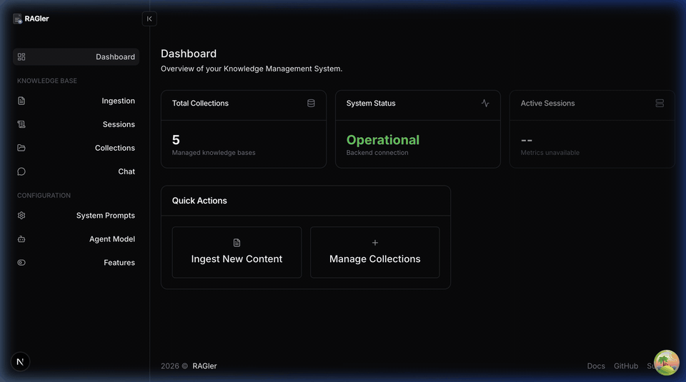

<div align="center">

# 🧠 RAGler

**The human-in-the-loop RAG knowledge platform**

[](https://github.com/scrobot/ragler/actions/workflows/ci.yml)
[](https://github.com/scrobot/ragler/actions/workflows/docs.yml)
[](https://github.com/scrobot/ragler/releases)
[](LICENSE)
[](https://nodejs.org)
[](https://typescriptlang.org)
[](https://nestjs.com)
[](https://nextjs.org)
[](https://qdrant.tech)
[](https://redis.io)
[](https://github.com/scrobot/ragler/pulls)

[Docs](https://scrobot.github.io/ragler/) · [API Reference](http://localhost:3000/api/docs) · [Report Bug](https://github.com/scrobot/ragler/issues) · [Request Feature](https://github.com/scrobot/ragler/issues)

</div>

---

## ✨ What is RAGler?

RAGler is an **open-source RAG knowledge operations platform** that gives you full control over your retrieval-augmented generation pipeline — from ingestion to publishing.

- 📥 **Ingest** knowledge from web pages, file uploads, or manual text
- 🔍 **Review & edit** chunks in a draft session before they go live
- 🚀 **Publish** validated chunks to Qdrant vector collections
- 🤖 **AI Agent** for chat, collection cleaning, and chunk generation
- 🔌 **MCP Server** built-in — IDE integration (Cursor, VS Code, etc.) via `/mcp` endpoint

## 🎬 Demo

<p align="center">
  
</p>

## 🏗️ Architecture

```
┌──────────────┐     ┌──────────────┐     ┌──────────────┐
│   Frontend   │────▶│   Backend    │────▶│    Qdrant    │
│  (Next.js)   │     │  (NestJS)    │     │  (vectors)   │
└──────────────┘     └──────┬───────┘     └──────────────┘
                            │
                     ┌──────┴───────┐
                     │    Redis     │
                     │  (sessions)  │
                     └──────────────┘
```

## 🚀 Quick Start

### Prerequisites

| Requirement | Version |
|-------------|---------|
| Node.js     | 20+     |
| pnpm        | 9+      |
| Docker      | latest  |
| OpenAI Key  | —       |

### 1. Clone & start infrastructure

```bash
git clone https://github.com/scrobot/ragler.git
cd ragler
docker compose up -d redis qdrant
```

### 2. Start backend

```bash
cd backend
pnpm install
cp .env.example .env
# set OPENAI_API_KEY in .env
pnpm start:dev
```

### 3. Verify

```bash
curl http://localhost:3000/api/health/liveness
# → {"status":"ok"}
```

### 4. Start frontend

```bash
cd frontend
pnpm install
pnpm dev
# → http://localhost:3000
```

### 5. (Optional) Verify MCP endpoint

```bash
curl -X POST http://localhost:3000/mcp \
  -H 'Content-Type: application/json' \
  -d '{"jsonrpc":"2.0","method":"tools/list","id":1}'
```

## 🐳 Docker Deployment

The fastest way to run RAGler — all services in one command.

### Using pre-built images (recommended)

```bash
git clone https://github.com/scrobot/ragler.git
cd ragler

# Set your OpenAI key
echo "OPENAI_API_KEY=sk-your-key-here" > .env

# Start everything
docker compose up -d
```

This pulls pre-built images from `ghcr.io/scrobot/ragler` and starts:

| Service | URL | Description |
|---------|-----|-------------|
| Frontend | [localhost:3000](http://localhost:3000) | RAGler UI |
| Backend API | [localhost:3010](http://localhost:3010/api/docs) | API + Swagger |
| Qdrant | [localhost:6333](http://localhost:6333/dashboard) | Vector DB dashboard |
| Redis | localhost:6379 | Session store |

### Build from source

```bash
docker compose up -d --build
```

### Debug tools (RedisInsight)

```bash
docker compose --profile debug up -d
# → RedisInsight at http://localhost:5540
```

### Stop & clean up

```bash
docker compose down           # stop containers
docker compose down -v        # stop + delete volumes
```

## ⚙️ Configuration

Backend config lives in `backend/.env`. Key variables:

| Variable | Required | Default | Description |
|----------|----------|---------|-------------|
| `OPENAI_API_KEY` | ✅ | — | OpenAI API key |
| `REDIS_HOST` | ✅ | — | Redis hostname |
| `REDIS_PORT` | — | `6379` | Redis port |
| `QDRANT_URL` | ✅ | — | Qdrant connection URL |
| `PORT` | — | `3000` | Backend port |
| `SESSION_TTL` | — | `86400` | Draft session TTL (seconds) |
| `SQLITE_PATH` | — | `data/ragler.db` | SQLite path for settings |

### 🚩 Feature Flags

Toggle features via environment variables or the UI (Settings → Features):

| Flag | Default | Controls |
|------|---------|----------|
| `FEATURE_WEB_INGEST` | `true` | Web URL ingestion |
| `FEATURE_FILE_INGEST` | `true` | File upload ingestion |
| `FEATURE_AGENT` | `true` | AI agent (chat, cleaning) |

## 📖 Documentation

| Resource | Link |
|----------|------|
| 📚 Full docs | [scrobot.github.io/ragler](https://scrobot.github.io/ragler/) |
| 🔧 API Swagger | [localhost:3000/api/docs](http://localhost:3000/api/docs) |
| 🏛️ Architecture | [docs/architecture](https://scrobot.github.io/ragler/architecture/overview) |
| 🚀 Getting started | [docs/getting-started](https://scrobot.github.io/ragler/getting-started/installation) |

## 🧪 Testing

```bash
cd backend
pnpm test        # run all tests
pnpm lint        # lint check
pnpm typecheck   # type check
```

## 🤝 Contributing

Contributions are welcome! Please feel free to submit a Pull Request.

1. Fork the project
2. Create your feature branch (`git checkout -b feat/amazing-feature`)
3. Commit using [conventional commits](https://www.conventionalcommits.org/) (`git commit -m 'feat: add amazing feature'`)
4. Push to the branch (`git push origin feat/amazing-feature`)
5. Open a Pull Request

## 🐛 Troubleshooting

| Problem | Solution |
|---------|----------|
| Readiness check fails | Check Redis/Qdrant: `docker compose ps` |
| 401/403 errors | Ensure `X-User-ID` header is set |
| Ingest failures | Verify `OPENAI_API_KEY` and network connectivity |

## 📄 License

Distributed under the ISC License.

---

<div align="center">
  <sub>Built with ❤️ by <a href="https://github.com/scrobot">scrobot</a></sub>
</div>
