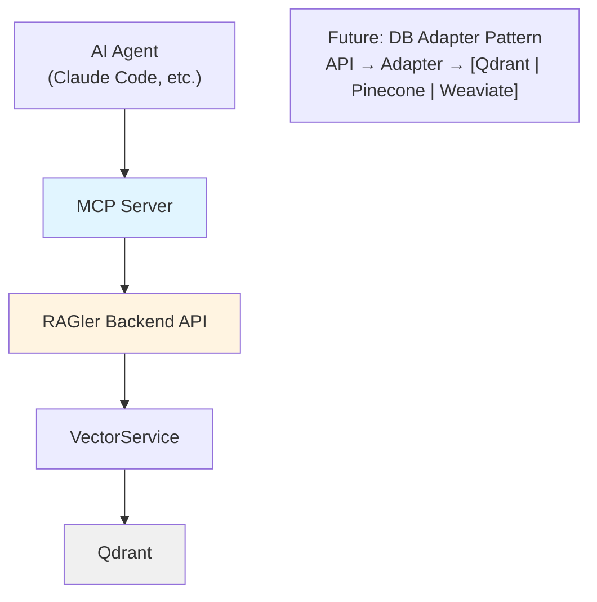
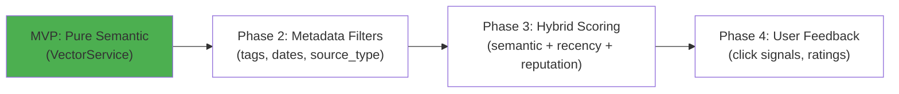

# MCP Server Integration

## Overview

The **MCP (Model Context Protocol) Server** provides AI agents with structured access to RAGler's knowledge base without direct vector database coupling. It acts as a protocol adapter between AI agents (like Claude Code) and RAGler's search API.

## Purpose & Rationale

**Key Benefits:**
- **Abstraction** - AI agents query RAGler, not Qdrant directly
- **Future-proof** - DB adapter pattern enables swapping Qdrant for other vector DBs
- **Enhanced search** - Hybrid search combining semantic + filtering/metadata
- **Standardization** - MCP is industry-standard protocol for AI tool integration

## Architecture

### System Position



**Communication Flow:**
1. AI agent sends MCP tool request (e.g., `search_knowledge`)
2. MCP server translates to HTTP API call
3. RAGler backend executes search via VectorService
4. Results returned through MCP protocol
5. AI agent receives structured search results

### Directory Structure

```
mcp-server/
├── src/
│   ├── server.ts              # MCP protocol handler
│   ├── tools/
│   │   ├── search.ts          # search_knowledge implementation
│   │   ├── collections.ts     # list_collections, get_collection_info
│   │   └── index.ts           # Tool registry
│   ├── client/
│   │   └── ragler-api.ts      # HTTP client to RAGler Backend
│   ├── config/
│   │   └── settings.ts        # Configuration management
│   └── utils/
│       ├── logger.ts          # Structured logging
│       └── metrics.ts         # Prometheus metrics
├── dist/                      # Compiled JavaScript
├── package.json
├── tsconfig.json
└── .mcp.json                  # MCP server configuration
```

## MCP Tools

### 1. search_knowledge

**Description:** Search across knowledge collections with semantic + hybrid filtering

**Parameters:**
```typescript
interface SearchKnowledgeParams {
  query: string;                // Natural language search query (required)
  collection_id?: string;       // UUID of target collection (optional, searches all if omitted)
  limit?: number;               // Max results (1-100, default 10)
  filters?: {
    source_type?: 'confluence' | 'web' | 'manual';
    date_from?: string;         // ISO-8601
    date_to?: string;           // ISO-8601
    tags?: string[];            // Filter by tags
  };
}
```

**Returns:**
```typescript
interface SearchKnowledgeResult {
  results: Array<{
    content: string;            // Chunk text content
    source_url: string;         // Original source URL
    score: number;              // Similarity score (0-1)
    metadata: {
      source_type: string;
      context_breadcrumbs?: string;
      heading?: string;
      tags?: string[];
      last_modified_by: string;
      last_modified_at: string;
    };
  }>;
  total: number;                // Total matching chunks
  query: string;                // Original query
  execution_time: number;       // milliseconds
}
```

**Example Usage:**
```typescript
// MCP tool call from AI agent
const result = await mcp.callTool('search_knowledge', {
  query: 'How do I authenticate API requests?',
  collection_id: 'uuid-api-docs',
  limit: 5,
  filters: {
    source_type: 'confluence',
    tags: ['api', 'authentication']
  }
});
```

**Implementation:**
```typescript
async function searchKnowledge(params: SearchKnowledgeParams) {
  // Call RAGler Backend API
  const response = await raglerClient.post('/vector/search', {
    query: params.query,
    collectionName: await getCollectionName(params.collection_id),
    limit: params.limit || 10,
    filters: params.filters
  });

  return {
    results: response.data.results,
    total: response.data.total,
    query: params.query,
    execution_time: response.data.executionTime
  };
}
```

### 2. list_collections

**Description:** List all available knowledge collections

**Parameters:** None

**Returns:**
```typescript
interface ListCollectionsResult {
  collections: Array<{
    id: string;                 // Collection UUID
    name: string;               // Human-readable name
    description: string;        // Purpose and context
    chunk_count: number;        // Number of chunks
    created_by: string;         // Creator email
    created_at: string;         // ISO-8601
  }>;
}
```

**Example Usage:**
```typescript
const result = await mcp.callTool('list_collections', {});

// Returns:
// {
//   "collections": [
//     {
//       "id": "uuid-1",
//       "name": "API Documentation",
//       "description": "Internal API guides",
//       "chunk_count": 45,
//       "created_by": "dev@company.com",
//       "created_at": "2026-02-01T10:00:00Z"
//     }
//   ]
// }
```

**Implementation:**
```typescript
async function listCollections() {
  const response = await raglerClient.get('/collections');

  return {
    collections: response.data.collections
  };
}
```

### 3. get_collection_info

**Description:** Get detailed information about a specific collection

**Parameters:**
```typescript
interface GetCollectionInfoParams {
  collection_id: string;        // Collection UUID (required)
}
```

**Returns:**
```typescript
interface GetCollectionInfoResult {
  id: string;
  name: string;
  description: string;
  chunk_count: number;
  created_by: string;
  created_at: string;
  updated_at: string;
  target_audience?: string[];
  usage_scenarios?: string[];
  statistics: {
    total_tokens: number;
    avg_chunk_size: number;
    last_published: string;
  };
}
```

**Example Usage:**
```typescript
const result = await mcp.callTool('get_collection_info', {
  collection_id: 'uuid-api-docs'
});
```

**Implementation:**
```typescript
async function getCollectionInfo(params: GetCollectionInfoParams) {
  const response = await raglerClient.get(`/collections/${params.collection_id}`);

  return response.data;
}
```

## Search Strategy

### Hybrid Approach

The MCP server's search implementation supports:

1. **Semantic search** (default): Vector similarity via embeddings
2. **Metadata filtering**: By source_type, date range, collection
3. **Hybrid ranking** (future): Combine semantic similarity with recency, source reputation

### Search Algorithm Evolution Path



**Current (MVP):** Pure semantic search via Qdrant vector similarity

**Future Enhancements:**
- **Recency boost** - Newer content ranked higher (decay function)
- **Source reputation** - Confluence > web > manual
- **User feedback** - Click-through rate, explicit ratings
- **Contextual ranking** - Adjust weights based on query type

### Hybrid Ranking Formula (Phase 3)

```
final_score = w1 * semantic_score
            + w2 * recency_score
            + w3 * reputation_score
            + w4 * feedback_score

Where:
  w1 + w2 + w3 + w4 = 1.0 (normalized weights)
  semantic_score = cosine_similarity(query_embedding, chunk_embedding)
  recency_score = exp(-decay_rate * days_since_update)
  reputation_score = source_type_weight[source_type]
  feedback_score = click_rate * 0.5 + rating_avg * 0.5
```

**Configurable Weights (Phase 3):**
```json
{
  "ranking_weights": {
    "semantic": 0.7,
    "recency": 0.15,
    "reputation": 0.10,
    "feedback": 0.05
  }
}
```

## Configuration

### MCP Server Configuration (.mcp.json)

```json
{
  "name": "ragler",
  "version": "1.0.0",
  "description": "RAGler Knowledge Management System MCP Server",
  "server": {
    "command": "node",
    "args": ["dist/server.js"],
    "env": {
      "RAGLER_API_URL": "http://localhost:3000",
      "RAGLER_API_KEY": "${RAGLER_API_KEY}",
      "LOG_LEVEL": "info",
      "ENABLE_METRICS": "true"
    }
  },
  "tools": [
    {
      "name": "search_knowledge",
      "description": "Search across knowledge collections with semantic + hybrid filtering"
    },
    {
      "name": "list_collections",
      "description": "List all available knowledge collections"
    },
    {
      "name": "get_collection_info",
      "description": "Get detailed information about a specific collection"
    }
  ]
}
```

### Environment Variables

| Variable | Purpose | Default | Required |
|----------|---------|---------|----------|
| `RAGLER_API_URL` | RAGler backend API base URL | `http://localhost:3000` | Yes |
| `RAGLER_API_KEY` | API authentication key | - | Yes |
| `LOG_LEVEL` | Logging verbosity (debug\|info\|warn\|error) | `info` | No |
| `ENABLE_METRICS` | Enable Prometheus metrics | `true` | No |
| `MCP_SERVER_PORT` | MCP server listening port | `3001` | No |
| `REQUEST_TIMEOUT` | HTTP request timeout (ms) | `30000` | No |

## Security & Access Control

### Authentication

**MCP Server → RAGler Backend:**
- API key authentication (passed via `Authorization: Bearer ${API_KEY}` header)
- OR: Service account token (future IAM integration)

**Configuration:**
```bash
# .env
RAGLER_API_KEY=your-api-key-here
```

**API Call:**
```typescript
const raglerClient = axios.create({
  baseURL: process.env.RAGLER_API_URL,
  headers: {
    'Authorization': `Bearer ${process.env.RAGLER_API_KEY}`,
    'X-User-ID': 'mcp-server',
    'X-User-Role': 'service'
  }
});
```

### Authorization

**Backend Enforcement:**
- MCP server queries run with **"service" role**
- Access all published collections (no draft access)
- Respects collection-level permissions (future)
- Cannot create or modify collections

**Role Capabilities:**
```typescript
const SERVICE_ROLE_PERMISSIONS = {
  search: true,              // ✅ Can search published knowledge
  listCollections: true,     // ✅ Can list collections
  getCollection: true,       // ✅ Can get collection details
  createCollection: false,   // ❌ Cannot create collections
  modifyCollection: false,   // ❌ Cannot modify collections
  accessDrafts: false,       // ❌ Cannot access draft sessions
  publish: false             // ❌ Cannot publish chunks
};
```

### Rate Limiting

**Backend Rate Limits (per MCP server instance):**
- Search: 100 requests/minute
- List collections: 20 requests/minute
- Get collection info: 50 requests/minute

**Configuration:**
```typescript
// Backend rate limit middleware
app.use('/vector/search', rateLimit({
  windowMs: 60 * 1000,      // 1 minute
  max: 100,                 // 100 requests per window
  keyGenerator: (req) => req.headers['x-user-id']
}));
```

## Observability

### Structured Logging

**Required Log Fields:**
```typescript
interface MCPLogEntry {
  timestamp: string;           // ISO-8601
  level: 'debug' | 'info' | 'warn' | 'error';
  correlation_id: string;      // Passthrough from AI agent
  tool: string;                // Tool name (search_knowledge, etc.)
  query?: string;              // Sanitized search query (no PII)
  collection_id?: string;      // Target collection UUID
  result_count?: number;       // Number of results returned
  response_time: number;       // milliseconds
  error?: string;              // Error message (if failed)
  user_agent?: string;         // AI agent identifier
}
```

**Example Log:**
```json
{
  "timestamp": "2026-02-08T10:30:00.123Z",
  "level": "info",
  "correlation_id": "req-abc123",
  "tool": "search_knowledge",
  "query": "authentication api",
  "collection_id": "uuid-api-docs",
  "result_count": 5,
  "response_time": 45,
  "user_agent": "claude-code/1.0"
}
```

### Metrics (Prometheus)

**Exposed Metrics:**
```
# Total MCP tool requests
mcp_requests_total{tool="search_knowledge",status="success"} 1250
mcp_requests_total{tool="search_knowledge",status="error"} 5
mcp_requests_total{tool="list_collections",status="success"} 120

# Request duration histogram
mcp_request_duration_seconds{tool="search_knowledge",le="0.1"} 1000
mcp_request_duration_seconds{tool="search_knowledge",le="0.5"} 1200
mcp_request_duration_seconds{tool="search_knowledge",le="1.0"} 1250

# Search result counts
mcp_search_results_count{collection_id="uuid-api-docs"} 5
mcp_search_results_count{collection_id="uuid-support-faq"} 12

# Error rates
mcp_errors_total{tool="search_knowledge",error_type="timeout"} 2
mcp_errors_total{tool="search_knowledge",error_type="not_found"} 1
```

**Grafana Dashboard Queries:**
```promql
# Average search response time
rate(mcp_request_duration_seconds_sum{tool="search_knowledge"}[5m])
/
rate(mcp_request_duration_seconds_count{tool="search_knowledge"}[5m])

# Search success rate
rate(mcp_requests_total{status="success"}[5m])
/
rate(mcp_requests_total[5m])

# Top searched collections
topk(10, sum by (collection_id) (increase(mcp_search_results_count[1h])))
```

## Development & Testing

### Local Development Setup

**Terminal 1: Start Backend**
```bash
cd backend
pnpm install
pnpm start:dev  # Backend runs on http://localhost:3000
```

**Terminal 2: Start MCP Server**
```bash
cd mcp-server
pnpm install
pnpm start:dev  # MCP server runs on default MCP port
```

**Terminal 3: Test MCP Tools**
```bash
# Using MCP CLI (if available)
mcp test search_knowledge --query "authentication" --limit 5

# Or use curl to test backend API directly
curl -X POST http://localhost:3000/vector/search \
  -H "Content-Type: application/json" \
  -H "Authorization: Bearer your-api-key" \
  -d '{"query": "authentication", "limit": 5}'
```

### Integration Tests

**Test MCP tools against running backend:**

```typescript
describe('MCP Server Integration', () => {
  beforeAll(async () => {
    // Start backend and MCP server
    backend = await startBackend();
    mcpServer = await startMCPServer();
  });

  describe('search_knowledge', () => {
    it('should search across all collections', async () => {
      const result = await mcpClient.callTool('search_knowledge', {
        query: 'API authentication',
        limit: 5
      });

      expect(result.results).toHaveLength(5);
      expect(result.results[0].score).toBeGreaterThan(0.5);
    });

    it('should filter by collection', async () => {
      const result = await mcpClient.callTool('search_knowledge', {
        query: 'authentication',
        collection_id: 'uuid-api-docs'
      });

      expect(result.results.every(r =>
        r.metadata.collection_id === 'uuid-api-docs'
      )).toBe(true);
    });

    it('should apply metadata filters', async () => {
      const result = await mcpClient.callTool('search_knowledge', {
        query: 'authentication',
        filters: {
          source_type: 'confluence',
          tags: ['api']
        }
      });

      expect(result.results.every(r =>
        r.metadata.source_type === 'confluence' &&
        r.metadata.tags.includes('api')
      )).toBe(true);
    });
  });

  describe('list_collections', () => {
    it('should list all collections', async () => {
      const result = await mcpClient.callTool('list_collections', {});

      expect(result.collections).toBeInstanceOf(Array);
      expect(result.collections.length).toBeGreaterThan(0);
    });
  });
});
```

## Deployment

### MVP Deployment (Standalone)

**Docker Compose:**
```yaml
version: '3.8'
services:
  backend:
    image: ragler-backend:latest
    ports:
      - "3000:3000"
    environment:
      - REDIS_HOST=redis
      - QDRANT_URL=http://qdrant:6333
      - OPENAI_API_KEY=${OPENAI_API_KEY}

  mcp-server:
    image: ragler-mcp-server:latest
    environment:
      - RAGLER_API_URL=http://backend:3000
      - RAGLER_API_KEY=${RAGLER_API_KEY}
    depends_on:
      - backend

  redis:
    image: redis:7-alpine
    ports:
      - "6379:6379"

  qdrant:
    image: qdrant/qdrant:latest
    ports:
      - "6333:6333"
```

### Production Deployment Options

#### Option 1: Sidecar Pattern (Kubernetes)

```yaml
apiVersion: apps/v1
kind: Deployment
metadata:
  name: ragler
spec:
  replicas: 3
  template:
    spec:
      containers:
      - name: backend
        image: ragler-backend:latest
        ports:
        - containerPort: 3000
      - name: mcp-server
        image: ragler-mcp-server:latest
        env:
        - name: RAGLER_API_URL
          value: "http://localhost:3000"
        - name: RAGLER_API_KEY
          valueFrom:
            secretKeyRef:
              name: ragler-secrets
              key: api-key
```

**Benefits:**
- ✅ Co-located (low latency)
- ✅ Shared lifecycle
- ✅ Simplified networking

#### Option 2: Standalone Deployment

```yaml
apiVersion: apps/v1
kind: Deployment
metadata:
  name: ragler-mcp-server
spec:
  replicas: 2
  template:
    spec:
      containers:
      - name: mcp-server
        image: ragler-mcp-server:latest
        ports:
        - containerPort: 3001
```

**Benefits:**
- ✅ Independent scaling
- ✅ Separate failure domains
- ✅ Easier monitoring

#### Option 3: Embedded (Future)

Integrate MCP protocol handler directly into backend (single deployment).

**Trade-offs:**
- ✅ Simplified deployment
- ❌ Tighter coupling
- ❌ Less flexible scaling

## Vector Database Abstraction (Future)

### DB Adapter Pattern

**Interface:**
```typescript
interface IVectorAdapter {
  search(query: Vector, options: SearchOptions): Promise<SearchResult[]>;
  upsert(points: VectorPoint[]): Promise<void>;
  deleteByFilter(filter: Filter): Promise<void>;
  createCollection(name: string, config: CollectionConfig): Promise<void>;
}
```

**Implementations:**
```typescript
class QdrantAdapter implements IVectorAdapter {
  // Current implementation
}

class PineconeAdapter implements IVectorAdapter {
  // Future: Pinecone support
}

class WeaviateAdapter implements IVectorAdapter {
  // Future: Weaviate support
}
```

**Adapter Registry:**
```typescript
const adapterRegistry = {
  'qdrant': new QdrantAdapter(qdrantClient),
  'pinecone': new PineconeAdapter(pineconeClient),
  'weaviate': new WeaviateAdapter(weaviateClient)
};

// Select adapter at runtime
const adapter = adapterRegistry[process.env.VECTOR_DB_TYPE || 'qdrant'];
```

**Benefits:**
- ✅ MCP server interface remains stable
- ✅ Swap vector DB without changing AI agent integrations
- ✅ Support multi-DB deployments (different collections in different DBs)

## Related Documentation

- [Product: Collections](/docs/product/collections) - Collection concepts
- [Architecture: Vector Module](/docs/architecture/modules/vector) - Qdrant integration
- [Architecture: Security](/docs/architecture/security) - Authentication and authorization
- [Getting Started: Configuration](/docs/getting-started/configuration) - MCP server setup
- [Claude Code MCP Integration](https://github.com/anthropics/claude-code) - AI agent integration guide
