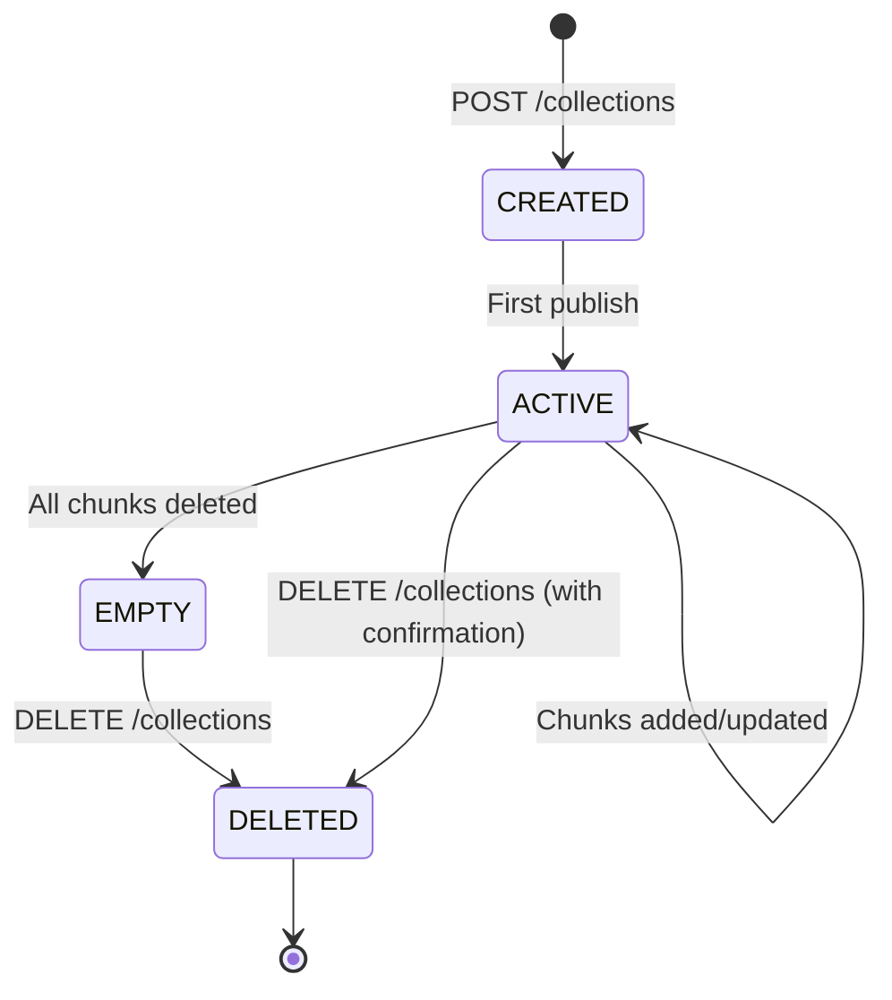

# Module: Collection

## Purpose

The **Collection module** manages knowledge collections (Knowledge Buckets) using Qdrant's `sys_registry` as a dynamic registry. Collections represent isolated contexts of knowledge use, not just containers for chunks.

## Architecture

### Components

**Key Classes:**
- `CollectionService` - Business logic for collection management
- `CollectionController` - HTTP API endpoints
- `CreateCollectionDto`, `CollectionResponseDto` - Data transfer objects

**Design Pattern:**
- **Registry Pattern** - Uses Qdrant `sys_registry` collection to store collection metadata
- **Dynamic Collections** - Collections created at runtime via API, not hardcoded

### Dependencies

**Internal:**
- `@vector/VectorService` - Qdrant operations (create collection, manage registry)

**External:**
- **Qdrant** - Stores both collection registry (`sys_registry`) and actual data collections (`kb_{uuid}`)

### Integration Points

**Used By:**
- `SessionService` - Validates collection before publish
- Frontend SPA - Collection selection UI
- MCP Server - Lists available collections for AI agents

**Exposes:**
- `GET /collections` - List all available collections
- `POST /collections` - Create new collection (DEV/ML only)
- `GET /collections/:id` - Get collection details
- `PATCH /collections/:id` - Update collection metadata (DEV/ML only)
- `DELETE /collections/:id` - Delete collection (DEV/ML only)

## Key Concepts

### Dynamic Collections vs Static Configuration

**Traditional Approach (Rejected):**
- Collections hardcoded in configuration
- Requires deployment to add new collection
- Uses PostgreSQL or other SQL DB for metadata

**RAGler Approach (v2.0 - Vector-First & Only):**
- Collections stored in Qdrant `sys_registry` collection
- Created dynamically via API
- No SQL database required (flat infrastructure)

**Benefits:**
- ✅ No additional infrastructure (Qdrant only)
- ✅ Collections managed by users at runtime
- ✅ Simpler deployment (no database migrations)
- ✅ System is a full-fledged product, not just a utility

### Collection Registry (`sys_registry`)

**Purpose:** Store metadata about user-created collections

**Schema:**
```json
{
  "id": "uuid-v4-collection-id",
  "vector": [0, 0, 0, ...],  // Dummy vector (not used for search)
  "payload": {
    "name": "API Documentation",
    "description": "Internal API guides for developers",
    "created_by": "dev@company.com",
    "created_at": "2026-02-08T10:30:00Z",
    "updated_at": "2026-02-08T10:30:00Z",
    "chunk_count": 0,
    "target_audience": ["developers", "architects"],
    "usage_scenarios": ["api_integration", "troubleshooting"]
  }
}
```

**Key Fields:**
- `name` - Human-readable collection name
- `description` - Purpose and usage context
- `created_by` - User who created collection (audit trail)
- `chunk_count` - Number of chunks in this collection (maintained on publish)
- `target_audience` - Who uses this knowledge
- `usage_scenarios` - When this knowledge is used

### Data Collections (`kb_{uuid}`)

**Naming Convention:** Each collection has a Qdrant collection named `kb_{collection_uuid}`

**Example:**
- Collection ID: `a1b2c3d4-e5f6-7890-abcd-ef1234567890`
- Qdrant collection name: `kb_a1b2c3d4-e5f6-7890-abcd-ef1234567890`

**Schema:** See [Architecture: Data Model](/docs/architecture/data-model) for full chunk payload schema.

### Collection Lifecycle



**States:**
- `CREATED` - Collection exists in registry, no chunks yet
- `ACTIVE` - Contains published chunks
- `EMPTY` - All chunks removed
- `DELETED` - Collection removed from registry and Qdrant

### Collection Operations

#### Create Collection

**API:**
```http
POST /collections
Content-Type: application/json
X-User-Role: DEV

{
  "name": "Support FAQ",
  "description": "L2 answers for common customer questions",
  "targetAudience": ["L2 support", "customers"],
  "usageScenarios": ["customer_support", "self_service"]
}
```

**Role Restrictions:**
- ✅ DEV (Developer)
- ✅ ML (ML Specialist)
- ❌ L2 (L2 Support) - Cannot create collections

**Implementation:**
1. Validate user role (`DEV` or `ML`)
2. Generate UUID for collection
3. Create Qdrant collection `kb_{uuid}`
4. Insert metadata into `sys_registry`
5. Return collection ID

**Validation Rules:**
- Name must be unique
- Name length: 3-100 characters
- Description length: 10-500 characters

#### List Collections

**API:**
```http
GET /collections
```

**Response:**
```json
{
  "collections": [
    {
      "id": "uuid-1",
      "name": "API Documentation",
      "description": "Internal API guides",
      "chunk_count": 45,
      "created_by": "dev@company.com",
      "created_at": "2026-02-01T10:00:00Z"
    },
    {
      "id": "uuid-2",
      "name": "Support FAQ",
      "description": "L2 answers",
      "chunk_count": 120,
      "created_by": "support@company.com",
      "created_at": "2026-02-05T14:30:00Z"
    }
  ]
}
```

**Implementation:**
1. Query `sys_registry` collection in Qdrant
2. Extract all collection metadata
3. Sort by `created_at` (descending)
4. Return list

#### Update Collection

**API:**
```http
PATCH /collections/:id
Content-Type: application/json
X-User-Role: DEV

{
  "description": "Updated description for API docs",
  "targetAudience": ["developers", "architects", "support"]
}
```

**Role Restrictions:**
- ✅ DEV (Developer)
- ✅ ML (ML Specialist)
- ❌ L2 (L2 Support) - Cannot update collections

**Updatable Fields:**
- `description`
- `targetAudience`
- `usageScenarios`

**Non-Updatable Fields:**
- `name` - Cannot be changed (immutable identifier)
- `id` - UUID cannot be changed
- `created_by` - Audit field (immutable)
- `created_at` - Audit field (immutable)

#### Delete Collection

**API:**
```http
DELETE /collections/:id
Content-Type: application/json
X-User-Role: DEV

{
  "confirm": true
}
```

**Role Restrictions:**
- ✅ DEV (Developer)
- ✅ ML (ML Specialist)
- ❌ L2 (L2 Support) - Cannot delete collections

**Safety Checks:**
1. **Confirmation required:** Must pass `{ "confirm": true }` in body
2. **Orphan warning:** If collection contains chunks, warn user
3. **Cascade delete:** Delete collection from `sys_registry` AND delete Qdrant collection `kb_{uuid}`

**Implementation:**
1. Validate user role
2. Check if `confirm: true` in body
3. Query `sys_registry` for collection metadata
4. Get chunk count from collection
5. If chunks > 0, require explicit confirmation
6. Delete Qdrant collection `kb_{uuid}`
7. Delete metadata from `sys_registry`

**Error Cases:**
- `COLLECTION_NOT_EMPTY` - Contains chunks, confirmation required
- `COLLECTION_NOT_FOUND` - Collection ID does not exist
- `PERMISSION_DENIED` - L2 role attempted deletion

### Collection Selection (Publishing Workflow)

**Mandatory Step:** Collection must be selected before publishing session

**API:**
```http
POST /sessions/:id/publish
Content-Type: application/json

{
  "collectionName": "API Documentation"
}
```

**Validation:**
1. Collection with given name must exist in `sys_registry`
2. User must have permission to publish to this collection
3. Collection must not be in deleted state

**Chunk Assignment:**
- All chunks in session are published to the same collection
- Chunks cannot span multiple collections
- Re-publishing (re-ingestion) replaces chunks in the same collection

## Data Model

### Collection Metadata (sys_registry)

```typescript
interface CollectionMetadata {
  id: string;                  // UUID v4
  name: string;                // Unique, human-readable
  description: string;         // Purpose and context
  created_by: string;          // User email/ID (audit)
  created_at: string;          // ISO-8601 timestamp
  updated_at: string;          // ISO-8601 timestamp
  chunk_count: number;         // Number of chunks published
  target_audience?: string[];  // Intended users
  usage_scenarios?: string[];  // Use cases
}
```

### Collection DTOs

**CreateCollectionDto:**
```typescript
class CreateCollectionDto {
  @IsString()
  @Length(3, 100)
  name: string;

  @IsString()
  @Length(10, 500)
  description: string;

  @IsOptional()
  @IsArray()
  @IsString({ each: true })
  targetAudience?: string[];

  @IsOptional()
  @IsArray()
  @IsString({ each: true })
  usageScenarios?: string[];
}
```

**CollectionResponseDto:**
```typescript
class CollectionResponseDto {
  id: string;
  name: string;
  description: string;
  chunk_count: number;
  created_by: string;
  created_at: string;
  updated_at: string;
  target_audience?: string[];
  usage_scenarios?: string[];
}
```

## Error Handling

### Common Errors

| Error | Cause | Resolution |
|-------|-------|------------|
| `COLLECTION_ALREADY_EXISTS` | Collection with same name exists | Use unique name |
| `COLLECTION_NOT_FOUND` | Collection ID does not exist | Verify collection ID from `GET /collections` |
| `PERMISSION_DENIED` | L2 role attempted restricted operation | Use DEV or ML role |
| `COLLECTION_NOT_EMPTY` | Attempted to delete collection with chunks | Pass `confirm: true` and explicitly confirm |
| `INVALID_COLLECTION_NAME` | Name violates validation rules | Use 3-100 characters, alphanumeric |
| `REGISTRY_SYNC_FAILED` | Qdrant sys_registry operation failed | Check Qdrant health, retry |

### Retry Strategy

**Qdrant Operations:**
- Connection timeout → Retry 3 times with exponential backoff
- Conflict errors (duplicate name) → Do not retry (user error)

**Consistency Guarantee:**
- Collection creation is atomic: both `sys_registry` insert and Qdrant collection creation must succeed
- If Qdrant collection creation fails, rollback `sys_registry` insert

## Configuration

### Environment Variables

| Variable | Purpose | Default |
|----------|---------|---------|
| `QDRANT_URL` | Qdrant server URL | `http://localhost:6333` |
| `QDRANT_API_KEY` | Qdrant authentication (optional) | `` |
| `COLLECTION_MAX_NAME_LENGTH` | Maximum collection name length | `100` |
| `COLLECTION_MAX_DESCRIPTION_LENGTH` | Maximum description length | `500` |

### Registry Collection Configuration

**Collection Name:** `sys_registry` (hardcoded)
**Vector Dimensions:** 1536 (matches embedding model)
**Distance Metric:** Cosine (standard for embeddings)

Note: Vectors in `sys_registry` are not used for search (dummy vectors). The registry is queried by metadata filters only.

## Testing Strategy

### Unit Tests

**Location:** `test/unit/collection/collection.service.spec.ts`

**Coverage:**
- Collection creation
- Collection listing
- Collection updates
- Collection deletion
- Role-based access control
- Validation rules
- Error handling

**Key Test Cases:**
```typescript
describe('CollectionService', () => {
  it('should create collection and insert into sys_registry');
  it('should create Qdrant collection kb_{uuid}');
  it('should reject collection creation from L2 role');
  it('should list all collections from sys_registry');
  it('should update collection description');
  it('should reject name updates (immutable)');
  it('should delete collection and cascade to Qdrant');
  it('should require confirmation for non-empty collection deletion');
  it('should rollback on Qdrant collection creation failure');
});
```

### Integration Tests

**Location:** `test/app.e2e-spec.ts`

**Coverage:**
- Full collection lifecycle (create → update → delete)
- Registry synchronization with Qdrant
- Publishing to collection
- Chunk count updates after publish

**Key Test Cases:**
```typescript
describe('Collection E2E', () => {
  it('should create collection, publish chunks, and verify chunk_count');
  it('should list collections with correct metadata');
  it('should prevent deletion of collection with chunks without confirmation');
  it('should delete collection and remove Qdrant collection');
  it('should handle concurrent collection operations');
});
```

## Related Documentation

- [Product: Collections](/docs/product/collections) - User-facing collection concepts
- [Architecture: Vector Module](/docs/architecture/modules/vector) - Qdrant integration
- [Architecture: Data Model](/docs/architecture/data-model) - Qdrant schemas
- [ADR-001: Vector-Only Storage](/docs/architecture/adr/001-vector-only-storage) - Why no SQL database
- [Product: Publishing](/docs/product/publishing) - Collection selection workflow
