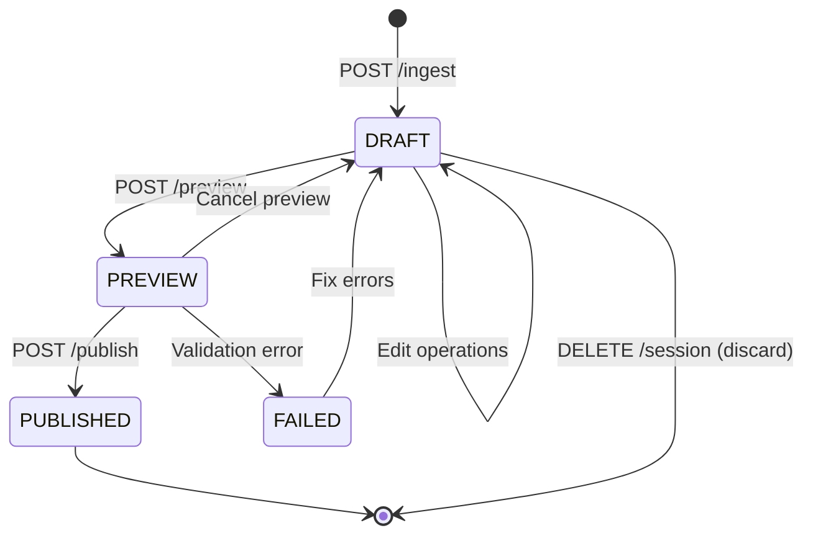

# Module: Session

## Purpose

The **Session module** manages draft editing workflows in Redis. It provides a temporary "sandbox" where users can edit chunks, split/merge operations, and preview changes before publishing to Qdrant.

## Architecture

### Components

**Key Classes:**
- `SessionService` - Core business logic for session operations
- `SessionController` - HTTP API endpoints for session management
- `SessionDto`, `SessionResponseDto` - Data transfer objects for API contracts
- Session storage layer uses Redis with TTL (24 hours default)

**Design Pattern:**
- **Repository Pattern** - Session state managed via Redis
- **Draft-Commit Workflow** - Changes isolated in drafts until explicit publish

### Dependencies

**Internal:**
- `@vector/VectorService` - Publishing chunks to Qdrant
- `@llm/LlmService` - LLM-powered refine operations
- `@collection/CollectionService` - Collection validation before publish

**External:**
- **Redis** - Draft session storage
  - Key pattern: `session:{session_id}`
  - TTL: 24 hours (configurable via `REDIS_SESSION_TTL`)
- **Qdrant** (via VectorService) - Final publishing destination

### Integration Points

**Used By:**
- `IngestModule` - Creates initial session after chunking
- Frontend SPA - All draft editing operations
- `PublishController` - Triggers publish workflow

**Exposes:**
- `GET /sessions/:id` - Retrieve draft session
- `PATCH /sessions/:id/chunks/:chunkId` - Edit chunk content
- `POST /sessions/:id/chunks/:chunkId/split` - Split chunk (Advanced Mode)
- `POST /sessions/:id/chunks/merge` - Merge chunks (Advanced Mode)
- `POST /sessions/:id/refine` - LLM-assisted enrichment
- `POST /sessions/:id/preview` - Lock and validate session
- `POST /sessions/:id/publish` - Commit draft to Qdrant
- `DELETE /sessions/:id` - Discard draft

## Key Concepts

### Draft Session Lifecycle



**States:**
- `DRAFT` - Session is being edited (chunks can be modified)
- `PREVIEW` - Session locked for review (read-only, validation runs)
- `PUBLISHED` - Session committed to Qdrant (Redis session deleted)
- `FAILED` - Publish failed due to validation error

### Session Isolation

**Key Principle:** Drafts are completely isolated from published chunks until explicit publish.

- **Editing:** All changes stored only in Redis (session key)
- **Preview:** Validates structure without affecting Qdrant
- **Publish:** Atomic replacement - delete old chunks, insert new chunks
- **Rollback:** Deleting session discards all changes

### Chunk Operations

#### Edit Chunk Text

**Use Case:** Fix typos, improve clarity, add context

**API:**
```http
PATCH /sessions/:id/chunks/:chunkId
Content-Type: application/json

{
  "content": "Updated chunk content..."
}
```

**Implementation:**
1. Read session from Redis
2. Find chunk by ID
3. Update chunk content
4. Mark chunk as `is_dirty: true`
5. Write session back to Redis

#### Split Chunk (Advanced Mode Only)

**Use Case:** Divide chunk that combines multiple concepts

**API:**
```http
POST /sessions/:id/chunks/:chunkId/split
Content-Type: application/json

{
  "splitPoints": [15, 30],
  "strategy": "by_line"
}
```

**Implementation:**
1. Validate user role (`DEV` or `ML` only)
2. Read session from Redis
3. Find target chunk
4. Split content at specified points
5. Create new chunk IDs (e.g., `chunk_3` → `chunk_3`, `chunk_3_1`, `chunk_3_2`)
6. Adjust order of subsequent chunks
7. Write session back to Redis

**Constraints:**
- L2 Support cannot split chunks (Simple Mode restriction)
- Minimum chunk size: 50 characters
- Maximum split points: 10 per operation

#### Merge Chunks (Advanced Mode Only)

**Use Case:** Combine chunks that are semantically related

**API:**
```http
POST /sessions/:id/chunks/merge
Content-Type: application/json

{
  "chunkIds": ["chunk_4", "chunk_5"],
  "separator": "\n\n"
}
```

**Implementation:**
1. Validate user role (`DEV` or `ML` only)
2. Read session from Redis
3. Find all target chunks
4. Concatenate content with separator
5. Create merged chunk with first ID
6. Delete other chunks from session
7. Adjust order
8. Write session back to Redis

**Constraints:**
- L2 Support cannot merge chunks (Simple Mode restriction)
- Maximum chunks per merge: 5
- Chunks must be contiguous (sequential order)

### LLM-Assisted Refinement

**Use Case:** Use LLM assistant to improve chunk quality

**API:**
```http
POST /sessions/:id/refine
Content-Type: application/json

{
  "chunkId": "chunk_7",
  "scenario": "clarify",
  "instructions": "Add example of API usage"
}
```

**Scenarios:**
- `simplify` - Remove jargon, shorten sentences
- `clarify` - Add context, explain acronyms
- `add_examples` - Generate code examples
- `restructure` - Improve semantic flow

**Implementation:**
1. Read session from Redis
2. Extract chunk content
3. Call `LlmService.refine()` with scenario
4. Return suggestions (NOT auto-applied)
5. User must approve changes
6. If approved: update chunk via `PATCH /chunks/:chunkId`

**IMPORTANT:** LLM results are suggestions only, never automatically applied.

### Preview & Validation

**Use Case:** Lock session and validate before publishing

**API:**
```http
POST /sessions/:id/preview
```

**Validation Rules:**
1. **Collection selected:** Session must have `targetCollectionId`
2. **No empty chunks:** All chunks must have non-empty content
3. **Order consistency:** Chunk order must be sequential (0, 1, 2, ...)
4. **Source ID present:** Session must have valid `source_id`

**Preview Response:**
```json
{
  "status": "PREVIEW",
  "validation": {
    "passed": true,
    "errors": []
  },
  "impact": {
    "chunksToDelete": 5,
    "chunksToInsert": 8,
    "sourceId": "a1b2c3d4e5f6"
  }
}
```

### Atomic Publishing

**Use Case:** Commit draft session to Qdrant

**API:**
```http
POST /sessions/:id/publish
Content-Type: application/json

{
  "collectionName": "API Documentation"
}
```

**Implementation (Atomic Replacement):**
1. **Validate:** Run preview validation
2. **Lock:** Set session status to `PUBLISHING`
3. **Delete Old:** `DELETE from Qdrant WHERE source_id == session.source_id`
4. **Generate Embeddings:** Call `LlmService.embed()` for each chunk
5. **Insert New:** `UPSERT` new chunks with embeddings to Qdrant
6. **Audit:** Add `last_modified_by`, `last_modified_at` metadata
7. **Cleanup:** Delete session from Redis
8. **Commit:** Transaction complete

**Atomicity Guarantee:**
- Delete-Insert wrapped in transaction
- If insert fails, old chunks remain (rollback)
- No duplicate chunks possible (same `source_id` deleted first)

## Data Model

### Redis Session Schema

```typescript
interface Session {
  sessionId: string;           // Primary key (UUID)
  sourceId: string;            // MD5(sourceUrl) - for atomic replacement
  sourceUrl: string;           // Original source URL
  sourceType: 'confluence' | 'web' | 'manual';
  status: 'DRAFT' | 'PREVIEW' | 'PUBLISHING' | 'FAILED';
  userId: string;              // From X-User-ID header
  userRole: 'L2' | 'DEV' | 'ML';
  targetCollectionId?: string; // Selected collection UUID
  chunks: Chunk[];
  createdAt: string;           // ISO-8601
  updatedAt: string;           // ISO-8601
  ttl: number;                 // Redis TTL (default 24 hours)
}

interface Chunk {
  id: string;                  // Unique within session
  content: string;             // Text content
  order: number;               // Sequential position
  isDirty: boolean;            // True if edited since creation
  metadata?: {
    heading?: string;
    tags?: string[];
    editReason?: string;
  };
}
```

### Qdrant Payload Schema (After Publish)

```json
{
  "id": "uuid-v4",
  "vector": [0.123, ...],
  "payload": {
    "content": "Chunk text content...",
    "source_id": "a1b2c3d4e5f6",
    "source_url": "https://confluence...",
    "source_type": "confluence",
    "context_breadcrumbs": "Page > Section",
    "last_modified_by": "dev@company.com",
    "last_modified_at": "2026-02-08T10:30:00Z",
    "revision": 1
  }
}
```

## Error Handling

### Common Errors

| Error | Cause | Resolution |
|-------|-------|------------|
| `SESSION_NOT_FOUND` | Session expired (TTL) or invalid ID | Re-ingest source to create new session |
| `SESSION_LOCKED` | Session in PREVIEW or PUBLISHING state | Wait for operation to complete or cancel preview |
| `COLLECTION_NOT_SELECTED` | Attempted publish without collection | Select collection before publishing |
| `SPLIT_NOT_ALLOWED` | L2 role attempted split operation | Use DEV or ML role (Advanced Mode) |
| `MERGE_NOT_ALLOWED` | L2 role attempted merge operation | Use DEV or ML role (Advanced Mode) |
| `INVALID_CHUNK_ID` | Chunk ID does not exist in session | Verify chunk ID from `GET /sessions/:id` |
| `PUBLISH_FAILED` | Qdrant insert failed | Check Qdrant health, retry operation |
| `VALIDATION_FAILED` | Preview validation did not pass | Fix validation errors, re-preview |

### Retry Strategy

**Transient Failures:**
- Qdrant connection timeout → Retry 3 times with exponential backoff
- Redis connection error → Retry immediately (circuit breaker)

**Non-Retryable Failures:**
- Validation errors → User must fix and re-submit
- Permission errors → User must use correct role

### Error Propagation

All errors follow standard API error format:

```json
{
  "statusCode": 400,
  "message": "Cannot split chunk: Simple Mode active",
  "error": "SPLIT_NOT_ALLOWED",
  "context": {
    "userRole": "L2",
    "requiredRole": "DEV"
  }
}
```

## Configuration

### Environment Variables

| Variable | Purpose | Default |
|----------|---------|---------|
| `REDIS_SESSION_TTL` | Session expiration time (seconds) | `86400` (24 hours) |
| `SESSION_MAX_CHUNKS` | Maximum chunks per session | `500` |
| `REDIS_HOST` | Redis server host | `localhost` |
| `REDIS_PORT` | Redis server port | `6379` |
| `REDIS_DB` | Redis database number | `0` |

### TTL Strategy

**Default TTL:** 24 hours

**Rationale:**
- Long enough for multi-day editing workflows
- Short enough to prevent memory bloat
- User can always re-ingest if session expires

**Trade-offs:**
- ✅ Prevents abandoned sessions from consuming memory
- ✅ Forces users to commit or discard work
- ❌ Lost work if user exceeds 24 hours
- ❌ No persistent drafts across days

## Testing Strategy

### Unit Tests

**Location:** `test/unit/session/session.service.spec.ts`

**Coverage:**
- Session creation and retrieval
- Chunk edit operations
- Split/merge logic
- Role-based access control
- Validation rules
- Error handling

**Key Test Cases:**
```typescript
describe('SessionService', () => {
  it('should create session with chunks from ingestion');
  it('should edit chunk content and mark as dirty');
  it('should split chunk into multiple chunks (DEV role)');
  it('should reject split operation for L2 role');
  it('should merge chunks with separator');
  it('should validate session before preview');
  it('should publish session to Qdrant with atomic replacement');
  it('should delete old chunks before inserting new ones');
  it('should handle Redis connection failure gracefully');
});
```

### Integration Tests

**Location:** `test/app.e2e-spec.ts`

**Coverage:**
- Full ingestion → edit → publish flow
- Redis + Qdrant integration
- Session TTL expiration
- Concurrent session operations
- Atomic replacement verification

**Key Test Cases:**
```typescript
describe('Session E2E', () => {
  it('should create session, edit chunks, and publish successfully');
  it('should replace old chunks with new chunks (same source_id)');
  it('should expire session after 24 hours');
  it('should handle concurrent edits to same session');
  it('should rollback on Qdrant insert failure');
});
```

## Related Documentation

- [Product: Draft Sessions](/docs/product/sessions) - User-facing workflow
- [Product: Publishing](/docs/product/publishing) - Atomic replacement explained
- [Architecture: Vector Module](/docs/architecture/modules/vector) - Qdrant integration
- [Architecture: LLM Module](/docs/architecture/modules/llm) - LLM refinement scenarios
- [ADR-002: Atomic Replacement](/docs/architecture/adr/002-atomic-replacement) - Design decision rationale
- [ADR-004: Redis Session TTL](/docs/architecture/adr/004-redis-session-ttl) - TTL design decision
