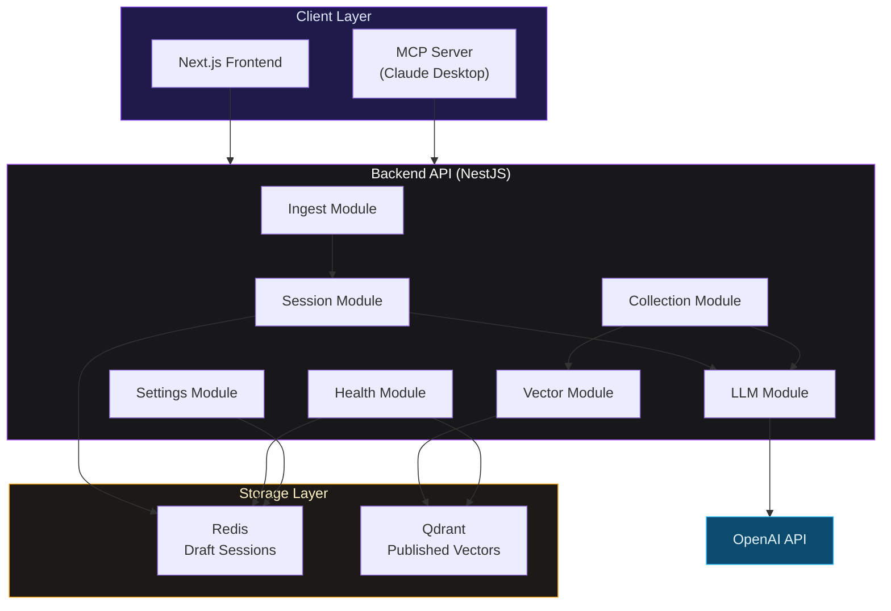
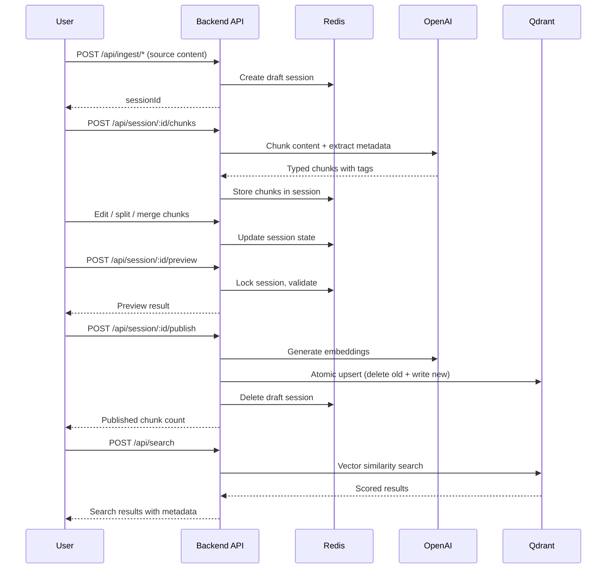

# Architecture Overview

## What this page is for

Describe the runtime architecture and data flow used by RAGler.

## System diagram

## High-level components

| Component | Technology | Role |
|-----------|-----------|------|
| Frontend | Next.js 16, Tailwind CSS 4 | User interface for all operations |
| Backend API | NestJS | REST API with Swagger docs at `/api/docs` |
| Redis | Redis Alpine | Draft session storage with TTL |
| Qdrant | Qdrant | Published chunk vectors + metadata |
| OpenAI | OpenAI API | LLM chunking, embeddings, agent chat |
| MCP Server | TypeScript | Claude Desktop integration adapter |

## Data flow

## Next steps

- [System Design](/docs/architecture/system-design)
- [Data Model](/docs/architecture/data-model)
- [Modules](/docs/architecture/modules/collection)
