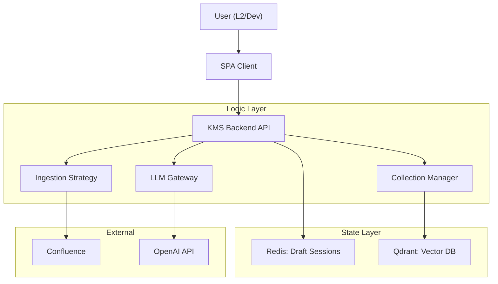

# Architecture Overview

## Executive Summary

KMS-RAG is a knowledge management system that provides **Human-in-the-Loop** data validation before data enters the search index. The system allows L2-Support and Developers to curate the knowledge base without involvement of ML engineers.

**Architectural Paradigm (v2.0):**

- **Vector-First & Only:** Rejection of SQL. Data (content) and metadata (collection registry) are stored in Qdrant.
- **Dynamic Context:** Collections are not rigidly fixed but managed via API.
- **Atomic Consistency:** Document (source) updates follow a full replacement strategy (Delete-Insert).

## High-Level Architecture

## Key Components

1. **Draft Store (Redis):** "Sandbox". This is where chunks live during editing, split/merge operations. Preview happens here too.
2. **Knowledge Store (Qdrant):**
   - `data_{collection_uuid}`: Storage of vectors and content.
   - `sys_registry`: System collection storing the list of user-created collections.
3. **Ingestion Engine:** Loading module. Computes source hash to control changes.
