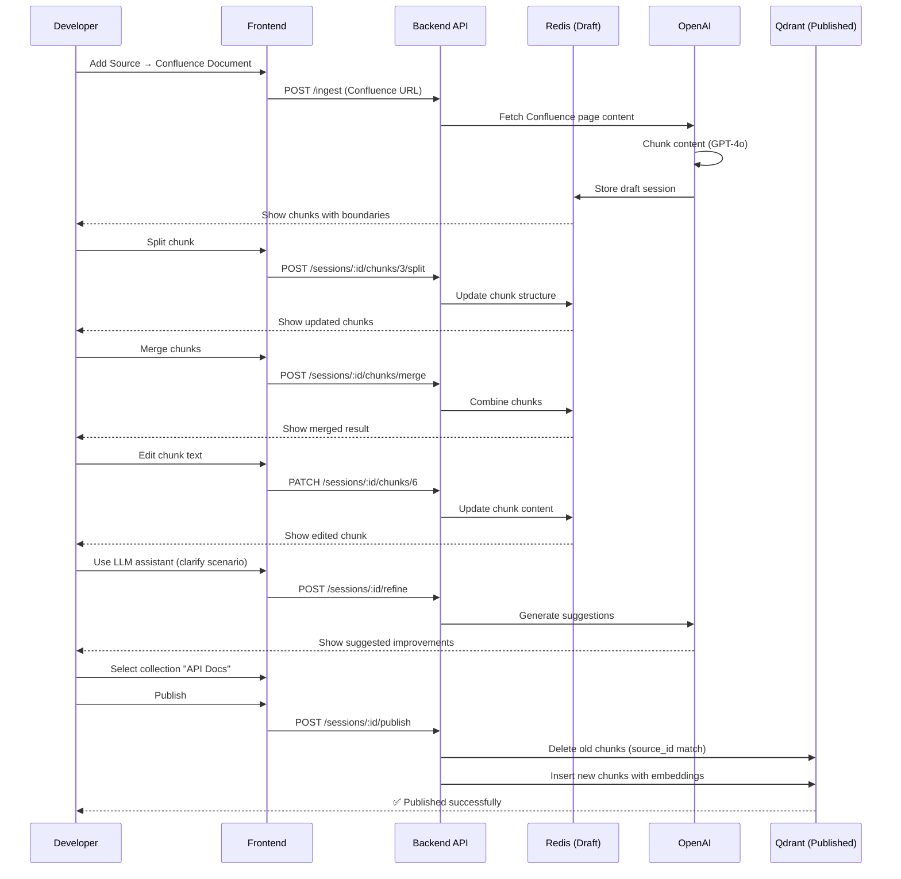

# Advanced Mode Workflow

Advanced Mode is designed for **Developers** and **ML Specialists** who need full control over chunk structure, including split/merge operations and advanced editing capabilities.

## Who Uses Advanced Mode?

**Target Users:**
- Developers (backend/platform engineers)
- ML Specialists (RAG experts)
- Technical content architects
- Users who understand RAG mechanics

**User Characteristics:**
- Understands RAG concepts (chunking, embeddings, retrieval)
- Needs precise control over knowledge structure
- Comfortable with technical UIs
- Can assess chunk quality and semantic boundaries

## Advanced Mode Philosophy

**Full control over structure:**
- Users see and manipulate chunk boundaries
- Split/merge operations available
- Access to raw chunk metadata
- Technical editing interface

**LLM assistant with advanced scenarios:**
- Standard scenarios (simplify, clarify, add examples)
- Advanced scenarios (restructure, enrich with metadata)
- Bulk operations (ML Specialists only)
- Custom prompts for specific use cases

## Advanced Mode Capabilities

### ✅ What You Can Do

| Action | Description | Endpoint |
|--------|-------------|----------|
| **View sources** | Inspect original content with technical details | `GET /sessions/:id` |
| **Edit chunk text** | Modify chunk content directly | `PATCH /sessions/:id/chunks/:chunkId` |
| **Split chunks** | Divide a chunk into smaller semantic units | `POST /sessions/:id/chunks/:chunkId/split` |
| **Merge chunks** | Combine multiple chunks into one | `POST /sessions/:id/chunks/merge` |
| **Use LLM assistant** | Access all enrichment scenarios | `POST /sessions/:id/refine` |
| **Re-process source** | Trigger re-chunking with new strategy | `POST /ingest` (same source) |
| **Select collection** | Choose where to publish chunks | `POST /sessions/:id/publish` |
| **Manage collections** | Create, edit, delete collections | `POST /collections`, `PATCH /collections/:id` |
| **Publish chunks** | Make knowledge searchable (atomic replacement) | `POST /sessions/:id/publish` |
| **Discard session** | Delete draft without publishing | `DELETE /sessions/:id` |
| **Bulk operations** | Mass edit chunks (ML Specialists only) | Various batch endpoints |

### ❌ What You Cannot Do (Intentional Limitations)

| Action | Why Not? |
|--------|----------|
| **Real-time Confluence sync** | Out of MVP scope |
| **Bulk space scanning** | Out of MVP scope |
| **Automatic chunk quality scoring** | Out of MVP scope |
| **Chunk versioning** | Out of MVP scope |

## Primary Flow: Confluence → Chunking → Save

**Target Role:** Developer
**Mode:** Advanced Mode
**Goal:** Precisely correct structure and content of knowledge for specific product scenario

### Step-by-Step Workflow



### Detailed Steps

#### 1. Add Data Source

**Action:** User selects "Add Source" → "Confluence Document"

**API Call:**
```bash
POST /api/ingest
Content-Type: application/json
X-User-ID: dev@company.com
X-User-Role: DEV

{
  "sourceType": "confluence",
  "sourceUrl": "https://company.atlassian.net/wiki/spaces/DOCS/pages/123456"
}
```

**Response:**
```json
{
  "sessionId": "sess_abc123",
  "status": "DRAFT",
  "sourceId": "a1b2c3d4e5f6",
  "sourceUrl": "https://company.atlassian.net/wiki/spaces/DOCS/pages/123456",
  "sourceType": "confluence",
  "chunksCount": 8,
  "chunks": [
    {
      "id": "chunk_1",
      "content": "First semantic chunk...",
      "order": 0,
      "metadata": { "heading": "Introduction" }
    }
  ]
}
```

#### 2. View and Analyze Chunk Structure

**What You See:**
- Original source document (full text)
- Chunks with explicit boundaries
- Chunk order and IDs
- Metadata (headings, structure)
- Semantic relationships between chunks

**Advanced UI Features:**
- Syntax highlighting for code chunks
- Diff view for edited chunks
- Token count per chunk
- Preview of how chunk will appear in search results

#### 3. Split Chunks (Advanced Mode Only)

**Use Case:** Chunk is too large or combines multiple concepts

**API Call:**
```bash
POST /api/sessions/sess_abc123/chunks/chunk_3/split
Content-Type: application/json

{
  "splitPoints": [
    { "line": 5, "reason": "New concept starts here" },
    { "line": 12, "reason": "Separate example from theory" }
  ]
}
```

**Result:**
- `chunk_3` becomes `chunk_3`, `chunk_3_1`, `chunk_3_2`
- Order adjusted automatically
- Subsequent chunks renumbered

#### 4. Merge Chunks (Advanced Mode Only)

**Use Case:** Two chunks are semantically related and should be combined

**API Call:**
```bash
POST /api/sessions/sess_abc123/chunks/merge
Content-Type: application/json

{
  "chunkIds": ["chunk_4", "chunk_5"],
  "mergeStrategy": "concatenate",
  "separator": "\n\n"
}
```

**Result:**
- Chunks combined into single chunk
- Content concatenated with separator
- Order updated

#### 5. Edit Chunk Text

**Use Case:** Fix typos, improve clarity, add missing context

**API Call:**
```bash
PATCH /api/sessions/sess_abc123/chunks/chunk_6
Content-Type: application/json

{
  "content": "Updated chunk content...",
  "metadata": {
    "editReason": "Fixed typo in API endpoint name"
  }
}
```

#### 6. Use LLM Assistant (Advanced Scenarios)

**Available Scenarios:**

| Scenario | Purpose | Example |
|----------|---------|---------|
| **Simplify** | Make text easier to understand | Remove jargon, shorten sentences |
| **Clarify** | Add missing context | Explain acronyms, add definitions |
| **Add examples** | Provide concrete use cases | Code snippets, API examples |
| **Restructure** | Improve semantic flow | Reorder sentences, improve transitions |
| **Enrich metadata** | Add tags, keywords | Extract key concepts automatically |
| **Generate summary** | Create chunk summary | TL;DR for long chunks |

**API Call:**
```bash
POST /api/sessions/sess_abc123/refine
Content-Type: application/json

{
  "chunkId": "chunk_7",
  "scenario": "clarify",
  "instructions": "Add example of how to use this API endpoint"
}
```

**Response:**
```json
{
  "suggestions": [
    {
      "type": "content_update",
      "original": "Use POST /api/ingest...",
      "suggested": "Use POST /api/ingest to create a new session. Example:\n```bash\ncurl -X POST...\n```"
    }
  ],
  "autoApply": false
}
```

**IMPORTANT:** LLM results are always suggestions, not automatic changes. User must approve.

#### 7. Select Collection

**API Call:**
```bash
POST /api/sessions/sess_abc123/publish
Content-Type: application/json

{
  "collectionName": "API Documentation",
  "preview": true
}
```

**Preview Response:**
- Shows final chunks as they will appear in Qdrant
- Indicates which chunks will be deleted (old versions)
- Indicates which chunks will be inserted (new versions)

#### 8. Publish (Atomic Replacement)

**API Call:**
```bash
POST /api/sessions/sess_abc123/publish
Content-Type: application/json

{
  "collectionName": "API Documentation",
  "preview": false
}
```

**What Happens:**
1. Backend filters Qdrant for all chunks with matching `source_id`
2. Deletes all old chunks (atomic delete)
3. Generates embeddings for new chunks
4. Inserts new chunks with embeddings (atomic insert)
5. Updates collection metadata
6. Deletes Redis draft session

**Result:**
- Old chunks removed completely (no duplicates)
- New chunks published with consistent `source_id`
- Draft session cleared (TTL or explicit delete)

## Primary Flow: Re-Processing Existing Knowledge

**Target Role:** Developer or ML Specialist
**Goal:** Update already-published knowledge with better chunking or corrections

### Workflow

1. **Identify stale content:** User finds outdated or incorrectly chunked content
2. **Re-ingest source:** Create new session from same source URL
3. **Edit chunks:** Make improvements in new draft session
4. **Publish:** Atomic replacement deletes old, inserts new
5. **Verify:** Test retrieval to confirm updates

### Key Rules for Re-Processing

- **Same source_id:** Re-ingesting same URL generates same source_id (MD5 hash)
- **Atomic replacement:** Old chunks deleted automatically on publish
- **No orphans:** Previous chunks are always replaced, never left behind
- **Session isolation:** New session does not affect published chunks until publish

## Primary Flow: ML Specialist — Advanced Analysis

**Target Role:** ML Specialist
**Goal:** Control and correct RAG quality, experiment with chunking strategies

### Workflow

1. **Analyze collection performance:** Review retrieval quality metrics
2. **Identify problem chunks:** Find chunks with poor recall or precision
3. **Re-process sources:** Create new sessions with better chunking
4. **Experiment with split/merge:** Optimize chunk boundaries
5. **Bulk operations:** Mass-edit multiple chunks (ML Specialists only)
6. **Publish and test:** Validate improvements in retrieval

### ML Specialist-Only Capabilities

#### Bulk Operations

**Example: Bulk tag assignment**
```bash
POST /api/sessions/sess_abc123/chunks/bulk-update
Content-Type: application/json

{
  "chunkIds": ["chunk_1", "chunk_2", "chunk_3"],
  "updates": {
    "metadata.tags": ["important", "api", "authentication"]
  }
}
```

#### Advanced Metadata Editing

**Example: Add custom metadata**
```bash
PATCH /api/sessions/sess_abc123/chunks/chunk_5
Content-Type: application/json

{
  "metadata": {
    "priority": "high",
    "target_audience": ["developers", "architects"],
    "related_docs": ["chunk_6", "chunk_7"]
  }
}
```

## General Rules for Advanced Mode

From BRD section 8.5:

1. **No automatic changes:** All chunk modifications require explicit user confirmation
2. **LLM suggestions only:** LLM results are always presented as suggestions, never auto-applied
3. **Collection mandatory:** Collection selection is required before publishing
4. **Mode determines actions:** User role determines available operations (ML Specialist has more than Developer)
5. **Atomic replacement:** Publishing always deletes old chunks before inserting new ones
6. **Preview before publish:** Users can preview final state before committing changes

## Best Practices for Advanced Mode

### Chunking Strategy

**Good chunks:**
- Self-contained semantic units
- 100-500 tokens (optimal for retrieval)
- Single topic or concept
- Include necessary context (don't assume prior chunks)

**Bad chunks:**
- Fragments of sentences
- Multiple unrelated topics
- Too large (more than 1000 tokens)
- Too small (less or equal to 50 tokens)

### When to Split

Split chunks when:
- Multiple distinct concepts are combined
- Chunk exceeds 800 tokens
- Two topics are only loosely related
- Search precision suffers (chunk retrieved for wrong queries)

### When to Merge

Merge chunks when:
- Chunks are fragments of a single concept
- Context is lost when separated
- Search recall suffers (chunks too granular)

### When to Re-Process

Re-ingest and re-chunk when:
- Source content has changed significantly
- Chunking strategy was suboptimal
- Many chunks need restructuring (easier than manual split/merge)

## Troubleshooting

### "Cannot split chunk: Simple Mode active"

**Cause:** User role is L2 Support, which is restricted to Simple Mode

**Solution:**
- Use Developer or ML Specialist role
- Or switch to Simple Mode workflow (edit text only, no split/merge)

### "Collection not selected before publish"

**Cause:** Attempted to publish without selecting collection

**Solution:**
```bash
POST /api/sessions/:id/publish
Content-Type: application/json

{
  "collectionName": "Your Collection Name"  # REQUIRED
}
```

### "Atomic replacement failed: source_id mismatch"

**Cause:** Session contains chunks from multiple sources

**Solution:**
- Ensure all chunks in session have same source_id
- Or publish chunks separately by source

## Related Documentation

- [Simple Mode Workflow](/docs/product/flows/simple-mode) — Basic workflow for L2 Support
- [Draft Sessions](/docs/product/sessions) — Managing draft sessions in Redis
- [Publishing](/docs/product/publishing) — Atomic replacement explained
- [Roles and Capabilities](/docs/product/roles) — Full capabilities matrix
- [Architecture: Session Module](/docs/architecture/modules/session) — Technical implementation
