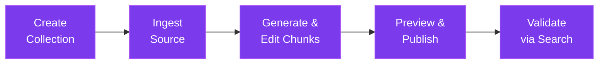

# Workflow Reference

## Flow 1: Ingest to Publish

1. Create a collection via `POST /api/collections`.
2. Ingest source content via `POST /api/ingest/*`.
3. Generate chunks (`POST /api/session/:id/chunks`) and edit/split/merge as needed.
4. Preview (`POST /api/session/:id/preview`) then publish (`POST /api/session/:id/publish`).
5. Validate with `POST /api/search`.

## Flow 2: Maintain Existing Collection

1. List collection chunks via `GET /api/collections/:id/chunks`.
2. Edit, split, merge, or reorder directly in the collection editor.
3. (Optional) Use the [Collection Agent](/docs/product/collection-agent) for AI-assisted suggestions and cleaning.
4. Validate with search queries.

## Flow 3: Incident-style Validation

1. Identify a missing or incorrect answer from the chat playground.
2. Locate the relevant collection and chunk via search or the collection editor.
3. Update chunk content via `PUT /api/collections/:id/chunks/:chunkId`.
4. Re-run the query to confirm the fix.
