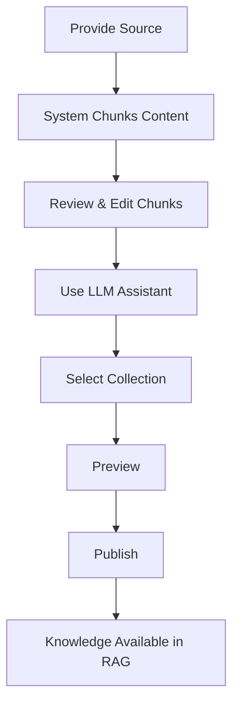

# Complete Workflow Guide

This guide covers the full workflow for managing knowledge in KMS-RAG, from ingestion to publishing.

## Workflow Overview



## Capabilities

All users have access to all features:

| Action | Description | Endpoint |
|--------|-------------|----------|
| **Create source** | Upload document, URL, or manual input | `POST /ingest` |
| **View chunks** | See chunked content with boundaries | `GET /sessions/:id` |
| **Edit chunk text** | Modify chunk content | `PATCH /sessions/:id/chunks/:chunkId` |
| **Split chunks** | Divide a chunk into smaller units | `POST /sessions/:id/chunks/:chunkId/split` |
| **Merge chunks** | Combine multiple chunks | `POST /sessions/:id/chunks/merge` |
| **Use LLM assistant** | Simplify, clarify, add examples | `POST /sessions/:id/refine` |
| **Manage collections** | Create, edit collections | `POST /collections` |
| **Preview** | Validate before publishing | `POST /sessions/:id/preview` |
| **Publish** | Make knowledge searchable | `POST /sessions/:id/publish` |
| **Bulk operations** | Mass edit chunks | Various batch endpoints |

## Primary Flow: Ingest → Chunk → Enrich → Save

**Goal:** Prepare knowledge for RAG from a source document.

### Step 1: Add Data Source

Provide content via one of three methods:

**Confluence Document:**
```bash
curl -X POST http://localhost:3000/api/ingest \
  -H "Content-Type: application/json" \
  -d '{
    "sourceType": "confluence",
    "sourceUrl": "https://company.atlassian.net/wiki/spaces/DOCS/pages/123456"
  }'
```

**URL/Web Page:**
```bash
curl -X POST http://localhost:3000/api/ingest \
  -H "Content-Type: application/json" \
  -d '{
    "sourceType": "url",
    "sourceUrl": "https://docs.example.com/guide"
  }'
```

**Manual Input:**
```bash
curl -X POST http://localhost:3000/api/ingest \
  -H "Content-Type: application/json" \
  -d '{
    "sourceType": "manual",
    "content": "Your knowledge content here...",
    "sourceUrl": "manual://my-knowledge"
  }'
```

**Response:**
```json
{
  "sessionId": "sess_abc123",
  "status": "DRAFT",
  "sourceId": "a1b2c3d4e5f6",
  "chunksCount": 8,
  "chunks": [
    {
      "id": "chunk_1",
      "content": "First semantic chunk...",
      "order": 0
    }
  ]
}
```

### Step 2: Review Chunks

View the generated chunks:

```bash
curl http://localhost:3000/api/sessions/sess_abc123
```

**What to evaluate:**
- Are chunks semantically complete?
- Are boundaries in sensible places?
- Is important context preserved?
- Are chunks appropriately sized (100-500 tokens ideal)?

### Step 3: Edit Chunks

#### Text Editing

Fix typos, improve clarity, add missing context:

```bash
curl -X PATCH http://localhost:3000/api/sessions/sess_abc123/chunks/chunk_1 \
  -H "Content-Type: application/json" \
  -d '{
    "content": "Updated chunk content with better clarity..."
  }'
```

#### Split Chunks

Divide a chunk that combines multiple concepts:

```bash
curl -X POST http://localhost:3000/api/sessions/sess_abc123/chunks/chunk_3/split \
  -H "Content-Type: application/json" \
  -d '{
    "splitPoints": [
      { "line": 5, "reason": "New concept starts here" }
    ]
  }'
```

**When to split:**
- Chunk exceeds 800 tokens
- Multiple unrelated topics combined
- Search precision suffers

#### Merge Chunks

Combine fragments that belong together:

```bash
curl -X POST http://localhost:3000/api/sessions/sess_abc123/chunks/merge \
  -H "Content-Type: application/json" \
  -d '{
    "chunkIds": ["chunk_4", "chunk_5"],
    "separator": "\n\n"
  }'
```

**When to merge:**
- Chunks are fragments of a single concept
- Context is lost when separated
- Chunks are too small (< 50 tokens)

### Step 4: Use LLM Assistant (Optional)

Enrich chunks with AI-assisted improvements:

**Available Scenarios:**

| Scenario | Purpose |
|----------|---------|
| `simplify` | Remove jargon, improve readability |
| `clarify` | Add definitions, explain terms |
| `add_examples` | Include practical examples |
| `restructure` | Improve semantic flow |
| `enrich_metadata` | Extract tags and keywords |

**Example: Simplify for clarity**

```bash
curl -X POST http://localhost:3000/api/sessions/sess_abc123/refine \
  -H "Content-Type: application/json" \
  -d '{
    "chunkId": "chunk_1",
    "scenario": "simplify",
    "targetAudience": "non-technical users"
  }'
```

**Response:**
```json
{
  "originalContent": "Navigate to the OAuth 2.0 configuration panel...",
  "suggestedContent": "Go to Settings > Login Options...",
  "scenario": "simplify",
  "reasoning": "Replaced technical term with user-friendly navigation"
}
```

**Important:** LLM results are suggestions. Review and apply manually:

```bash
curl -X PATCH http://localhost:3000/api/sessions/sess_abc123/chunks/chunk_1 \
  -H "Content-Type: application/json" \
  -d '{
    "content": "Go to Settings > Login Options..."
  }'
```

### Step 5: Select Collection

List available collections:

```bash
curl http://localhost:3000/api/collections
```

**Response:**
```json
{
  "collections": [
    {
      "id": "coll_api_docs",
      "name": "API Documentation",
      "description": "Technical API reference"
    },
    {
      "id": "coll_support_faq",
      "name": "Support FAQ",
      "description": "Common customer questions"
    }
  ]
}
```

**Creating a new collection:**

```bash
curl -X POST http://localhost:3000/api/collections \
  -H "Content-Type: application/json" \
  -d '{
    "name": "Product Guides",
    "description": "Step-by-step product tutorials",
    "purpose": "Answering how-to questions"
  }'
```

### Step 6: Preview

Lock the session and validate before publishing:

```bash
curl -X POST http://localhost:3000/api/sessions/sess_abc123/preview
```

**Response:**
```json
{
  "sessionId": "sess_abc123",
  "status": "LOCKED",
  "validation": {
    "isValid": true,
    "errors": [],
    "warnings": []
  },
  "chunksCount": 8,
  "estimatedTokens": 2400
}
```

**If validation fails:**
1. Unlock session: `POST /sessions/:id/unlock`
2. Fix issues
3. Preview again

### Step 7: Publish

Publish chunks to the selected collection:

```bash
curl -X POST http://localhost:3000/api/sessions/sess_abc123/publish \
  -H "Content-Type: application/json" \
  -d '{
    "collectionId": "coll_api_docs"
  }'
```

**Response:**
```json
{
  "success": true,
  "collectionId": "coll_api_docs",
  "publishedChunks": 8,
  "sourceId": "a1b2c3d4e5f6",
  "operation": "atomic_replace"
}
```

**What happens on publish:**
1. System finds all existing chunks with same `source_id`
2. Deletes old chunks (atomic delete)
3. Generates embeddings for new chunks
4. Inserts new chunks (atomic insert)
5. Clears draft session from Redis

## Improving Existing Knowledge

To update already-published content:

1. **Re-ingest the source** — Same URL generates same `source_id`
2. **Edit chunks** — Make improvements in new draft session
3. **Publish** — Atomic replacement deletes old, inserts new

**Key rule:** Re-ingesting same source URL creates a new session but maintains the same `source_id`, enabling clean atomic replacement.

## Bulk Operations

For mass updates across multiple chunks:

**Bulk tag assignment:**
```bash
curl -X POST http://localhost:3000/api/sessions/sess_abc123/chunks/bulk-update \
  -H "Content-Type: application/json" \
  -d '{
    "chunkIds": ["chunk_1", "chunk_2", "chunk_3"],
    "updates": {
      "metadata.tags": ["important", "api"]
    }
  }'
```

## Best Practices

### Good Chunks
- Self-contained semantic units
- 100-500 tokens (optimal for retrieval)
- Single topic or concept
- Include necessary context

### Bad Chunks
- Sentence fragments
- Multiple unrelated topics
- Too large (> 1000 tokens)
- Too small (< 50 tokens)

### Workflow Tips
- **Preview before publishing** — Catch errors early
- **Use LLM assistant** — But always review suggestions
- **Match collection to content** — Choose appropriate context
- **Test retrieval** — After publishing, verify with real queries

## Troubleshooting

### "Session not found"
Session may have expired (TTL). Re-ingest the source.

### "Collection not selected before publish"
Collection is required. Add `collectionId` to publish request.

### "Validation failed"
Check the `errors` array in preview response. Common issues:
- Empty chunks
- Missing required metadata
- Duplicate chunk IDs

## Related Documentation

- [Collections](/docs/product/collections) — Managing knowledge collections
- [Draft Sessions](/docs/product/sessions) — Session lifecycle in Redis
- [Publishing](/docs/product/publishing) — Atomic replacement explained
