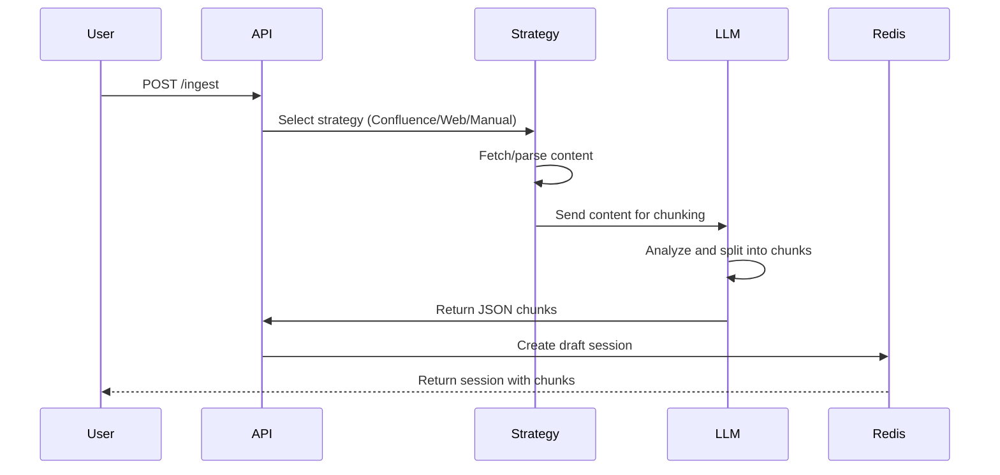

# Data Ingestion

RAGler supports multiple data sources for building your knowledge base. This guide covers the three ingestion strategies: Confluence, Web, and Manual input.

## Overview

**Ingestion** is the process of importing content into RAGler and transforming it into semantic chunks. All ingestion methods follow the same workflow:



## Ingestion Strategies

RAGler uses a **strategy pattern** to support different data sources. Each strategy handles content extraction differently, but all produce the same output: a draft session with chunks.

| Strategy | Source Type | Use Case | Requirements |
|----------|-------------|----------|--------------|
| **Confluence** | Atlassian Confluence pages | Corporate documentation, wikis | Confluence credentials |
| **Web** | Public web pages (URLs) | Blog posts, articles, public docs | Internet access |
| **Manual** | User-provided text | Custom content, small documents | None |

## Strategy 1: Manual Input

**Best for:** Quick testing, small snippets, custom content

### How It Works

1. User provides text content directly in the API request
2. Content is immediately sent to LLM for chunking
3. No external fetching required

### API Request

```bash
curl -X POST http://localhost:3000/api/ingest \
  -H "Content-Type: application/json" \
  -H "X-User-ID: you@example.com" \
  -H "X-User-Role: DEV" \
  -d '{
    "sourceType": "manual",
    "content": "Your content here...",
    "sourceUrl": "manual://my-custom-content",
    "metadata": {
      "title": "Custom Document",
      "author": "John Doe",
      "tags": ["tutorial", "example"]
    }
  }'
```

### Request Parameters

| Field | Type | Required | Description |
|-------|------|----------|-------------|
| `sourceType` | string | Yes | Must be `"manual"` |
| `content` | string | Yes | The text content to chunk (max 30,000 chars) |
| `sourceUrl` | string | No | Identifier for this content (default: `manual://untitled`) |
| `metadata` | object | No | Custom metadata (title, author, tags, etc.) |

### Example Response

```json
{
  "sessionId": "sess_abc123def456",
  "status": "DRAFT",
  "sourceId": "b3d4e5f6a1b2c3d4e5f6",
  "sourceUrl": "manual://my-custom-content",
  "sourceType": "manual",
  "chunksCount": 3,
  "chunks": [
    {
      "id": "chunk_1",
      "content": "First semantic chunk...",
      "order": 0
    },
    {
      "id": "chunk_2",
      "content": "Second semantic chunk...",
      "order": 1
    }
  ],
  "metadata": {
    "title": "Custom Document",
    "author": "John Doe"
  }
}
```

### Use Cases

- **Testing:** Quickly test chunking behavior with sample text
- **Short snippets:** FAQs, definitions, small glossaries
- **Custom content:** Content not available via URL or Confluence
- **API-generated content:** Programmatically created documentation

### Limitations

- Max content length: 30,000 characters (configurable via `LLM_CHUNKING_MAX_CONTENT_LENGTH`)
- No automatic refetching or synchronization
- No original source tracking (URL is user-defined)

## Strategy 2: Web URLs

**Best for:** Public documentation, blog posts, articles, external resources

### How It Works

1. User provides a URL
2. RAGler fetches the page content
3. HTML is parsed and converted to markdown
4. Cleaned text is sent to LLM for chunking

### API Request

```bash
curl -X POST http://localhost:3000/api/ingest \
  -H "Content-Type: application/json" \
  -H "X-User-ID: you@example.com" \
  -H "X-User-Role: DEV" \
  -d '{
    "sourceType": "web",
    "sourceUrl": "https://example.com/docs/guide.html"
  }'
```

### Request Parameters

| Field | Type | Required | Description |
|-------|------|----------|-------------|
| `sourceType` | string | Yes | Must be `"web"` |
| `sourceUrl` | string | Yes | Full URL to the web page (must be publicly accessible) |

### What Gets Extracted

- **Text content:** Paragraphs, headings, lists
- **Code blocks:** Preserves formatting
- **Tables:** Converted to markdown tables
- **Links:** Preserved as markdown links

**Ignored:**
- Navigation menus
- Advertisements
- Sidebars
- Footer content
- JavaScript-rendered content (currently)

### Example Response

```json
{
  "sessionId": "sess_web789xyz",
  "status": "DRAFT",
  "sourceId": "a1b2c3d4e5f6",
  "sourceUrl": "https://example.com/docs/guide.html",
  "sourceType": "web",
  "chunksCount": 5,
  "chunks": [...],
  "metadata": {
    "title": "Guide - Example Docs",
    "fetchedAt": "2026-02-06T10:30:00Z"
  }
}
```

### Use Cases

- **External documentation:** Ingest third-party library docs
- **Blog posts:** Import technical articles for reference
- **Public knowledge bases:** Competitor documentation, open-source wikis
- **Research:** Academic papers, whitepapers (if HTML)

### Limitations

- **Public URLs only:** Cannot access authenticated content
- **No JavaScript rendering:** Single-page apps (SPAs) may not work
- **Rate limiting:** Some sites may block automated fetching
- **Static snapshot:** Content is fetched once (no auto-sync)

### Best Practices

**Do:**
- ✅ Use for stable, public documentation
- ✅ Verify content quality after ingestion
- ✅ Re-ingest when source content updates

**Don't:**
- ❌ Scrape paywalled or authenticated content
- ❌ Violate robots.txt or site terms of service
- ❌ Ingest dynamic content that requires JavaScript

## Strategy 3: Confluence

**Best for:** Internal corporate documentation, team wikis, knowledge bases

### How It Works

1. User provides Confluence page URL
2. RAGler uses Confluence REST API to fetch page content
3. Confluence markup is converted to plain text
4. Text is sent to LLM for chunking

### Prerequisites

Before using Confluence ingestion, configure credentials in `.env`:

```bash
CONFLUENCE_BASE_URL=https://your-domain.atlassian.net
CONFLUENCE_USER_EMAIL=your-email@company.com
CONFLUENCE_API_TOKEN=your-confluence-api-token
```

**How to get an API token:**
1. Go to [id.atlassian.com/manage-profile/security/api-tokens](https://id.atlassian.com/manage-profile/security/api-tokens)
2. Click **Create API token**
3. Copy the token to `.env`

### API Request

```bash
curl -X POST http://localhost:3000/api/ingest \
  -H "Content-Type: application/json" \
  -H "X-User-ID: you@example.com" \
  -H "X-User-Role: DEV" \
  -d '{
    "sourceType": "confluence",
    "sourceUrl": "https://your-domain.atlassian.net/wiki/spaces/DOCS/pages/123456/My+Page"
  }'
```

### Request Parameters

| Field | Type | Required | Description |
|-------|------|----------|-------------|
| `sourceType` | string | Yes | Must be `"confluence"` |
| `sourceUrl` | string | Yes | Full URL to Confluence page |
| `pageId` | string | No | Confluence page ID (extracted from URL if omitted) |

### URL Formats Supported

RAGler supports multiple Confluence URL formats:

```
# Standard URL
https://domain.atlassian.net/wiki/spaces/SPACE/pages/123456/Page+Title

# Short URL
https://domain.atlassian.net/wiki/pages/123456

# Direct page ID (in request body)
{
  "sourceType": "confluence",
  "pageId": "123456"
}
```

### What Gets Extracted

- **Page title**
- **Page content:** Text, headings, lists
- **Macros:** Converted to text (best-effort)
- **Tables:** Preserved structure
- **Attachments:** Links preserved (files not downloaded)
- **Breadcrumbs:** Space and parent page context

### Example Response

```json
{
  "sessionId": "sess_conf456",
  "status": "DRAFT",
  "sourceId": "c4d5e6f7a8b9",
  "sourceUrl": "https://domain.atlassian.net/wiki/spaces/DOCS/pages/123456",
  "sourceType": "confluence",
  "chunksCount": 8,
  "chunks": [...],
  "metadata": {
    "title": "API Authentication Guide",
    "space": "DOCS",
    "pageId": "123456",
    "breadcrumbs": "Documentation > API > Authentication",
    "lastModified": "2026-01-15T14:30:00Z",
    "author": "jane.doe@company.com"
  }
}
```

### Use Cases

- **Internal documentation:** Engineering wikis, product specs
- **Team knowledge bases:** Support documentation, runbooks
- **Process documentation:** Onboarding guides, SOPs
- **Meeting notes:** Decision records, project plans

### Limitations

- **Single page only:** Does not crawl child pages or spaces
- **No real-time sync:** Content is fetched once (snapshot)
- **Requires credentials:** Must configure API token
- **Timeouts:** Large pages (>30k chars) may need increased timeout

### Best Practices

**Do:**
- ✅ Use for stable, well-structured Confluence pages
- ✅ Re-ingest when page content is updated significantly
- ✅ Set appropriate timeouts for large pages
- ✅ Use page IDs for faster access

**Don't:**
- ❌ Bulk crawl entire spaces (not supported in MVP)
- ❌ Expect real-time synchronization
- ❌ Ingest pages with heavy macros (may not render correctly)

### Troubleshooting Confluence Ingestion

**401 Unauthorized:**
```
Error: Confluence authentication failed
```
- Verify `CONFLUENCE_API_TOKEN` is correct
- Check `CONFLUENCE_USER_EMAIL` matches token owner
- Ensure token has read permissions

**404 Page Not Found:**
```
Error: Confluence page 123456 not found
```
- Verify page ID is correct
- Check page is not deleted or archived
- Ensure you have read permissions for the page

**Timeout:**
```
Error: Confluence fetch timeout after 30000ms
```
- Increase `CONFLUENCE_FETCH_TIMEOUT` in `.env`
- Page may be very large (try splitting it manually)

## Ingestion Best Practices

### Content Preparation

**Before ingesting:**
1. **Review source quality:**
   - Well-structured content chunks better
   - Remove navigation, ads, irrelevant sections
   - Use headings to organize content

2. **Check content length:**
   - Max: 30,000 characters (default)
   - Large documents should be split at source
   - Consider chunking long pages manually

3. **Verify source stability:**
   - Use stable URLs (not temporary links)
   - Avoid dynamic content that changes frequently

### After Ingestion

1. **Review chunks:** Always preview before publishing
2. **Edit as needed:** Fix formatting, clarify content
3. **Test retrieval:** After publishing, verify chunks are searchable
4. **Monitor quality:** Track which sources produce good chunks

### Re-Ingestion Strategy

**When to re-ingest:**
- Source content has changed significantly
- Chunks need restructuring (new chunking strategy)
- Fixing errors in published content

**How re-ingestion works:**
1. Create new session from same source URL
2. Edit chunks in new session
3. Publish → **Atomic replacement** deletes old chunks, inserts new ones
4. Same `source_id` ensures clean replacement

## Ingestion Workflow Comparison

| Step | Manual | Web | Confluence |
|------|--------|-----|------------|
| 1. Fetch content | None (provided) | HTTP GET | Confluence API |
| 2. Parse | None | HTML → Markdown | Confluence markup → Text |
| 3. Clean | None | Remove nav/ads | Remove macros |
| 4. Chunk | LLM (GPT-4o) | LLM (GPT-4o) | LLM (GPT-4o) |
| 5. Session | Redis | Redis | Redis |
| 6. User edits | ✓ | ✓ | ✓ |
| 7. Publish | Qdrant | Qdrant | Qdrant |

## API Reference

### POST /api/ingest

Create a new draft session from a data source.

**Request Headers:**
```
Content-Type: application/json
X-User-ID: your-email@example.com
X-User-Role: DEV|ML|L2
```

**Request Body (Manual):**
```json
{
  "sourceType": "manual",
  "content": "Text content here...",
  "sourceUrl": "manual://identifier",
  "metadata": {}
}
```

**Request Body (Web):**
```json
{
  "sourceType": "web",
  "sourceUrl": "https://example.com/page"
}
```

**Request Body (Confluence):**
```json
{
  "sourceType": "confluence",
  "sourceUrl": "https://domain.atlassian.net/wiki/spaces/X/pages/123456"
}
```

**Response (201 Created):**
```json
{
  "sessionId": "sess_...",
  "status": "DRAFT",
  "sourceId": "...",
  "sourceUrl": "...",
  "sourceType": "manual|web|confluence",
  "chunksCount": 5,
  "chunks": [...]
}
```

**Error Responses:**
- `400 Bad Request` — Invalid source type or missing required fields
- `401 Unauthorized` — Missing or invalid authentication (Confluence)
- `404 Not Found` — Source not found (Confluence page, web URL)
- `408 Request Timeout` — Fetch or chunking timeout
- `429 Too Many Requests` — Rate limit exceeded (OpenAI or source)
- `500 Internal Server Error` — LLM failure or system error

## Advanced Configuration

### Timeouts

Adjust timeouts for different scenarios:

```bash
# In .env
CONFLUENCE_FETCH_TIMEOUT=60000     # Confluence API call timeout
LLM_CHUNKING_TIMEOUT=120000        # LLM chunking timeout
```

### Content Length Limits

Control maximum content size:

```bash
LLM_CHUNKING_MAX_CONTENT_LENGTH=30000  # Max characters per document
```

Larger documents:
- Split at source before ingesting
- Or increase limit (may increase costs and latency)

### Retry Behavior

Configure retry attempts for transient failures:

```bash
LLM_CHUNKING_MAX_RETRIES=2  # Retry LLM calls
```

## Related Documentation

- [Draft Sessions](/docs/product/sessions) — Managing chunks after ingestion
- [Publishing](/docs/product/publishing) — Making chunks searchable
- [Configuration Guide](/docs/getting-started/configuration) — Setting up Confluence credentials
- [Architecture: Ingest Module](/docs/architecture/modules/ingest) — Technical implementation details
