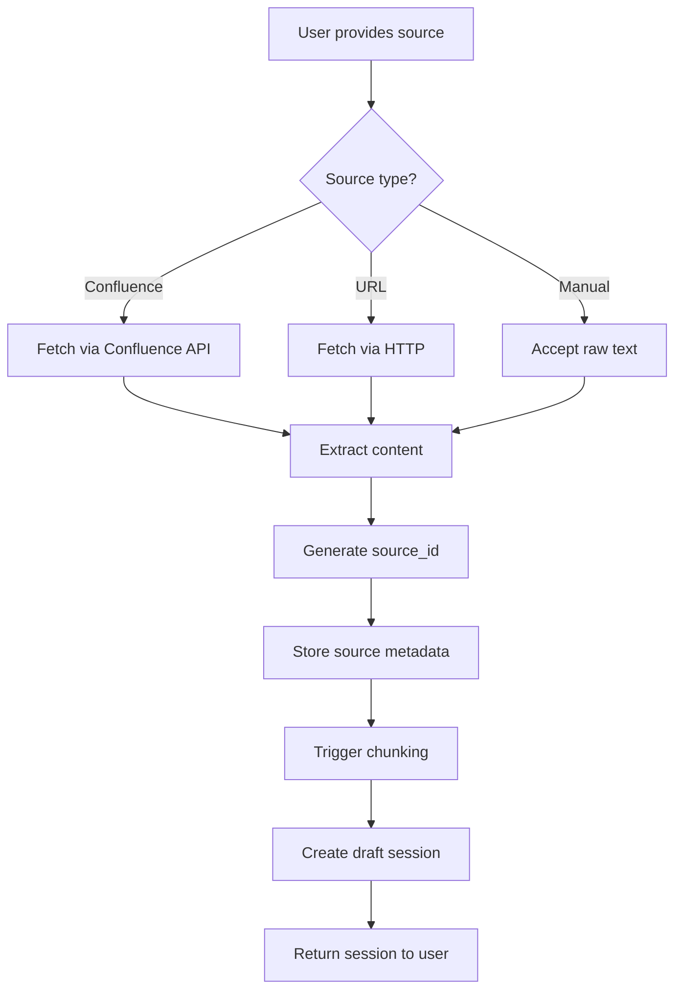

# FTR-001: Data Ingestion

**Status:** Draft
**BRD Reference:** Sections 4, 5.1
**Author:** BA Skill
**Date:** 2026-02-12
**Reviewers:** Product, Engineering

---

## 1. Executive Summary

Data Ingestion enables users to import knowledge from multiple source types (Confluence, URL, manual input) into the system for processing. This is the entry point for all knowledge that will eventually be searchable via RAG.

---

## 2. Business Context

### 2.1 Problem Statement

Teams have knowledge scattered across Confluence, web pages, and tribal knowledge. This content needs to be brought into the RAG system in a structured way that preserves source attribution and enables re-processing.

### 2.2 Business Goals

- Enable importing from Confluence documents via link
- Support URL/web page content extraction
- Allow manual knowledge entry
- Maintain source-to-chunk traceability

### 2.3 Success Metrics

| Metric | Current | Target |
|--------|---------|--------|
| Source types supported | 0 | 3 (Confluence, URL, Manual) |
| Ingestion success rate | N/A | > 95% |
| Time to ingest (p95) | N/A | < 30s |

### 2.4 User Stories

- As a user, I want to paste a Confluence link so that I can import that document's content
- As a user, I want to provide a URL so that I can import web page content
- As a user, I want to manually enter content so that I can add tribal knowledge

---

## 3. Functional Requirements

### 3.1 In Scope

- FR-001-001: System shall accept Confluence document URLs and extract content
- FR-001-002: System shall accept arbitrary URLs and extract text content
- FR-001-003: System shall accept manual text input as a source
- FR-001-004: System shall generate a unique, deterministic `source_id` from source URL
- FR-001-005: System shall store source metadata (URL, type, timestamp)
- FR-001-006: System shall trigger chunking automatically after ingestion
- FR-001-007: System shall create a draft session containing the ingested source

### 3.2 Out of Scope

- Real-time synchronization with Confluence
- Bulk scanning of Confluence spaces
- Automatic re-ingestion on source changes
- File upload (PDF, DOCX, etc.) — future enhancement

### 3.3 User Flow

### 3.4 Acceptance Criteria

- [ ] AC-001: Given a valid Confluence URL, when user submits, then content is extracted and session created
- [ ] AC-002: Given a valid web URL, when user submits, then text content is extracted and session created
- [ ] AC-003: Given manual text, when user submits, then source is created and session returned
- [ ] AC-004: Given the same URL submitted twice, then both sessions have identical `source_id`
- [ ] AC-005: Given an invalid URL, when user submits, then appropriate error is returned
- [ ] AC-006: Given Confluence URL without access, when user submits, then auth error is returned

---

## 4. Non-Functional Requirements (NFR)

### 4.1 Performance

- Ingestion request response time: < 5s (p50), < 30s (p95)
- Confluence fetch timeout: 30s
- URL fetch timeout: 15s

### 4.2 Scalability

- Expected load: 10-50 ingestions/day initially
- Growth projection: 100-500 ingestions/day at scale

### 4.3 Reliability

- Availability target: 99.5%
- Recovery: Failed ingestions should be retryable without side effects

### 4.4 Security

- Confluence API: Use user-provided credentials or service account
- URL fetching: Validate URL format, respect robots.txt
- No sensitive data logged (full content not in logs)

---

## 5. Technical Considerations

### 5.1 Affected Modules

| Module | Change Type | Complexity |
|--------|-------------|------------|
| `ingest` | Primary | High |
| `session` | Integration | Medium |
| `llm` | Consumer | Low |

### 5.2 Integration Points

- External: Confluence REST API, HTTP for URLs
- Internal: Session module (creates draft), LLM module (triggers chunking)

### 5.3 Data Model Impact

- New entity: `DataSource` (stored as session metadata)
- Fields: `source_id`, `source_type`, `source_url`, `raw_content`, `created_at`

### 5.4 Observability Requirements

- Log events: `ingest_start`, `ingest_fetch_success`, `ingest_fetch_failure`, `ingest_complete`
- Metrics: `ingest_requests_total{source_type,status}`, `ingest_duration_seconds{source_type}`

---

## 6. Dependencies & Risks

### 6.1 Dependencies

| ID | Dependency | Type | Status |
|----|------------|------|--------|
| DEP-001 | Confluence API access | Blocking | Requires credentials |
| DEP-002 | Session module | Blocking | Must be implemented first |

### 6.2 Risks

| ID | Risk | Probability | Impact | Mitigation |
|----|------|-------------|--------|------------|
| RISK-001 | Confluence API rate limits | Medium | High | Implement backoff, queue |
| RISK-002 | URL content extraction fails | Medium | Medium | Graceful degradation, manual fallback |

### 6.3 Assumptions

- ASM-001: Confluence credentials will be provided at system level
- ASM-002: Most URLs will be publicly accessible or use standard auth

---

## 7. Implementation Guidance

### 7.1 Recommended Approach

Use strategy pattern for source types. Each source type (Confluence, URL, Manual) implements a common `IngestStrategy` interface. This allows easy addition of new source types.

### 7.2 Test Strategy

- Unit tests: Strategy implementations, source_id generation
- Integration tests: Full ingest flow with mocked external services
- E2E tests: Real Confluence/URL ingestion (in CI with test accounts)

### 7.3 Rollout Strategy

- Feature flag: No (core MVP feature)
- Phased rollout: Start with manual input, then URL, then Confluence
- Rollback plan: Disable individual strategies via config

---

## 8. Open Questions

| ID | Question | Owner | Due Date | Resolution |
|----|----------|-------|----------|------------|
| Q-001 | How to handle Confluence auth? Service account vs user token? | Engineering | TBD | |
| Q-002 | Should we support authenticated URLs (Bearer token)? | Product | TBD | |

---

## 9. Approval

| Role | Name | Date | Status |
|------|------|------|--------|
| Product | | | Pending |
| Engineering | | | Pending |
| Architecture | | | Pending |

---

## Changelog

| Version | Date | Author | Changes |
|---------|------|--------|---------|
| 0.1 | 2026-02-12 | BA Skill | Initial draft |
