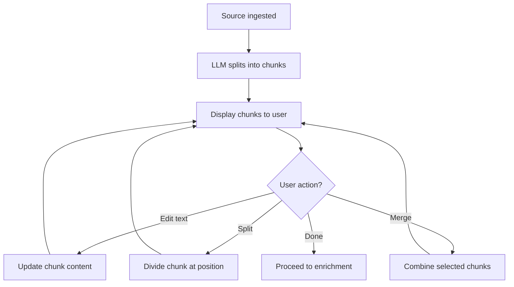

# FTR-002: Chunking

**Status:** Draft
**BRD Reference:** Section 5.2
**Author:** BA Skill
**Date:** 2026-02-12
**Reviewers:** Product, Engineering

---

## 1. Executive Summary

Chunking transforms raw source content into semantic units (chunks) suitable for RAG retrieval. The system uses LLM to intelligently split content, then allows users to manually refine chunk boundaries through split and merge operations.

---

## 2. Business Context

### 2.1 Problem Statement

Raw documents are too large for effective RAG retrieval. Content must be split into appropriately-sized, semantically coherent chunks that can be independently retrieved and used as context.

### 2.2 Business Goals

- Automatically split source content using LLM intelligence
- Enable manual refinement of chunk boundaries
- Produce chunks optimized for retrieval (100-500 tokens)
- Preserve semantic coherence within chunks

### 2.3 Success Metrics

| Metric | Current | Target |
|--------|---------|--------|
| Avg chunks per source | N/A | 5-20 |
| Chunk size distribution | N/A | 80% in 100-500 token range |
| User edit rate | N/A | < 30% of chunks need manual adjustment |

### 2.4 User Stories

- As a user, I want the system to automatically split my content so that I don't have to do it manually
- As a user, I want to split a large chunk so that each concept is separate
- As a user, I want to merge small chunks so that related content stays together

---

## 3. Functional Requirements

### 3.1 In Scope

- FR-002-001: System shall use LLM to split source into semantic chunks
- FR-002-002: System shall present chunks to user with visible boundaries
- FR-002-003: System shall allow user to split a chunk at specified position
- FR-002-004: System shall allow user to merge multiple adjacent chunks
- FR-002-005: System shall allow user to edit chunk text content
- FR-002-006: System shall maintain chunk order within session
- FR-002-007: System shall preserve original source reference in each chunk

### 3.2 Out of Scope

- Automatic chunk quality scoring
- ML-based chunk boundary optimization
- Custom chunking strategies per source type

### 3.3 User Flow

### 3.4 Acceptance Criteria

- [ ] AC-001: Given source content, when chunking triggered, then LLM returns array of chunks
- [ ] AC-002: Given a chunk, when user requests split at line N, then chunk becomes two chunks
- [ ] AC-003: Given two adjacent chunks, when user requests merge, then chunks combine into one
- [ ] AC-004: Given chunk edit, when user updates text, then chunk content is updated
- [ ] AC-005: Given split operation, then chunk order is maintained correctly
- [ ] AC-006: Given merge operation, then combined content preserves logical flow

---

## 4. Non-Functional Requirements (NFR)

### 4.1 Performance

- LLM chunking response time: < 15s (p95) for typical document
- Split/merge operations: < 500ms (p95)
- Max source size for chunking: 50,000 tokens

### 4.2 Scalability

- Concurrent chunking operations: 10-20 simultaneous
- Chunk count per session: up to 100 chunks

### 4.3 Reliability

- Chunking failures should not corrupt session state
- Partial chunking results should be recoverable

### 4.4 Security

- Chunk content processed via LLM should not be logged in full
- User edits should be sanitized for XSS if rendered

---

## 5. Technical Considerations

### 5.1 Affected Modules

| Module | Change Type | Complexity |
|--------|-------------|------------|
| `llm` | Primary | High |
| `session` | Integration | Medium |

### 5.2 Integration Points

- External: OpenAI API for chunking
- Internal: Session module (stores chunks in Redis)

### 5.3 Data Model Impact

- Entity: `Chunk` within session
- Fields: `id`, `content`, `order`, `original_content`, `metadata`

### 5.4 Observability Requirements

- Log events: `chunking_start`, `chunking_complete`, `chunking_failure`, `chunk_split`, `chunk_merge`
- Metrics: `chunking_duration_seconds`, `chunks_per_session`, `chunk_operations_total{operation}`

---

## 6. Dependencies & Risks

### 6.1 Dependencies

| ID | Dependency | Type | Status |
|----|------------|------|--------|
| DEP-001 | OpenAI API access | Blocking | Required |
| DEP-002 | Session module | Blocking | Must store chunks |

### 6.2 Risks

| ID | Risk | Probability | Impact | Mitigation |
|----|------|-------------|--------|------------|
| RISK-001 | LLM produces poor chunk boundaries | Medium | Medium | Allow manual refinement |
| RISK-002 | Large documents timeout | Low | High | Implement streaming, size limits |

### 6.3 Assumptions

- ASM-001: GPT-4o or similar model provides acceptable chunking quality
- ASM-002: Most documents fit within context window

---

## 7. Implementation Guidance

### 7.1 Recommended Approach

Use a structured prompt that instructs LLM to identify semantic boundaries. Return chunks as JSON array with content and suggested boundaries. Store in Redis as array within session object.

### 7.2 Test Strategy

- Unit tests: Split/merge logic, order maintenance
- Integration tests: LLM chunking with mocked responses
- E2E tests: Full chunking flow with real LLM

### 7.3 Rollout Strategy

- Feature flag: No (core MVP feature)
- Phased rollout: N/A
- Rollback plan: Fallback to simple character-based splitting if LLM unavailable

---

## 8. Open Questions

| ID | Question | Owner | Due Date | Resolution |
|----|----------|-------|----------|------------|
| Q-001 | What prompt produces best chunking results? | Engineering | TBD | |
| Q-002 | Should we show token count per chunk in UI? | Product | TBD | |

---

## 9. Approval

| Role | Name | Date | Status |
|------|------|------|--------|
| Product | | | Pending |
| Engineering | | | Pending |
| Architecture | | | Pending |

---

## Changelog

| Version | Date | Author | Changes |
|---------|------|--------|---------|
| 0.1 | 2026-02-12 | BA Skill | Initial draft |
