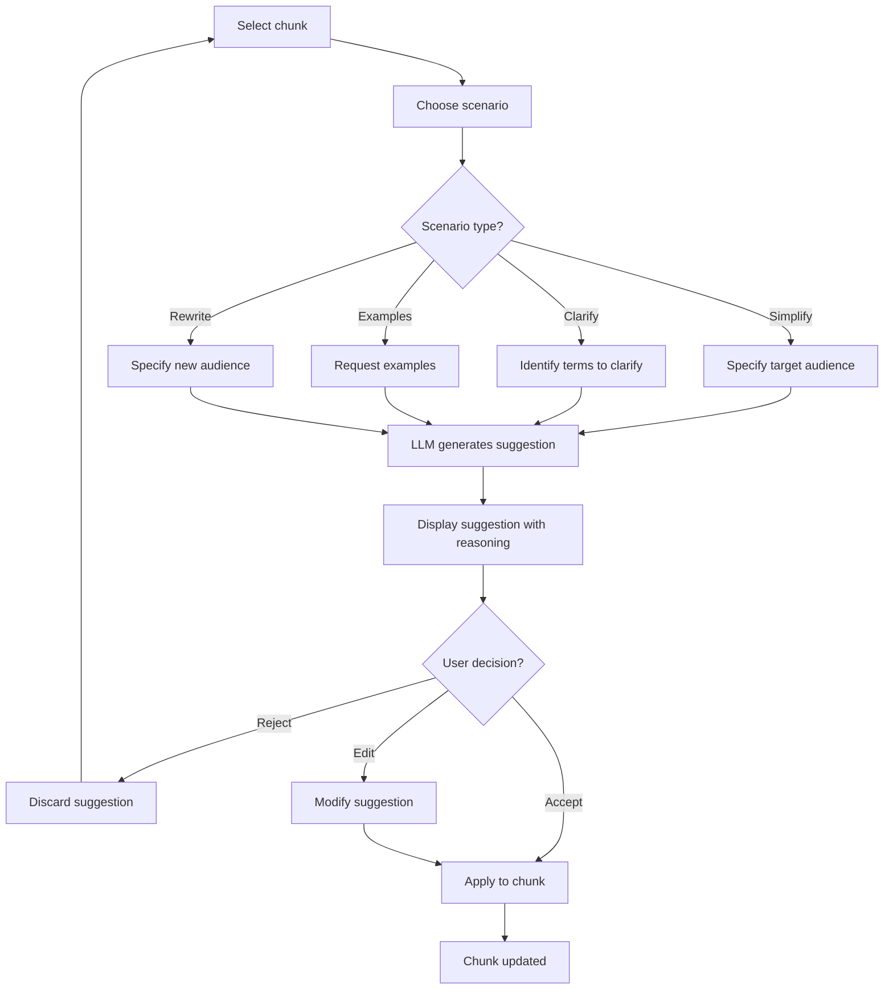

# FTR-003: Enrichment

**Status:** Draft
**BRD Reference:** Section 5.3
**Author:** BA Skill
**Date:** 2026-02-12
**Reviewers:** Product, Engineering

---

## 1. Executive Summary

Enrichment enables users to improve chunk quality through LLM-assisted scenarios. The system provides predefined scenarios (simplify, clarify, add examples, rewrite) that generate suggestions for user approval. All enrichment is proposal-based — changes are never auto-applied.

---

## 2. Business Context

### 2.1 Problem Statement

Raw content often contains jargon, lacks examples, or is poorly structured for the target audience. Users need AI assistance to improve content quality without requiring prompt engineering skills.

### 2.2 Business Goals

- Provide easy-to-use LLM scenarios for content improvement
- Maintain human control over all changes (HITL)
- Support common enrichment patterns (simplify, clarify, examples)
- Enable iterative refinement of chunk quality

### 2.3 Success Metrics

| Metric | Current | Target |
|--------|---------|--------|
| LLM scenario usage rate | N/A | > 50% of sessions use at least one |
| Suggestion acceptance rate | N/A | > 70% |
| Avg enrichment iterations | N/A | 1-2 per chunk |

### 2.4 User Stories

- As a user, I want to simplify technical jargon so that non-experts can understand
- As a user, I want to add examples so that concepts are clearer
- As a user, I want to clarify terminology so that ambiguous terms are defined
- As a user, I want to review suggestions before applying so that I maintain control

---

## 3. Functional Requirements

### 3.1 In Scope

- FR-003-001: System shall provide "simplify" scenario to reduce complexity
- FR-003-002: System shall provide "clarify" scenario to add definitions
- FR-003-003: System shall provide "add examples" scenario
- FR-003-004: System shall provide "rewrite for audience" scenario
- FR-003-005: System shall accept target audience parameter for relevant scenarios
- FR-003-006: System shall return suggestions with reasoning
- FR-003-007: User must explicitly apply suggestions (no auto-apply)
- FR-003-008: System shall allow manual context addition without LLM

### 3.2 Out of Scope

- Custom user-defined scenarios
- Batch enrichment across multiple chunks
- Automatic enrichment suggestions

### 3.3 User Flow

### 3.4 Acceptance Criteria

- [ ] AC-001: Given chunk and "simplify" scenario, when submitted, then LLM returns simplified version
- [ ] AC-002: Given chunk and "clarify" scenario, when submitted, then LLM adds definitions
- [ ] AC-003: Given chunk and "add examples" scenario, when submitted, then LLM adds relevant examples
- [ ] AC-004: Given suggestion, when user accepts, then chunk content is updated
- [ ] AC-005: Given suggestion, when user rejects, then chunk remains unchanged
- [ ] AC-006: Given suggestion, user can edit before applying
- [ ] AC-007: System never auto-applies LLM suggestions

---

## 4. Non-Functional Requirements (NFR)

### 4.1 Performance

- Scenario response time: < 10s (p95)
- Suggestion generation: streaming preferred for UX

### 4.2 Scalability

- Concurrent enrichment requests: 20-50 simultaneous

### 4.3 Reliability

- Failed enrichment should not affect chunk state
- Retryable without side effects

### 4.4 Security

- Chunk content sent to LLM should follow data handling policies
- Suggestions should not execute code (sanitize output)

---

## 5. Technical Considerations

### 5.1 Affected Modules

| Module | Change Type | Complexity |
|--------|-------------|------------|
| `llm` | Primary | Medium |
| `session` | Consumer | Low |

### 5.2 Integration Points

- External: OpenAI API
- Internal: Session module (updates chunks)

### 5.3 Data Model Impact

- No new entities
- Chunk may store `enrichment_history` for audit trail (optional)

### 5.4 Observability Requirements

- Log events: `enrichment_request`, `enrichment_success`, `enrichment_applied`, `enrichment_rejected`
- Metrics: `enrichment_requests_total{scenario,status}`, `enrichment_duration_seconds{scenario}`

---

## 6. Dependencies & Risks

### 6.1 Dependencies

| ID | Dependency | Type | Status |
|----|------------|------|--------|
| DEP-001 | OpenAI API | Blocking | Required |
| DEP-002 | Chunking complete | Informational | Enrichment follows chunking |

### 6.2 Risks

| ID | Risk | Probability | Impact | Mitigation |
|----|------|-------------|--------|------------|
| RISK-001 | LLM produces poor suggestions | Medium | Low | User can reject/edit |
| RISK-002 | Suggestions change meaning | Low | High | Show diff, require confirmation |

### 6.3 Assumptions

- ASM-001: Predefined scenarios cover 80%+ of use cases
- ASM-002: Users will review suggestions before applying

---

## 7. Implementation Guidance

### 7.1 Recommended Approach

Create scenario-specific prompt templates. Each scenario has a system prompt defining the transformation and expected output format. Return both suggested content and reasoning for transparency.

### 7.2 Test Strategy

- Unit tests: Scenario selection, suggestion application
- Integration tests: LLM scenarios with mocked responses
- E2E tests: Full enrichment flow

### 7.3 Rollout Strategy

- Feature flag: No (core MVP feature)
- Phased rollout: Start with simplify, add others iteratively
- Rollback plan: Disable individual scenarios

---

## 8. Open Questions

| ID | Question | Owner | Due Date | Resolution |
|----|----------|-------|----------|------------|
| Q-001 | Should we show diffs for before/after? | Product | TBD | |
| Q-002 | Store enrichment history for audit? | Product | TBD | |

---

## 9. Approval

| Role | Name | Date | Status |
|------|------|------|--------|
| Product | | | Pending |
| Engineering | | | Pending |
| Architecture | | | Pending |

---

## Changelog

| Version | Date | Author | Changes |
|---------|------|--------|---------|
| 0.1 | 2026-02-12 | BA Skill | Initial draft |
