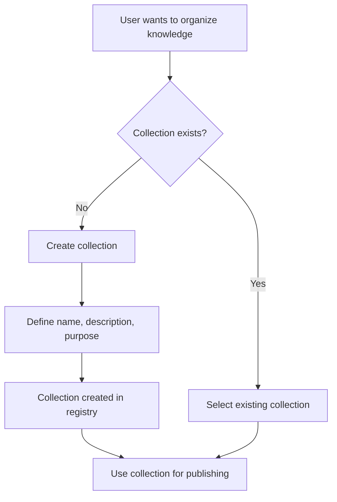

# FTR-004: Collections

**Status:** Draft
**BRD Reference:** Section 3
**Author:** BA Skill
**Date:** 2026-02-12
**Reviewers:** Product, Engineering

---

## 1. Executive Summary

Collections are logical groupings of chunks that define a knowledge context. Each collection describes its purpose, target audience, and expected use scenarios. Collections provide organizational structure and context for RAG retrieval.

---

## 2. Business Context

### 2.1 Problem Statement

Without organization, chunks become a flat list that's hard to manage and search. Collections provide context that helps both users (finding relevant knowledge) and RAG (scoping retrieval to relevant context).

### 2.2 Business Goals

- Organize knowledge by purpose and audience
- Enable scoped retrieval within collections
- Provide metadata for knowledge management
- Prevent orphaned chunks when collections change

### 2.3 Success Metrics

| Metric | Current | Target |
|--------|---------|--------|
| Collections created | 0 | 5-20 active |
| Avg chunks per collection | N/A | 50-200 |
| Collection metadata completeness | N/A | 100% have purpose defined |

### 2.4 User Stories

- As a user, I want to create collections so that I can organize knowledge by topic
- As a user, I want to describe collection purpose so that others understand its scope
- As a user, I want to assign chunks to collections so that knowledge is organized
- As a user, I want to prevent accidental chunk loss when deleting collections

---

## 3. Functional Requirements

### 3.1 In Scope

- FR-004-001: System shall allow creating collections with name and description
- FR-004-002: System shall require purpose/audience specification for collections
- FR-004-003: System shall allow editing collection metadata
- FR-004-004: System shall list all collections with chunk counts
- FR-004-005: System shall prevent deletion of collections with chunks (require migration)
- FR-004-006: Collection must be selected before publishing chunks
- FR-004-007: System shall store collection metadata in registry

### 3.2 Out of Scope

- Hierarchical collections (folders)
- Collection sharing/permissions
- Collection versioning

### 3.3 User Flow

### 3.4 Acceptance Criteria

- [ ] AC-001: Given collection details, when user creates, then collection appears in registry
- [ ] AC-002: Given collection, when user edits metadata, then changes are persisted
- [ ] AC-003: Given collection with chunks, when user attempts delete, then warning shown
- [ ] AC-004: Given publish request without collection, then error returned
- [ ] AC-005: Given collection list request, then all collections with counts returned

---

## 4. Non-Functional Requirements (NFR)

### 4.1 Performance

- Collection CRUD operations: < 200ms (p95)
- Collection listing: < 500ms for up to 100 collections

### 4.2 Scalability

- Max collections: 1000
- Max chunks per collection: 10,000

### 4.3 Reliability

- Collection metadata must be durable (survive restarts)
- Registry consistency with vector store

### 4.4 Security

- Collection names should not contain executable content
- Validate input lengths

---

## 5. Technical Considerations

### 5.1 Affected Modules

| Module | Change Type | Complexity |
|--------|-------------|------------|
| `collection` | Primary | Medium |
| `vector` | Integration | Low |

### 5.2 Integration Points

- External: Qdrant (collections map to Qdrant collections or namespaces)
- Internal: Publishing module (requires collection), Session module (selection)

### 5.3 Data Model Impact

- Entity: `Collection` in `sys_registry` (Qdrant)
- Fields: `id`, `name`, `description`, `purpose`, `target_audience`, `created_at`, `updated_at`, `chunk_count`

### 5.4 Observability Requirements

- Log events: `collection_created`, `collection_updated`, `collection_deleted`
- Metrics: `collections_total`, `chunks_per_collection`

---

## 6. Dependencies & Risks

### 6.1 Dependencies

| ID | Dependency | Type | Status |
|----|------------|------|--------|
| DEP-001 | Qdrant connection | Blocking | Required |
| DEP-002 | Registry pattern | Informational | sys_registry design |

### 6.2 Risks

| ID | Risk | Probability | Impact | Mitigation |
|----|------|-------------|--------|------------|
| RISK-001 | Collection/Qdrant mismatch | Low | High | Sync on startup, health checks |
| RISK-002 | Orphaned chunks on delete | Medium | Medium | Require migration before delete |

### 6.3 Assumptions

- ASM-001: Collections map 1:1 to Qdrant collections or use filtering
- ASM-002: Collection count will remain manageable (< 100 typical)

---

## 7. Implementation Guidance

### 7.1 Recommended Approach

Store collection registry in Qdrant `sys_registry` collection as metadata documents. Each collection entry contains metadata but no vectors. Use filtering on `collection_id` payload field for chunk retrieval.

### 7.2 Test Strategy

- Unit tests: Collection CRUD, validation
- Integration tests: Registry persistence, Qdrant sync
- E2E tests: Full collection lifecycle

### 7.3 Rollout Strategy

- Feature flag: No (core MVP feature)
- Phased rollout: N/A
- Rollback plan: Collections are stored in Qdrant, standard backup/restore

---

## 8. Open Questions

| ID | Question | Owner | Due Date | Resolution |
|----|----------|-------|----------|------------|
| Q-001 | One Qdrant collection per logical collection, or shared with filtering? | Architecture | TBD | |
| Q-002 | Should collections have owners? | Product | TBD | Deferred (no auth) |

---

## 9. Approval

| Role | Name | Date | Status |
|------|------|------|--------|
| Product | | | Pending |
| Engineering | | | Pending |
| Architecture | | | Pending |

---

## Changelog

| Version | Date | Author | Changes |
|---------|------|--------|---------|
| 0.1 | 2026-02-12 | BA Skill | Initial draft |
