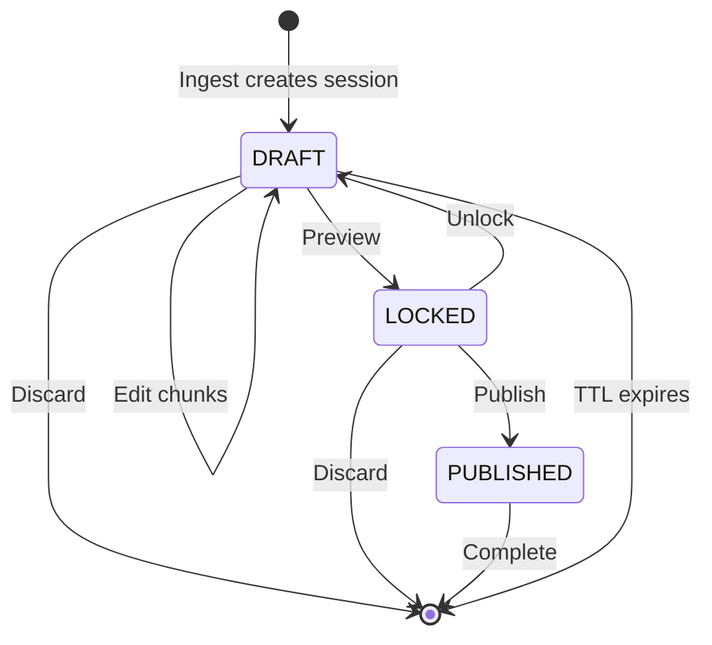

# FTR-005: Draft Sessions

**Status:** Draft
**BRD Reference:** Section 6.1-6.3
**Author:** BA Skill
**Date:** 2026-02-12
**Reviewers:** Product, Engineering

---

## 1. Executive Summary

Draft Sessions provide a temporary workspace for editing chunks before publishing. Sessions are stored in Redis with TTL, isolating work-in-progress from published knowledge. Users can edit, preview, and either publish or discard sessions.

---

## 2. Business Context

### 2.1 Problem Statement

Users need a safe space to work on knowledge without affecting production RAG. Changes should be reviewable before publishing, and incomplete work should not pollute the vector store.

### 2.2 Business Goals

- Isolate draft work from published content
- Enable preview before publishing
- Auto-expire abandoned sessions
- Support atomic publish or discard

### 2.3 Success Metrics

| Metric | Current | Target |
|--------|---------|--------|
| Avg session duration | N/A | 5-30 minutes |
| Session publish rate | N/A | > 80% |
| Abandoned sessions | N/A | < 20% |

### 2.4 User Stories

- As a user, I want my edits saved in a draft so that I can review before publishing
- As a user, I want to preview final state so that I can catch errors
- As a user, I want to discard a session so that I can start over
- As a user, I want sessions to auto-expire so that old drafts don't accumulate

---

## 3. Functional Requirements

### 3.1 In Scope

- FR-005-001: System shall create session on ingestion
- FR-005-002: System shall store session data in Redis
- FR-005-003: Sessions shall have configurable TTL (default 24h)
- FR-005-004: System shall allow retrieving session by ID
- FR-005-005: System shall allow updating chunks within session
- FR-005-006: System shall provide preview endpoint (lock session)
- FR-005-007: System shall allow unlocking session for further edits
- FR-005-008: System shall allow explicit session deletion (discard)
- FR-005-009: Session shall track status: DRAFT → LOCKED → PUBLISHED

### 3.2 Out of Scope

- Multi-user collaboration on sessions
- Session history/undo
- Session cloning

### 3.3 User Flow

### 3.4 Acceptance Criteria

- [ ] AC-001: Given ingestion, when complete, then session created with DRAFT status
- [ ] AC-002: Given session ID, when retrieved, then all chunks returned
- [ ] AC-003: Given chunk update, when saved, then session reflects change
- [ ] AC-004: Given preview request, when called, then session locks to LOCKED status
- [ ] AC-005: Given locked session, when unlock called, then status returns to DRAFT
- [ ] AC-006: Given discard request, then session deleted from Redis
- [ ] AC-007: Given TTL expiry, then session auto-deleted

---

## 4. Non-Functional Requirements (NFR)

### 4.1 Performance

- Session retrieval: < 100ms (p95)
- Session update: < 200ms (p95)
- Max session size: 10MB (serialized)

### 4.2 Scalability

- Concurrent active sessions: 100-500
- Max chunks per session: 100

### 4.3 Reliability

- Sessions must survive Redis restart (persistence)
- No data loss on normal operation

### 4.4 Security

- Session IDs should be unguessable (UUID)
- Sessions should not be accessible cross-user (future auth)

---

## 5. Technical Considerations

### 5.1 Affected Modules

| Module | Change Type | Complexity |
|--------|-------------|------------|
| `session` | Primary | High |
| `ingest` | Producer | Low |
| `vector` | Consumer | Low |

### 5.2 Integration Points

- External: Redis
- Internal: Ingest (creates), Publishing (consumes and deletes)

### 5.3 Data Model Impact

- Entity: `Session` in Redis
- Fields: `id`, `status`, `source_id`, `source_url`, `source_type`, `chunks[]`, `created_at`, `updated_at`, `ttl`
- Key pattern: `session:{id}`

### 5.4 Observability Requirements

- Log events: `session_created`, `session_updated`, `session_locked`, `session_unlocked`, `session_published`, `session_discarded`, `session_expired`
- Metrics: `sessions_active` (gauge), `session_operations_total{operation}`, `session_duration_seconds`

---

## 6. Dependencies & Risks

### 6.1 Dependencies

| ID | Dependency | Type | Status |
|----|------------|------|--------|
| DEP-001 | Redis connection | Blocking | Required |
| DEP-002 | Ingest module | Producer | Creates sessions |

### 6.2 Risks

| ID | Risk | Probability | Impact | Mitigation |
|----|------|-------------|--------|------------|
| RISK-001 | Redis data loss | Low | High | Enable persistence, backups |
| RISK-002 | Session bloat | Medium | Medium | TTL, size limits |

### 6.3 Assumptions

- ASM-001: Redis persistence is enabled (AOF or RDB)
- ASM-002: Single user per session (no collaboration)

---

## 7. Implementation Guidance

### 7.1 Recommended Approach

Store session as JSON in Redis with TTL. Use Redis MULTI/EXEC for atomic updates. Session service encapsulates all Redis operations. Consider Redis Streams for future event sourcing.

### 7.2 Test Strategy

- Unit tests: Session state transitions, chunk operations
- Integration tests: Redis operations, TTL behavior
- E2E tests: Full session lifecycle

### 7.3 Rollout Strategy

- Feature flag: No (core MVP feature)
- Phased rollout: N/A
- Rollback plan: Sessions are ephemeral, safe to clear Redis

---

## 8. Open Questions

| ID | Question | Owner | Due Date | Resolution |
|----|----------|-------|----------|------------|
| Q-001 | Default TTL value? 24h? 72h? | Product | TBD | |
| Q-002 | Should we notify on TTL expiry? | Product | TBD | |

---

## 9. Approval

| Role | Name | Date | Status |
|------|------|------|--------|
| Product | | | Pending |
| Engineering | | | Pending |
| Architecture | | | Pending |

---

## Changelog

| Version | Date | Author | Changes |
|---------|------|--------|---------|
| 0.1 | 2026-02-12 | BA Skill | Initial draft |
