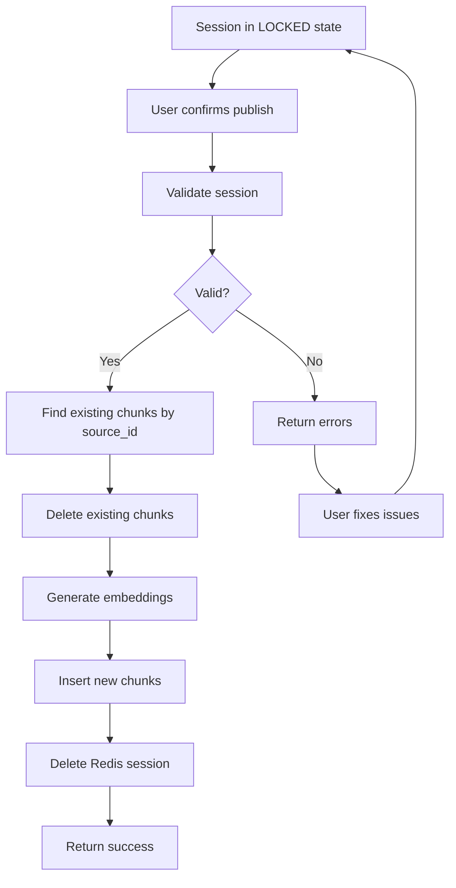

# FTR-006: Publishing

**Status:** Draft
**BRD Reference:** Section 5.4
**Author:** BA Skill
**Date:** 2026-02-12
**Reviewers:** Product, Engineering

---

## 1. Executive Summary

Publishing moves validated chunks from draft session (Redis) to published state (Qdrant) using atomic replacement. The system deletes all existing chunks from the same source before inserting new ones, ensuring no duplicates or orphans.

---

## 2. Business Context

### 2.1 Problem Statement

When knowledge is updated, old versions must be cleanly replaced. Without atomic replacement, re-publishing creates duplicates or leaves orphaned chunks that pollute RAG retrieval.

### 2.2 Business Goals

- Ensure clean replacement of source content
- Generate embeddings for vector search
- Maintain source traceability
- Prevent duplicate chunks in production

### 2.3 Success Metrics

| Metric | Current | Target |
|--------|---------|--------|
| Publish success rate | N/A | > 99% |
| Publish latency (p95) | N/A | < 10s |
| Orphaned chunk rate | N/A | 0% |

### 2.4 User Stories

- As a user, I want to publish my changes so that they're searchable in RAG
- As a user, I want old content replaced so that there are no duplicates
- As a user, I want to preview before publishing so that I can catch errors
- As a user, I want confirmation that publish succeeded

---

## 3. Functional Requirements

### 3.1 In Scope

- FR-006-001: System shall require collection selection before publishing
- FR-006-002: System shall validate session before publishing (preview)
- FR-006-003: System shall delete all existing chunks with matching `source_id`
- FR-006-004: System shall generate embeddings for new chunks
- FR-006-005: System shall insert new chunks with embeddings
- FR-006-006: Delete and insert shall be atomic (all-or-nothing)
- FR-006-007: System shall delete session from Redis after successful publish
- FR-006-008: System shall return publish confirmation with counts

### 3.2 Out of Scope

- Partial publishing (subset of chunks)
- Scheduled publishing
- Publishing to multiple collections

### 3.3 User Flow

### 3.4 Acceptance Criteria

- [ ] AC-001: Given locked session with collection, when publish called, then chunks appear in Qdrant
- [ ] AC-002: Given existing chunks with same source_id, when publish called, then old chunks deleted
- [ ] AC-003: Given publish success, then session deleted from Redis
- [ ] AC-004: Given publish failure mid-operation, then no partial state (rollback)
- [ ] AC-005: Given no collection specified, then publish rejected with error
- [ ] AC-006: Given unlocked session, then publish rejected (must preview first)

---

## 4. Non-Functional Requirements (NFR)

### 4.1 Performance

- Publish latency: < 5s (p50), < 10s (p95) for typical session
- Embedding generation: batched for efficiency
- Max chunks per publish: 100

### 4.2 Scalability

- Concurrent publishes: 10-20 simultaneous
- Qdrant capacity: 100k+ chunks

### 4.3 Reliability

- Atomic operation: all-or-nothing
- Retry-safe: idempotent with same source_id
- No partial state on failure

### 4.4 Security

- Embedding generation via secure API
- Chunk content validated before persistence

---

## 5. Technical Considerations

### 5.1 Affected Modules

| Module | Change Type | Complexity |
|--------|-------------|------------|
| `vector` | Primary | High |
| `session` | Producer | Low |
| `llm` | Consumer | Medium (embeddings) |

### 5.2 Integration Points

- External: Qdrant (delete + upsert), OpenAI (embeddings)
- Internal: Session module (source), Collection module (target)

### 5.3 Data Model Impact

- Qdrant point structure:
  - `id`: UUID
  - `vector`: embedding array
  - `payload`: `{ source_id, collection_id, content, order, metadata, created_at }`

### 5.4 Observability Requirements

- Log events: `publish_start`, `publish_delete_done`, `publish_embed_done`, `publish_upsert_done`, `publish_success`, `publish_failure`
- Metrics: `publish_operations_total{status}`, `publish_duration_seconds`, `publish_chunks_total`, `embeddings_generated_total`

---

## 6. Dependencies & Risks

### 6.1 Dependencies

| ID | Dependency | Type | Status |
|----|------------|------|--------|
| DEP-001 | Qdrant connection | Blocking | Required |
| DEP-002 | OpenAI embeddings API | Blocking | Required |
| DEP-003 | Session module | Producer | Provides chunks |
| DEP-004 | Collection module | Informational | Target must exist |

### 6.2 Risks

| ID | Risk | Probability | Impact | Mitigation |
|----|------|-------------|--------|------------|
| RISK-001 | Partial publish on failure | Low | High | Transaction-like pattern, rollback |
| RISK-002 | Embedding API failure | Medium | High | Retry with backoff, cache embeddings |
| RISK-003 | Qdrant unavailable | Low | High | Health checks, circuit breaker |

### 6.3 Assumptions

- ASM-001: Qdrant supports filtering by payload field for delete
- ASM-002: Embedding model produces consistent vectors
- ASM-003: source_id is deterministic and stable

---

## 7. Implementation Guidance

### 7.1 Recommended Approach

1. Validate session is locked and has collection
2. Query Qdrant for existing points with matching `source_id`
3. Delete existing points (batch delete)
4. Generate embeddings for all chunks (batch API call)
5. Upsert new points with embeddings
6. Delete Redis session on success
7. On any failure, attempt rollback (restore deleted points if possible)

Consider using Qdrant's point versioning or a two-phase approach for safer atomicity.

### 7.2 Test Strategy

- Unit tests: Validation logic, publish flow
- Integration tests: Qdrant operations, embedding generation
- E2E tests: Full publish lifecycle, atomic replacement verification

### 7.3 Rollout Strategy

- Feature flag: No (core MVP feature)
- Phased rollout: N/A
- Rollback plan: Manual Qdrant recovery from backups

---

## 8. Open Questions

| ID | Question | Owner | Due Date | Resolution |
|----|----------|-------|----------|------------|
| Q-001 | How to handle rollback on partial failure? | Engineering | TBD | |
| Q-002 | Should we keep deleted chunks for recovery window? | Architecture | TBD | |

---

## 9. Approval

| Role | Name | Date | Status |
|------|------|------|--------|
| Product | | | Pending |
| Engineering | | | Pending |
| Architecture | | | Pending |

---

## Changelog

| Version | Date | Author | Changes |
|---------|------|--------|---------|
| 0.1 | 2026-02-12 | BA Skill | Initial draft |
