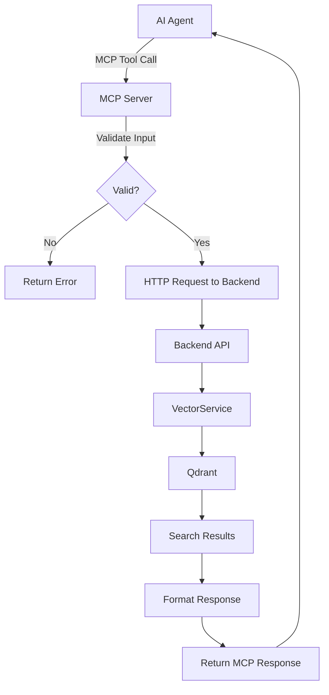

# FTR-007: MCP Server Integration

**Status:** Draft
**BRD Reference:** N/A (Not yet documented in BRD - requires BRD update)
**Author:** BA Skill
**Date:** 2026-02-12
**Reviewers:** Product, Engineering

---

## 1. Executive Summary

The MCP (Model Context Protocol) Server provides AI agents (e.g., Claude Code, Claude Desktop) with structured access to RAGler's knowledge base. It acts as a protocol adapter, translating MCP tool calls into HTTP requests to the RAGler backend API, enabling semantic search and collection management without direct vector database coupling.

---

## 2. Business Context

### 2.1 Problem Statement

AI coding assistants and agents need structured access to enterprise knowledge bases to provide accurate, context-aware responses. Direct database access is complex, insecure, and tightly coupled. A standardized protocol adapter enables AI agents to query knowledge without implementation complexity.

### 2.2 Business Goals

- Enable AI agents to search published knowledge collections
- Provide standardized MCP interface for tool integration
- Abstract backend implementation from AI consumers
- Support Claude Desktop and Claude Code integration

### 2.3 Success Metrics

| Metric | Current | Target |
|--------|---------|--------|
| MCP tools available | 3 | 3 (search, list, get_info) |
| Search response time (p95) | N/A | < 2s |
| Integration complexity | N/A | < 5 min setup |

### 2.4 User Stories

- As an AI agent, I want to search knowledge collections so that I can provide accurate answers with citations
- As an AI agent, I want to list available collections so that I can help users choose the right knowledge base
- As an AI agent, I want to get collection details so that I can understand the scope and purpose of a collection

---

## 3. Functional Requirements

### 3.1 In Scope

- FR-007-001: MCP server shall expose `search_knowledge` tool for semantic search
- FR-007-002: MCP server shall expose `list_collections` tool to enumerate collections
- FR-007-003: MCP server shall expose `get_collection_info` tool for collection details
- FR-007-004: Search results shall include structured citations (title, URL, path, tags)
- FR-007-005: Server shall validate inputs using Zod schemas
- FR-007-006: Server shall use stdio transport for MCP protocol communication
- FR-007-007: Server shall support metadata filtering (source_type, chunk_type, tags)
- FR-007-008: Server shall only access published content (no draft access)

### 3.2 Out of Scope

- Write operations (create/modify collections)
- Direct Qdrant access (always through backend API)
- Caching layer (every request hits backend)
- Cross-collection search (requires collection_id)
- Retry logic with backoff
- Authentication via API key (current MVP uses header-based user ID)

### 3.3 User Flow



### 3.4 Acceptance Criteria

- [ ] AC-001: Given valid search query and collection_id, when AI calls search_knowledge, then results returned with citations
- [ ] AC-002: Given no collection_id, when AI calls search_knowledge, then error returned (cross-collection not supported)
- [ ] AC-003: Given list_collections call, when AI invokes tool, then all collections returned with metadata
- [ ] AC-004: Given valid collection_id, when AI calls get_collection_info, then collection details returned
- [ ] AC-005: Given invalid UUID, when AI calls any tool, then Zod validation error returned
- [ ] AC-006: Given backend timeout, when AI calls search_knowledge, then timeout error propagated

---

## 4. Non-Functional Requirements (NFR)

### 4.1 Performance

- Search response time: < 500ms (p50), < 2s (p95)
- HTTP timeout to backend: 30s
- No local caching (stateless)

### 4.2 Scalability

- Expected load: 50-200 searches/day initially
- Growth projection: 1000+ searches/day at scale
- Stateless design enables horizontal scaling

### 4.3 Reliability

- Availability: Dependent on backend availability
- Recovery: Fail-fast on errors, AI agent handles retry
- No persistent state to recover

### 4.4 Security

- Read-only access to published content
- No draft session access
- User ID passed via header (audit trail)
- No secrets logged

---

## 5. Technical Considerations

### 5.1 Affected Modules

| Module | Change Type | Complexity |
|--------|-------------|------------|
| `mcp-server/` | New (standalone) | Medium |
| `backend/search` | Consumer | Low |
| `backend/collections` | Consumer | Low |

### 5.2 Integration Points

- External: Claude Desktop, Claude Code, any MCP-compatible agent
- Internal: RAGler Backend API (`/api/search`, `/api/collections`)

### 5.3 Data Model Impact

- No new entities
- Consumes existing Collection and Chunk data
- No migration required

### 5.4 Observability Requirements

- Log events: Server startup, tool invocations, errors
- Logs written to stderr (stdout reserved for MCP protocol)
- Correlation: Pass through request context from AI agent

**Required Log Events:**
```
mcp_server_start
mcp_tool_invoke{tool_name}
mcp_tool_success{tool_name, result_count}
mcp_tool_error{tool_name, error_type}
```

---

## 6. Dependencies & Risks

### 6.1 Dependencies

| ID | Dependency | Type | Status |
|----|------------|------|--------|
| DEP-001 | Backend Search API | Blocking | Implemented |
| DEP-002 | Backend Collections API | Blocking | Implemented |
| DEP-003 | MCP SDK (@modelcontextprotocol/sdk) | External | Available |

### 6.2 Risks

| ID | Risk | Probability | Impact | Mitigation |
|----|------|-------------|--------|------------|
| RISK-001 | Backend unavailable | Low | High | Fail-fast with clear error message |
| RISK-002 | MCP protocol changes | Low | Medium | Pin SDK version, monitor releases |
| RISK-003 | Search latency too high | Medium | Medium | Monitor p95, optimize backend |

### 6.3 Assumptions

- ASM-001: AI agents will handle retry logic on transient failures
- ASM-002: MCP protocol stability from Anthropic
- ASM-003: Backend API remains stable

---

## 7. Implementation Guidance

### 7.1 Recommended Approach

**Architecture:**
- Standalone Node.js process using `@modelcontextprotocol/sdk`
- Stdio transport for MCP protocol (Claude Desktop/Code compatible)
- HTTP client (axios) for backend communication
- Zod for input validation

**Directory Structure:**
```
mcp-server/
├── src/
│   ├── index.ts          # Entry point, transport setup
│   ├── server.ts         # MCP server factory, tool registration
│   ├── config.ts         # Environment configuration
│   ├── client/
│   │   └── kms-client.ts # HTTP client for backend API
│   └── tools/
│       ├── search.ts     # search_knowledge implementation
│       └── collections.ts # list/get collection tools
├── package.json
└── tsconfig.json
```

### 7.2 Test Strategy

- Unit tests: Zod schema validation, response formatting
- Integration tests: End-to-end with running backend
- Manual testing: MCP Inspector tool

### 7.3 Rollout Strategy

- Feature flag: No (optional component)
- Phased rollout: Internal testing → Claude Code beta → general availability
- Rollback plan: Remove from Claude Desktop config

---

## 8. Open Questions

| ID | Question | Owner | Due Date | Resolution |
|----|----------|-------|----------|------------|
| Q-001 | Should cross-collection search be supported? | Product | TBD | Deferred to post-MVP |
| Q-002 | Should API key auth be added for production? | Engineering | TBD | |
| Q-003 | Should results be cached for performance? | Engineering | TBD | |
| Q-004 | Update config.ts to remove deprecated MCP_USER_ROLE | Engineering | Immediate | Role-based ACL removed |

---

## 9. Approval

| Role | Name | Date | Status |
|------|------|------|--------|
| Product | | | Pending |
| Engineering | | | Pending |
| Architecture | | | Pending |

---

## Changelog

| Version | Date | Author | Changes |
|---------|------|--------|---------|
| 0.1 | 2026-02-12 | BA Skill | Initial draft |

---

## Appendix A: MCP Tool Specifications

### A.1 search_knowledge

**Input Schema:**
```typescript
{
  query: string;               // Required: natural language search query
  collection_id?: string;      // Optional (currently required): UUID
  limit?: number;              // Optional: 1-100, default 10
  filters?: {
    source_types?: ('confluence' | 'web' | 'manual')[];
    chunk_types?: ('knowledge' | 'navigation' | 'table_row' | 'glossary' | 'faq' | 'code')[];
    exclude_navigation?: boolean;
    tags?: string[];
  };
}
```

**Output Format:**
```
# Search Results for "query"

Found N results:

## Result 1 (Score: 0.XXX)

**Content:**
[chunk text]

**Citation:** Document Title
**Path:** Heading > Subheading
**URL:** https://...
**Type:** knowledge (confluence)
**Tags:** tag1, tag2

---
```

### A.2 list_collections

**Input Schema:** (none)

**Output Format:**
```json
{
  "collections": [
    {
      "id": "uuid",
      "name": "Collection Name",
      "description": "...",
      "createdBy": "user@example.com",
      "createdAt": "2026-02-01T10:00:00Z"
    }
  ],
  "total": 5
}
```

### A.3 get_collection_info

**Input Schema:**
```typescript
{
  collection_id: string;  // Required: UUID
}
```

**Output Format:**
```json
{
  "id": "uuid",
  "name": "Collection Name",
  "description": "...",
  "createdBy": "user@example.com",
  "createdAt": "2026-02-01T10:00:00Z"
}
```

---

## Appendix B: Configuration

### B.1 Environment Variables

| Variable | Purpose | Default |
|----------|---------|---------|
| `KMS_API_URL` | Backend API base URL | `http://localhost:3000` |
| `MCP_USER_ID` | User ID for audit trail | `mcp-server` |
| `KMS_API_KEY` | API key (future) | (empty) |

### B.2 Claude Desktop Configuration

```json
{
  "mcpServers": {
    "ragler": {
      "command": "node",
      "args": ["/path/to/mcp-server/dist/index.js"],
      "env": {
        "KMS_API_URL": "http://localhost:3000",
        "MCP_USER_ID": "claude-desktop"
      }
    }
  }
}
```

---

## Appendix C: BRD Update Required

The MCP Server feature is not currently documented in the BRD. The following should be added:

**Suggested BRD Section:**
> ### MCP Server Integration
>
> RAGler provides a Model Context Protocol (MCP) server that enables AI agents to search and explore knowledge collections. This allows tools like Claude Code and Claude Desktop to access the knowledge base programmatically.
>
> **Capabilities:**
> - Search published collections with semantic search
> - List and inspect available collections
> - Filter by source type, chunk type, and tags
>
> **Constraints:**
> - Read-only access (no create/modify operations)
> - No access to draft sessions
> - Collection ID required for search (no cross-collection search)
