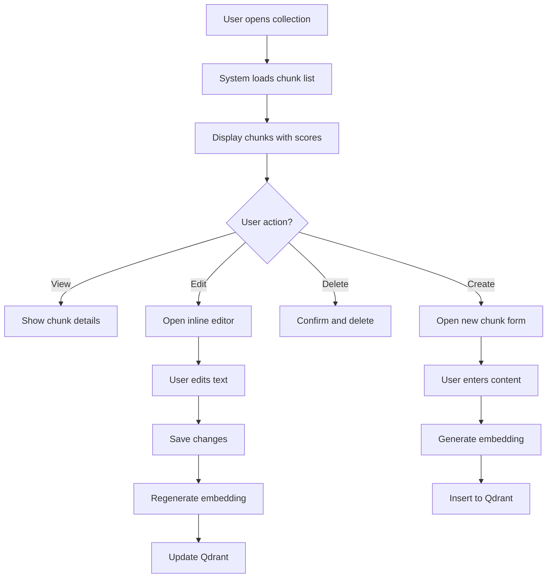
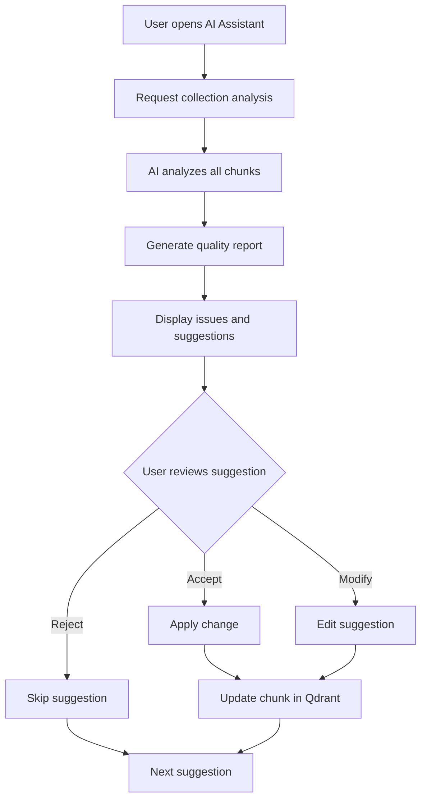
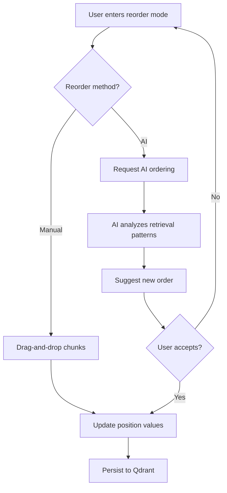

# FTR-008: Collection Editor

**Status:** Draft
**BRD Reference:** Sections 3.2, 5.2, 5.3, 6.2
**Author:** BA Skill
**Date:** 2026-02-12
**Reviewers:** Product, Engineering, Architecture

---

## 1. Executive Summary

The Collection Editor provides a comprehensive interface for managing published knowledge collections. Users can directly view, edit, create, delete, and reorder chunks within collections. An embedded AI assistant analyzes collection quality, suggests optimizations, and helps with chunk operations. This feature completes the "Improve Existing Knowledge" flow (BRD 6.2) and enables continuous knowledge maintenance without re-ingestion.

---

## 2. Business Context

### 2.1 Problem Statement

Currently, users can only add knowledge through the ingest-session-publish flow. Once chunks are published:
- There's no way to view individual chunks in a collection
- Fixing a typo requires re-ingesting the entire source
- No visibility into collection quality or optimization opportunities
- No way to reorder chunks for better retrieval

Teams need direct access to manage published knowledge without going through the full ingestion pipeline.

### 2.2 Business Goals

- Enable direct management of published knowledge
- Reduce time to fix knowledge issues from minutes to seconds
- Provide AI-powered quality insights and optimization suggestions
- Support manual and AI-assisted chunk reordering for retrieval optimization

### 2.3 Success Metrics

| Metric | Current | Target |
|--------|---------|--------|
| Time to edit a chunk | N/A (impossible) | < 30s |
| Collections with quality score | 0% | 100% |
| User-initiated optimizations | N/A | 10+ per collection |
| AI suggestions accepted | N/A | > 50% |

### 2.4 User Stories

- As a user, I want to view all chunks in a collection so that I can understand what knowledge exists
- As a user, I want to edit a chunk directly so that I can fix errors without re-ingesting
- As a user, I want to create new chunks manually so that I can add knowledge without a source
- As a user, I want to delete chunks so that I can remove outdated or incorrect knowledge
- As a user, I want to reorder chunks so that I can optimize retrieval order
- As a user, I want AI to analyze my collection so that I can identify improvement opportunities
- As a user, I want AI to suggest chunk operations so that I can improve quality efficiently
- As a user, I want to see quality scores so that I can prioritize improvements

---

## 3. Functional Requirements

### 3.1 In Scope

#### Chunk Management
- FR-008-001: System shall list all chunks within a collection with pagination
- FR-008-002: System shall display chunk content, metadata, and quality score
- FR-008-003: System shall allow direct editing of chunk text
- FR-008-004: System shall allow creating new chunks within a collection
- FR-008-005: System shall allow deleting chunks from a collection
- FR-008-006: System shall allow splitting a chunk into multiple chunks
- FR-008-007: System shall allow merging multiple chunks into one
- FR-008-008: System shall regenerate embeddings after chunk modification

#### Reranking
- FR-008-009: System shall support manual drag-and-drop chunk reordering
- FR-008-010: System shall persist chunk order as a `position` field
- FR-008-011: System shall provide AI-suggested optimal ordering
- FR-008-012: User shall be able to accept or reject AI ordering suggestions

#### AI Assistant
- FR-008-013: AI shall analyze collection and provide quality report
- FR-008-014: AI shall identify potential issues (duplicates, gaps, unclear chunks)
- FR-008-015: AI shall suggest chunk operations (split, merge, rewrite, delete)
- FR-008-016: AI shall score each chunk on retrieval quality (0-100)
- FR-008-017: AI suggestions shall be presented for user approval (HITL)
- FR-008-018: System shall track accepted/rejected AI suggestions

#### UI/UX
- FR-008-019: Collection editor shall show chunk list with search/filter
- FR-008-020: Inline editing shall be supported (click to edit)
- FR-008-021: Bulk operations shall be supported (multi-select)
- FR-008-022: AI assistant shall be accessible via side panel
- FR-008-023: Quality scores shall be visualized (color-coded, badges)

### 3.2 Out of Scope

- Undo/rollback functionality (direct editing, no session)
- Version history of chunks
- Scheduled/automated AI optimization
- Cross-collection chunk movement
- Collaborative editing (multi-user)

### 3.3 User Flows

#### Flow 1: View and Edit Collection



#### Flow 2: AI-Assisted Optimization



#### Flow 3: Reranking



### 3.4 Acceptance Criteria

#### Chunk Management
- [ ] AC-001: Given a collection, when user opens editor, then all chunks displayed with pagination
- [ ] AC-002: Given a chunk, when user edits text and saves, then embedding regenerated and updated in Qdrant
- [ ] AC-003: Given collection, when user creates new chunk, then chunk inserted with new embedding
- [ ] AC-004: Given chunk, when user deletes, then chunk removed from Qdrant after confirmation
- [ ] AC-005: Given chunk, when user splits, then two new chunks created with embeddings
- [ ] AC-006: Given two chunks selected, when user merges, then single chunk created

#### Reranking
- [ ] AC-007: Given chunk list, when user drags chunk, then position updated
- [ ] AC-008: Given reorder request, when AI suggests order, then preview shown before applying
- [ ] AC-009: Given new positions, when saved, then position field updated in Qdrant

#### AI Assistant
- [ ] AC-010: Given collection, when AI analysis requested, then quality report generated
- [ ] AC-011: Given chunk, when AI scores quality, then score (0-100) displayed
- [ ] AC-012: Given AI suggestion, when user accepts, then operation applied
- [ ] AC-013: Given AI suggestion, when user rejects, then suggestion dismissed with feedback

---

## 4. Non-Functional Requirements (NFR)

### 4.1 Performance

| Operation | P50 | P95 |
|-----------|-----|-----|
| Load chunk list (100 chunks) | 500ms | 2s |
| Edit and save chunk | 1s | 3s |
| Generate embedding | 500ms | 1.5s |
| AI collection analysis | 5s | 30s |
| AI quality scoring (per chunk) | 200ms | 500ms |

### 4.2 Scalability

- Max chunks per collection: 10,000
- Max chunks in single view: 100 (paginated)
- Concurrent editors per collection: 1 (no locking, last-write-wins)

### 4.3 Reliability

- Changes are immediately persisted (no draft state)
- Embedding generation failure should not lose text changes
- AI assistant failures should not block manual editing

### 4.4 Security

- All operations require authenticated user
- Chunk content validated for injection attacks
- AI prompts should not expose system instructions

---

## 5. Technical Considerations

### 5.1 Affected Modules

| Module | Change Type | Complexity |
|--------|-------------|------------|
| `collection` | Major extension | High |
| `vector` | New operations | Medium |
| `llm` | New AI scenarios | High |
| Frontend | New pages/components | High |

### 5.2 Integration Points

**Backend API Endpoints (New):**
```
GET    /api/collections/:id/chunks         - List chunks with pagination
GET    /api/collections/:id/chunks/:chunkId - Get single chunk
PUT    /api/collections/:id/chunks/:chunkId - Update chunk
POST   /api/collections/:id/chunks          - Create new chunk
DELETE /api/collections/:id/chunks/:chunkId - Delete chunk
POST   /api/collections/:id/chunks/merge    - Merge chunks
POST   /api/collections/:id/chunks/:chunkId/split - Split chunk
PUT    /api/collections/:id/reorder         - Update chunk positions
POST   /api/collections/:id/analyze         - AI collection analysis
GET    /api/collections/:id/quality         - Get quality scores
POST   /api/collections/:id/chunks/:chunkId/ai-suggest - AI suggestions for chunk
```

**External:**
- Qdrant: scroll, upsert, delete operations
- OpenAI: embeddings, chat completions (analysis, suggestions)

### 5.3 Data Model Impact

**Existing Chunk Payload Extension:**
```typescript
interface ChunkPayload {
  // Existing fields
  doc: { source_id, source_type, url, title, revision };
  chunk: { type, heading_path, section, lang };
  content: string;
  tags: string[];

  // NEW fields for Collection Editor
  position: number;           // Order within collection (0-indexed)
  quality_score: number;      // AI quality score (0-100)
  quality_issues: string[];   // AI-identified issues
  last_edited_at: string;     // ISO timestamp of last edit
  last_edited_by: string;     // User who last edited
  edit_count: number;         // Number of times edited
  ai_suggestions: {           // Pending AI suggestions
    type: 'split' | 'merge' | 'rewrite' | 'delete';
    rationale: string;
    suggested_content?: string;
    created_at: string;
  }[];
}
```

**New Qdrant Indexes:**
```typescript
await qdrantClient.createPayloadIndex(collection, 'position', 'integer');
await qdrantClient.createPayloadIndex(collection, 'quality_score', 'float');
await qdrantClient.createPayloadIndex(collection, 'last_edited_at', 'datetime');
```

### 5.4 Observability Requirements

**Log Events:**
```
collection_editor_opened{collection_id, user_id}
chunk_viewed{collection_id, chunk_id}
chunk_edited{collection_id, chunk_id, user_id}
chunk_created{collection_id, chunk_id, user_id}
chunk_deleted{collection_id, chunk_id, user_id}
chunk_split{collection_id, original_chunk_id, new_chunk_ids}
chunk_merged{collection_id, merged_chunk_ids, result_chunk_id}
chunks_reordered{collection_id, chunk_count}
ai_analysis_requested{collection_id, user_id}
ai_analysis_completed{collection_id, duration_ms, issue_count}
ai_suggestion_generated{collection_id, chunk_id, suggestion_type}
ai_suggestion_accepted{collection_id, chunk_id, suggestion_type}
ai_suggestion_rejected{collection_id, chunk_id, suggestion_type, reason}
quality_score_updated{collection_id, chunk_id, old_score, new_score}
```

**Metrics:**
```
collection_editor_operations_total{operation,status}
collection_editor_duration_seconds{operation}
ai_analysis_duration_seconds
ai_suggestions_total{type,outcome}
chunk_quality_scores{collection_id} (histogram)
embedding_regenerations_total{reason}
```

---

## 6. Dependencies & Risks

### 6.1 Dependencies

| ID | Dependency | Type | Status |
|----|------------|------|--------|
| DEP-001 | Qdrant scroll/filter | Blocking | Available |
| DEP-002 | OpenAI embeddings API | Blocking | Available |
| DEP-003 | OpenAI chat completions | Blocking | Available |
| DEP-004 | Frontend component library | Blocking | Available |
| DEP-005 | Collection module | Blocking | Implemented |

### 6.2 Risks

| ID | Risk | Probability | Impact | Mitigation |
|----|------|-------------|--------|------------|
| RISK-001 | Data loss from direct editing | Medium | High | Add "modified" indicator, consider soft-delete |
| RISK-002 | Embedding cost explosion | Medium | Medium | Batch operations, cache unchanged embeddings |
| RISK-003 | AI hallucinations in suggestions | Medium | Medium | Always require user approval (HITL) |
| RISK-004 | Performance degradation on large collections | Medium | Medium | Pagination, lazy loading, background AI tasks |
| RISK-005 | Concurrent edit conflicts | Low | Medium | Last-write-wins with warning, consider optimistic locking |

### 6.3 Assumptions

- ASM-001: Qdrant supports efficient scroll with filtering and ordering
- ASM-002: Users accept that direct editing has no undo capability
- ASM-003: AI quality analysis can be performed asynchronously
- ASM-004: Position/order is collection-specific (not global)

---

## 7. Implementation Guidance

### 7.1 Recommended Approach

**Phase 1: Core Chunk Operations**
1. Implement chunk list API with pagination
2. Implement CRUD operations for individual chunks
3. Add embedding regeneration on edit
4. Build basic frontend UI for viewing/editing

**Phase 2: Advanced Operations**
1. Implement split/merge functionality
2. Add manual reordering with position field
3. Build drag-and-drop UI

**Phase 3: AI Assistant**
1. Implement collection analysis endpoint
2. Add quality scoring per chunk
3. Build AI suggestions flow
4. Add AI-suggested reordering

### 7.2 Test Strategy

**Unit Tests:**
- Chunk CRUD operations
- Position/reordering logic
- AI prompt construction

**Integration Tests:**
- Qdrant operations (scroll, upsert, delete)
- Embedding regeneration flow
- AI API calls (mocked)

**E2E Tests:**
- Full edit cycle
- Split/merge operations
- AI analysis and suggestion acceptance

### 7.3 Rollout Strategy

- **Feature flag:** Yes - `collection_editor_enabled`
- **Phased rollout:**
  1. Phase 1: View-only collection browser
  2. Phase 2: Enable edit/delete operations
  3. Phase 3: Enable AI assistant
- **Rollback plan:** Disable feature flag (data remains in Qdrant)

---

## 8. Open Questions

| ID | Question | Owner | Due Date | Resolution |
|----|----------|-------|----------|------------|
| Q-001 | Should we implement soft-delete for recovery? | Engineering | TBD | |
| Q-002 | How to handle position conflicts during concurrent edits? | Architecture | TBD | |
| Q-003 | Should AI analysis run automatically or on-demand? | Product | TBD | On-demand (user decision) |
| Q-004 | What is the cost budget for AI operations? | Product | TBD | |
| Q-005 | Should chunk quality scores be visible in MCP search results? | Product | TBD | |

---

## 9. Approval

| Role | Name | Date | Status |
|------|------|------|--------|
| Product | | | Pending |
| Engineering | | | Pending |
| Architecture | | | Pending |

---

## Changelog

| Version | Date | Author | Changes |
|---------|------|--------|---------|
| 0.1 | 2026-02-12 | BA Skill | Initial draft |

---

## Appendix A: AI Prompts

### A.1 Collection Analysis Prompt

```
You are analyzing a knowledge collection for RAG retrieval quality.

Collection: {collection_name}
Purpose: {collection_description}
Total chunks: {chunk_count}

Analyze the following chunks and identify:
1. Duplicate or highly similar content
2. Gaps in coverage (missing topics)
3. Unclear or ambiguous formulations
4. Chunks that are too long or too short
5. Inconsistent terminology
6. Outdated information indicators

For each issue found, provide:
- Issue type
- Affected chunk IDs
- Severity (low/medium/high)
- Suggested action

Chunks:
{chunks_json}

Respond in JSON format.
```

### A.2 Chunk Quality Scoring Prompt

```
Score this knowledge chunk for RAG retrieval quality (0-100).

Criteria:
- Clarity (is the content clear and unambiguous?)
- Completeness (does it answer a question fully?)
- Specificity (is it focused, not too broad?)
- Standalone (can it be understood without context?)
- Accuracy signals (dates, sources, specificity)

Chunk content:
{chunk_content}

Metadata:
- Source: {source_type}
- Type: {chunk_type}
- Tags: {tags}

Respond with:
{
  "score": <0-100>,
  "issues": ["issue1", "issue2"],
  "suggestions": ["suggestion1"]
}
```

### A.3 Chunk Operation Suggestion Prompt

```
Analyze this chunk and suggest improvements.

Chunk:
{chunk_content}

Context (surrounding chunks):
{context_chunks}

Collection purpose:
{collection_description}

Suggest ONE of the following operations if applicable:
- SPLIT: If chunk covers multiple distinct topics
- MERGE: If chunk is incomplete and context provides continuation
- REWRITE: If chunk is unclear or could be improved
- DELETE: If chunk is duplicate or irrelevant

If no action needed, respond with "KEEP".

Respond with:
{
  "action": "SPLIT|MERGE|REWRITE|DELETE|KEEP",
  "rationale": "explanation",
  "suggested_content": "new content if REWRITE",
  "split_points": [positions if SPLIT],
  "merge_with": ["chunk_ids if MERGE"]
}
```

### A.4 Reorder Suggestion Prompt

```
Suggest optimal ordering for these chunks to maximize RAG retrieval quality.

Collection purpose: {collection_description}

Current chunks (in current order):
{chunks_with_ids}

Consider:
- Conceptual flow (basics before advanced)
- Dependency order (define terms before using them)
- Frequency of access patterns
- Completeness of coverage

Respond with ordered list of chunk IDs:
["id1", "id2", "id3", ...]

And rationale for the ordering.
```

---

## Appendix B: UI Wireframes (Conceptual)

### B.1 Collection Editor Main View

```
┌─────────────────────────────────────────────────────────────────┐
│ Collection: API Documentation                           [AI] [⚙]│
├─────────────────────────────────────────────────────────────────┤
│ [Search chunks...] [Filter ▼] [Sort ▼]     [+ New Chunk] [Reorder]│
├─────────────────────────────────────────────────────────────────┤
│ ☐ │ 92 │ Authentication overview                        [···]   │
│   │    │ Users must authenticate using OAuth 2.0...             │
├─────────────────────────────────────────────────────────────────┤
│ ☐ │ 78 │ API rate limits                                [···]   │
│   │    │ The API enforces rate limits of 100 req/min...         │
├─────────────────────────────────────────────────────────────────┤
│ ☐ │ 45 │ Error handling                                 [···]   │
│   │    │ When an error occurs, the API returns...               │
├─────────────────────────────────────────────────────────────────┤
│                         [1] [2] [3] ... [10]                    │
└─────────────────────────────────────────────────────────────────┘
Legend: [Score] | Chunk title/preview | [Actions menu]
```

### B.2 AI Assistant Panel

```
┌─────────────────────────────────────┐
│ AI Assistant                    [×] │
├─────────────────────────────────────┤
│ Collection Quality: 72/100          │
│ ████████████░░░░░░                  │
├─────────────────────────────────────┤
│ Issues Found: 5                     │
│                                     │
│ ⚠ 2 potential duplicates            │
│   > Chunks #3 and #7 are similar    │
│   [View] [Merge] [Dismiss]          │
│                                     │
│ ⚠ 1 chunk needs clarity             │
│   > Chunk #12 has unclear terms     │
│   [View] [Rewrite] [Dismiss]        │
│                                     │
│ ℹ 2 chunks could be split           │
│   > Chunk #5 covers multiple topics │
│   [View] [Split] [Dismiss]          │
├─────────────────────────────────────┤
│ [Refresh Analysis] [Apply All Safe] │
└─────────────────────────────────────┘
```

---

## Appendix C: BRD Update Required

The following additions should be made to the BRD:

**Section 3.2 Collection Management (update):**
> The system should allow:
> - Creating collections with description of purpose
> - Editing collection description and parameters
> - **Viewing and managing chunks within a collection**
> - **Direct editing of published chunks**
> - **Reordering chunks for retrieval optimization**
> - **AI-assisted collection quality analysis**
> - Managing chunk composition within a collection
> - Preventing implicit loss of chunks when deleting a collection

**Section 7.1 MVP In Scope (update):**
> #### Collection Editor
> - View all chunks within a collection
> - Edit, create, delete chunks directly
> - Split and merge chunks
> - Manual chunk reordering
> - AI collection analysis and suggestions
> - Quality scoring per chunk
