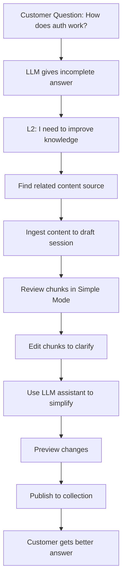

# Simple Mode Workflow

Simple Mode is designed for **L2 Support** and non-technical users who need to improve RAG knowledge without understanding chunk structure or ML concepts.

## Who Uses Simple Mode?

**Target Users:**
- L2 Support teams
- Customer success representatives
- Non-technical content editors
- Anyone managing customer-facing knowledge

**User Characteristics:**
- Not required to understand RAG mechanics
- Works with user questions and incidents
- Focuses on content quality, not technical structure
- Wants simple, safe workflows

## Simple Mode Philosophy

**Focus on content, not structure:**
- Users see chunks as "text blocks" to edit
- No split/merge operations (can't restructure chunks)
- Simplified UI with guided scenarios
- Safe by default (limited destructive actions)

**LLM assistant is your helper:**
- Pre-defined scenarios (simplify, clarify, add examples)
- Results are suggestions, not automatic changes
- Users always have final approval

## Simple Mode Capabilities

### ✅ What You Can Do

| Action | Description | Endpoint |
|--------|-------------|----------|
| **View sources** | See original content and chunks | `GET /sessions/:id` |
| **Edit chunk text** | Modify chunk content directly | `PATCH /sessions/:id/chunks/:chunkId` |
| **Use LLM assistant** | Simplify, clarify, add examples | `POST /sessions/:id/refine` |
| **Select collection** | Choose where to publish chunks | `POST /sessions/:id/publish` |
| **Publish chunks** | Make knowledge searchable | `POST /sessions/:id/publish` |
| **Discard session** | Delete draft without publishing | `DELETE /sessions/:id` |

### ❌ What You Cannot Do

| Action | Reason | Alternative |
|--------|--------|-------------|
| **Split chunks** | Requires understanding chunk structure | Use Advanced Mode or ask Developer |
| **Merge chunks** | Requires understanding chunk structure | Use Advanced Mode or ask Developer |
| **Create collections** | Organizational decision | Ask Developer/ML to create collection |
| **Bulk operations** | Risk of large-scale errors | Process sessions individually |
| **Re-process source** | Technical operation | Create new ingestion session |

## End-to-End Workflow

### Scenario: Improve Knowledge for Customer Question

**Context:** A customer asked about authentication, but the LLM gave an incomplete answer. You need to add clarifying information.



### Step-by-Step: Simple Mode Workflow

#### Step 1: Identify Content to Improve

**Where to find source content:**
- Confluence pages related to the topic
- Internal documentation
- Support articles
- Manual notes from subject matter experts

**Example:**
- Customer asked: "How do I reset my password?"
- Current RAG answer is incomplete
- Find Confluence page: "Password Reset Guide"

#### Step 2: Ingest Content

Create a draft session from the source:

**Manual Input (small content):**
```bash
curl -X POST http://localhost:3000/api/ingest \
  -H "Content-Type: application/json" \
  -H "X-User-ID: support@company.com" \
  -H "X-User-Role: L2" \
  -d '{
    "sourceType": "manual",
    "content": "To reset your password, go to Settings > Security > Password. Click Reset Password and follow the email instructions. Note: Password resets expire after 1 hour.",
    "sourceUrl": "manual://password-reset-guide"
  }'
```

**Confluence (larger content):**
```bash
curl -X POST http://localhost:3000/api/ingest \
  -H "Content-Type: application/json" \
  -H "X-User-ID: support@company.com" \
  -H "X-User-Role: L2" \
  -d '{
    "sourceType": "confluence",
    "sourceUrl": "https://company.atlassian.net/wiki/spaces/SUPPORT/pages/123456"
  }'
```

**Response:**
```json
{
  "sessionId": "sess_l2_abc123",
  "status": "DRAFT",
  "chunksCount": 3,
  "chunks": [
    {
      "id": "chunk_1",
      "content": "To reset your password, go to Settings > Security > Password.",
      "order": 0
    },
    {
      "id": "chunk_2",
      "content": "Click Reset Password and follow the email instructions.",
      "order": 1
    },
    {
      "id": "chunk_3",
      "content": "Note: Password resets expire after 1 hour.",
      "order": 2
    }
  ]
}
```

#### Step 3: Review Chunks

View the generated chunks:

```bash
curl http://localhost:3000/api/sessions/sess_l2_abc123 \
  -H "X-User-ID: support@company.com" \
  -H "X-User-Role: L2"
```

**What to look for:**
- ✓ Are chunks clear and complete?
- ✓ Is information accurate?
- ✓ Are there any confusing parts?
- ✓ Does it answer customer questions?

#### Step 4: Edit Chunks (If Needed)

**Example edit: Add more context**

```bash
curl -X PATCH http://localhost:3000/api/sessions/sess_l2_abc123/chunks/chunk_1 \
  -H "Content-Type: application/json" \
  -H "X-User-ID: support@company.com" \
  -H "X-User-Role: L2" \
  -d '{
    "content": "To reset your password in the web app, navigate to Settings > Security > Password. This option is available in the top-right menu."
  }'
```

**When to edit:**
- Clarify confusing wording
- Add missing context
- Fix typos or errors
- Simplify technical jargon

#### Step 5: Use LLM Assistant (Optional)

**Available scenarios in Simple Mode:**
1. **Simplify for audience** — Remove technical jargon
2. **Clarify terminology** — Explain terms
3. **Add examples** — Include practical examples
4. **Rewrite for clarity** — Improve readability

**Example: Simplify chunk for non-technical users**

```bash
curl -X POST http://localhost:3000/api/sessions/sess_l2_abc123/refine \
  -H "Content-Type: application/json" \
  -H "X-User-ID: support@company.com" \
  -H "X-User-Role: L2" \
  -d '{
    "chunkId": "chunk_1",
    "scenario": "simplify",
    "targetAudience": "non-technical users"
  }'
```

**Response (LLM suggestion):**
```json
{
  "originalContent": "To reset your password in the web app, navigate to Settings > Security > Password.",
  "suggestedContent": "To reset your password, click on your profile picture in the top-right corner, then click Settings. Look for the Security section and click the Password option.",
  "scenario": "simplify",
  "reasoning": "Added step-by-step navigation to make it easier for non-technical users to find the password reset option."
}
```

**Review and apply suggestion:**
```bash
# If you like the suggestion, update the chunk
curl -X PATCH http://localhost:3000/api/sessions/sess_l2_abc123/chunks/chunk_1 \
  -H "Content-Type: application/json" \
  -d '{
    "content": "To reset your password, click on your profile picture in the top-right corner, then click Settings. Look for the Security section and click the Password option."
  }'
```

#### Step 6: Preview Before Publishing

Lock the session and validate:

```bash
curl -X POST http://localhost:3000/api/sessions/sess_l2_abc123/preview \
  -H "X-User-ID: support@company.com" \
  -H "X-User-Role: L2"
```

**Response:**
```json
{
  "sessionId": "sess_l2_abc123",
  "status": "LOCKED",
  "validation": {
    "isValid": true,
    "errors": [],
    "warnings": []
  },
  "chunksCount": 3,
  "estimatedTokens": 180
}
```

**If validation fails:**
- Unlock session: `POST /sessions/:id/unlock`
- Fix issues
- Preview again

#### Step 7: Select Collection

Choose the appropriate collection for this knowledge:

```bash
# List available collections
curl http://localhost:3000/api/collections \
  -H "X-User-ID: support@company.com" \
  -H "X-User-Role: L2"
```

**Response:**
```json
{
  "collections": [
    {
      "id": "coll_support_faq",
      "name": "Support FAQ",
      "description": "Frequently asked customer questions",
      "purpose": "Answering common support tickets"
    },
    {
      "id": "coll_product_docs",
      "name": "Product Documentation",
      "description": "Product features and user guides"
    }
  ]
}
```

**Choose collection based on content type:**
- Password reset → "Support FAQ" collection

#### Step 8: Publish

Publish validated chunks to the collection:

```bash
curl -X POST http://localhost:3000/api/sessions/sess_l2_abc123/publish \
  -H "Content-Type: application/json" \
  -H "X-User-ID: support@company.com" \
  -H "X-User-Role: L2" \
  -d '{
    "collectionId": "coll_support_faq"
  }'
```

**Response:**
```json
{
  "success": true,
  "collectionId": "coll_support_faq",
  "publishedChunks": 3,
  "sourceId": "abc123def456",
  "operation": "atomic_replace"
}
```

**✅ Done!** Your improved knowledge is now searchable.

## Common Simple Mode Scenarios

### Scenario 1: Fix Typo in Existing Knowledge

**Problem:** Published content has a typo that confuses customers.

**Solution:**
1. Re-ingest the source (same URL)
2. Find the chunk with the typo
3. Edit the chunk to fix typo
4. Preview and publish

**Result:** Atomic replacement updates the content, no duplicates.

### Scenario 2: Simplify Technical Language

**Problem:** Chunks use technical jargon that customers don't understand.

**Solution:**
1. Use LLM assistant scenario: "simplify for audience"
2. Target audience: "non-technical users"
3. Review suggested simplification
4. Apply if it improves clarity

**Example:**
```
Before: "Navigate to the OAuth 2.0 configuration panel"
After:  "Go to Settings > Login Options"
```

### Scenario 3: Add Clarifying Examples

**Problem:** Instructions are correct but abstract, customers need examples.

**Solution:**
1. Use LLM assistant scenario: "add examples"
2. Review generated examples
3. Edit to match your product specifics
4. Publish

**Example:**
```
Before: "Set a strong password"
After:  "Set a strong password. Example: Use a mix of letters, numbers, and symbols like 'MyP@ssw0rd2026!'"
```

### Scenario 4: Update Outdated Information

**Problem:** Feature changed, documentation is outdated.

**Solution:**
1. Re-ingest the source
2. Edit chunks with new information
3. Preview and publish

**Note:** Simple Mode cannot create new collections. If content doesn't fit existing collections, ask a Developer to create one.

## Simple Mode Best Practices

### Do:
- ✅ **Focus on content quality** — Your expertise is knowing what customers need
- ✅ **Use simple language** — Avoid jargon
- ✅ **Preview before publishing** — Catch errors early
- ✅ **Test with real questions** — After publishing, verify customers get good answers
- ✅ **Ask for help** — If you need to split/merge chunks, ask a Developer

### Don't:
- ❌ **Don't skip preview** — Always validate before publishing
- ❌ **Don't guess technical details** — Verify information with SMEs
- ❌ **Don't publish to wrong collection** — Match content to collection purpose
- ❌ **Don't try to split/merge** — These actions are blocked in Simple Mode

## Simple Mode Limitations

### Why Can't I Split/Merge Chunks?

**Reason:** Splitting and merging chunks requires understanding:
- Semantic boundaries (where to split)
- Context dependencies (what information belongs together)
- Retrieval implications (how chunks affect search quality)

**Alternative:** If chunks need restructuring:
1. Ask a Developer or ML Specialist to help
2. They can use Advanced Mode to split/merge
3. Or: Edit content at the source (Confluence) and re-ingest

### Why Can't I Create Collections?

**Reason:** Collection creation is an organizational decision:
- Defines knowledge context and purpose
- Affects team workflows
- Requires understanding of RAG architecture

**Alternative:** Request collection from Developer/ML Specialist with:
- Collection name
- Purpose (what questions it should answer)
- Target audience

## Getting Help

**When to escalate to Advanced Mode users:**
- Chunks need split/merge operations
- Content requires technical restructuring
- New collection is needed
- Bulk operations across many sessions

**How to escalate:**
1. Share session ID
2. Explain what needs to be changed
3. Developer/ML can use Advanced Mode on your session

## Related Documentation

- [Roles](/docs/product/roles) — Detailed permissions for L2 Support
- [Draft Sessions](/docs/product/sessions) — Understanding session lifecycle
- [Publishing](/docs/product/publishing) — How atomic replacement works
- [Advanced Mode Workflow](/docs/product/flows/advanced-mode) — What Developers can do
- [Troubleshooting](/docs/getting-started/troubleshooting) — Common issues and solutions
