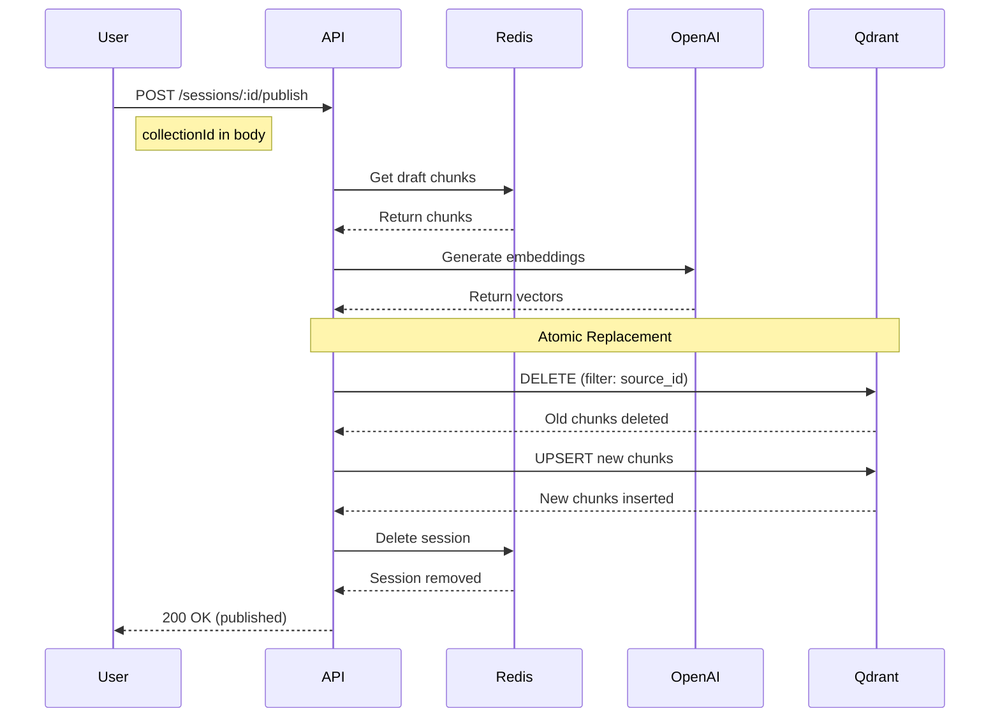

# Publishing Chunks

Publishing is the final step in RAGler's workflow, where validated chunks from a draft session are made searchable in a collection. This guide explains how publishing works, the atomic replacement strategy, and best practices.

## What is Publishing?

**Publishing** transforms draft chunks into production-ready, searchable knowledge:

1. **Embeddings Generated:** OpenAI creates vector embeddings for each chunk
2. **Atomic Replacement:** Old chunks are deleted, new chunks are inserted
3. **Session Deleted:** Draft session is removed from Redis
4. **Chunks Searchable:** Content is now retrievable via vector search

**Publishing is irreversible** — once published, the draft session is deleted.

## Publishing Workflow



## Atomic Replacement Strategy

### Why Atomic Replacement?

**Problem:** When you edit and republish content, you might:
- Merge 3 chunks into 1
- Split 1 chunk into 5
- Change chunk boundaries entirely

If we used deterministic IDs (`url + index`), old chunks would remain as **garbage** in the database.

**Solution: Atomic Replacement**

All chunks from the same source share a `source_id` (MD5 hash of source URL). When publishing:

1. **DELETE** all chunks with `source_id = X`
2. **INSERT** all new chunks with `source_id = X`

**Result:** Clean database, no duplicates, no orphaned chunks.

### How source_id Works

The `source_id` is calculated from the source URL:

```javascript
source_id = MD5(sourceUrl)
```

**Examples:**
```
sourceUrl: "https://example.com/docs/guide"
source_id: "b3d4e5f6a1b2c3d4e5f6"

sourceUrl: "manual://my-content"
source_id: "a1b2c3d4e5f6g7h8i9j0"
```

**Key property:** Same URL = Same source_id → Atomic replacement works

### Atomic Replacement Example

**Initial publish:**
```
Source URL: https://example.com/guide
Source ID: abc123
Chunks: [chunk_1, chunk_2, chunk_3]
```

**Re-ingest and edit:**
- Merge `chunk_1` and `chunk_2` into one
- Keep `chunk_3` as is
- Result: 2 chunks total

**Publish again:**
```sql
-- Step 1: DELETE
DELETE FROM collection WHERE source_id = 'abc123'
-- Deletes: chunk_1, chunk_2, chunk_3 (all 3)

-- Step 2: UPSERT
INSERT INTO collection (id, source_id, content, vector, ...)
VALUES
  ('new_chunk_1', 'abc123', 'Merged content...', [...], ...),
  ('new_chunk_2', 'abc123', 'Original chunk_3...', [...], ...);
-- Inserts: 2 new chunks
```

**Final state:** Clean collection with 2 chunks, no duplicates.

## Publishing Process

### Step 1: Preview (Recommended)

Before publishing, always preview to validate chunks:

```bash
curl -X POST http://localhost:3000/api/sessions/sess_abc123/preview \
  -H "X-User-ID: you@example.com"
```

**Response:**
```json
{
  "sessionId": "sess_abc123",
  "status": "LOCKED",
  "validation": {
    "isValid": true,
    "errors": [],
    "warnings": ["Chunk 3 is longer than recommended (1200 tokens)"]
  },
  "chunksCount": 5,
  "estimatedTokens": 850
}
```

**What gets validated:**
- ✓ At least 1 chunk exists
- ✓ No empty chunks
- ✓ Chunks have valid content
- ⚠️ Warnings for very long chunks (>1000 tokens)

### Step 2: Select Target Collection

You **must** specify which collection to publish to:

```bash
curl -X POST http://localhost:3000/api/sessions/sess_abc123/publish \
  -H "Content-Type: application/json" \
  -H "X-User-ID: you@example.com" \
  -d '{
    "collectionId": "550e8400-e29b-41d4-a716-446655440000"
  }'
```

**Why collection is required:**
- Organizes knowledge by context
- Enables collection-level permissions
- Allows targeted retrieval

### Step 3: Publish Executes

When you publish, the backend:

1. **Validates session:**
   - Session exists
   - Session is LOCKED (or auto-locks)
   - Collection exists
   - User has permissions

2. **Generates embeddings:**
   - OpenAI API call: `text-embedding-3-small`
   - Each chunk → 1536-dimensional vector
   - Batch processing (default: 100 chunks per call)

3. **Atomic replacement in Qdrant:**
   ```javascript
   // Delete old chunks
   await qdrant.delete({
     collection: collectionId,
     filter: { must: [{ key: 'source_id', match: { value: sourceId } }] }
   });

   // Insert new chunks
   await qdrant.upsert({
     collection: collectionId,
     points: chunksWithVectors
   });
   ```

4. **Clean up:**
   - Delete session from Redis
   - Log publish event
   - Return success response

### Step 4: Verify Publication

**Response (200 OK):**
```json
{
  "success": true,
  "collectionId": "550e8400-e29b-41d4-a716-446655440000",
  "publishedChunks": 5,
  "sourceId": "b3d4e5f6a1b2c3d4e5f6",
  "sourceUrl": "https://example.com/guide",
  "operation": "atomic_replace",
  "deletedChunks": 3,
  "insertedChunks": 5
}
```

**Verify chunks in collection:**
```bash
curl http://localhost:3000/api/collections/550e8400-e29b-41d4-a716-446655440000 \
  -H "X-User-ID: you@example.com"
```

## Publishing Rules

### Collection Selection is Mandatory

**You cannot publish without specifying a collection:**

```bash
# ❌ This will fail
curl -X POST http://localhost:3000/api/sessions/sess_abc123/publish

# ✅ This succeeds
curl -X POST http://localhost:3000/api/sessions/sess_abc123/publish \
  -d '{"collectionId": "550e8400-..."}'
```

**Why?**
- Prevents accidental publishing to wrong collection
- Forces conscious decision about knowledge organization
- Enables collection-level access control

### Session is Deleted After Publishing

**Important:** Once published, the draft session no longer exists.

**To edit published content:**
1. Re-ingest the same source URL
2. Edit chunks in the new session
3. Publish again → Atomic replacement

**You cannot:**
- Edit published chunks directly
- Unpublish chunks
- Revert to a previous session

### Re-Publishing Updates Content

**Scenario:** You published yesterday, now you need to fix a typo.

**Solution:**
1. Re-ingest the source (same URL)
2. New session created (same `source_id`)
3. Edit the chunks
4. Publish → Old chunks deleted, new chunks inserted

**Result:** Updated content, no duplicates.

## Publishing Permissions

Publishing is **allowed for all roles** (L2, DEV, ML), but:

### Simple Mode (L2 Support)
- ✅ Can publish sessions
- ✅ Can select collection
- ❌ Cannot create new collections
- ❌ Cannot split/merge chunks before publishing

### Advanced Mode (Developers, ML Specialists)
- ✅ Can publish sessions
- ✅ Can create collections
- ✅ Can split/merge chunks before publishing
- ✅ Can bulk publish multiple sessions (future)

See [Roles Documentation](/docs/product/roles) for detailed permissions.

## Publishing Best Practices

### Before Publishing

1. **Always preview:**
   ```bash
   POST /sessions/:id/preview
   ```
   - Validates chunks
   - Catches empty or malformed chunks
   - Shows warnings (very long chunks, etc.)

2. **Review chunks manually:**
   - Check content quality
   - Fix typos and formatting
   - Verify chunk boundaries make sense

3. **Select correct collection:**
   - Match content to collection purpose
   - Don't mix unrelated topics in one collection

4. **Verify source URL is stable:**
   - Use canonical URLs (not temporary redirects)
   - Consistent URLs enable atomic replacement

### After Publishing

1. **Verify publication:**
   - Check collection chunk count increased
   - Test retrieval (search for published content)

2. **Monitor performance:**
   - Track chunking quality
   - Adjust source content if chunks are poor

3. **Re-publish when needed:**
   - Source content updated
   - Chunk strategy improved
   - Errors discovered

### Don't:

- ❌ **Publish without preview** — You might publish malformed chunks
- ❌ **Use different URLs for same content** — Breaks atomic replacement
- ❌ **Forget which collection you published to** — List collections to verify
- ❌ **Expect to edit after publishing** — Re-ingest to make changes

## Handling Publish Failures

### Validation Errors

**Empty chunks:**
```json
{
  "error": "Validation failed",
  "details": ["Chunk 3 has empty content"]
}
```

**Solution:**
1. Unlock session: `POST /sessions/:id/unlock`
2. Fix chunk: `PATCH /sessions/:id/chunks/chunk_3`
3. Preview again
4. Publish

### Collection Not Found

```json
{
  "error": "Collection 550e8400-... not found"
}
```

**Solution:**
- Verify collection ID is correct
- List all collections: `GET /collections`
- Create collection if missing: `POST /collections`

### Embedding Timeout

```json
{
  "error": "OpenAI embedding timeout after 30000ms"
}
```

**Solution:**
- Retry publish (transient OpenAI issue)
- Increase `LLM_EMBEDDING_TIMEOUT` in `.env`
- Reduce `LLM_EMBEDDING_BATCH_SIZE` (fewer chunks per API call)

### Rate Limit (OpenAI)

```json
{
  "error": "Rate limit exceeded for embeddings"
}
```

**Solution:**
- Wait 60 seconds and retry
- Check OpenAI usage dashboard
- Upgrade OpenAI plan if needed

### Transaction Failure (Qdrant)

```json
{
  "error": "Failed to upsert chunks to Qdrant"
}
```

**Solution:**
- Check Qdrant is running: `curl http://localhost:6333/health`
- Restart Qdrant: `docker compose restart qdrant`
- Retry publish

## Publishing Cost Considerations

### OpenAI API Costs

Publishing involves **embedding generation**, which costs money:

**Model:** `text-embedding-3-small`

**Pricing (as of 2026):**
- ~$0.02 per 1M tokens

**Example calculations:**

| Chunks | Avg Tokens/Chunk | Total Tokens | Cost |
|--------|------------------|--------------|------|
| 10 | 200 | 2,000 | $0.00004 |
| 100 | 200 | 20,000 | $0.0004 |
| 1,000 | 200 | 200,000 | $0.004 |
| 10,000 | 200 | 2,000,000 | $0.04 |

**Re-publishing costs:**
- Same as initial publish (full re-embedding)
- Atomic replacement requires new vectors

**Cost optimization:**
- Don't re-publish unless necessary
- Batch multiple edits before publishing
- Use preview to catch errors before publishing

## Publishing vs. Updating

### Publishing (Atomic Replacement)
- **Use case:** New content, major updates, restructuring
- **Cost:** Full embedding regeneration
- **Process:** Delete all chunks with `source_id`, insert new chunks
- **Result:** Clean state, no duplicates

### Partial Updates (Not Supported Yet)
- **Use case:** Minor typo fixes, small edits
- **Cost:** Lower (only changed chunks re-embedded)
- **Status:** Planned for future release

**Current best practice:** Re-publish even for small changes.

## Related Documentation

- [Draft Sessions](/docs/product/sessions) — Managing chunks before publishing
- [Collections](/docs/product/collections) — Organizing published chunks
- [Data Ingestion](/docs/product/ingestion) — Creating sessions to publish
- [Simple Mode Workflow](/docs/product/flows/simple-mode) — L2 Support publishing process
- [Advanced Mode Workflow](/docs/product/flows/advanced-mode) — Developer/ML publishing process
- [Architecture: Atomic Replacement ADR](/docs/architecture/adr/002-atomic-replacement) — Technical design decision
- [Architecture: Data Model](/docs/architecture/data-model) — Qdrant chunk schema
