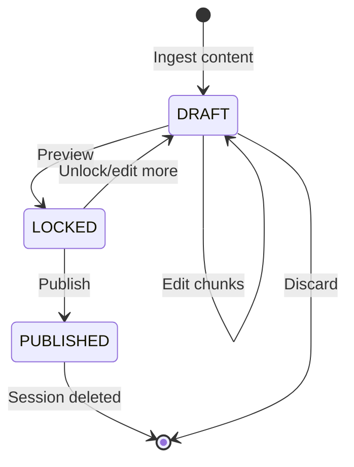

# Draft Sessions

Draft sessions are the core of RAGler's Human-in-the-Loop workflow. A session is a temporary workspace where you can preview, edit, and refine chunks before publishing them to a collection.

## What is a Session?

A **session** is an ephemeral editing sandbox stored in Redis. It contains:
- **Source information** (URL, type, metadata)
- **Chunks** generated by the LLM
- **Session metadata** (user, status, timestamps)

Sessions enable you to:
- Preview how content will be chunked
- Edit chunk content
- Split or merge chunks (Advanced Mode)
- Validate chunks before publishing
- Discard changes without affecting published data

## Session Lifecycle

Sessions follow a defined lifecycle with four states:



### State Definitions

| State | Description | Allowed Actions |
|-------|-------------|-----------------|
| **DRAFT** | Active editing state | View, edit, split, merge, enrich chunks |
| **LOCKED** | Preview state (read-only) | View chunks, validate, publish |
| **PUBLISHED** | Final state (chunks in Qdrant) | No further actions (session deleted) |

## Session States in Detail

### 1. DRAFT State

**When:** Immediately after ingestion

**What you can do:**
- View all chunks
- Edit chunk content
- Split chunks (Advanced Mode)
- Merge chunks (Advanced Mode)
- Use LLM assistant for enrichment
- Delete chunks
- Reorder chunks

**API Operations:**
- `GET /sessions/:id` — View session
- `PATCH /sessions/:id/chunks/:chunkId` — Edit chunk
- `POST /sessions/:id/chunks/:chunkId/split` — Split chunk
- `POST /sessions/:id/chunks/merge` — Merge chunks
- `DELETE /sessions/:id` — Discard session

**Example:**
```bash
# Edit a chunk
curl -X PATCH http://localhost:3000/api/sessions/sess_abc123/chunks/chunk_1 \
  -H "Content-Type: application/json" \
  -d '{
    "content": "Updated chunk text..."
  }'
```

### 2. LOCKED State

**When:** After calling preview endpoint

**Purpose:** Validate chunks before publishing

**What you can do:**
- View final chunk structure
- See validation results
- Review estimated token counts
- Proceed to publish
- Unlock to return to DRAFT state

**What you CANNOT do:**
- Edit chunks (read-only)
- Split or merge chunks
- Add new chunks

**API Operations:**
- `POST /sessions/:id/preview` — Lock and validate
- `GET /sessions/:id` — View locked session
- `POST /sessions/:id/publish` — Publish to collection
- `POST /sessions/:id/unlock` — Return to DRAFT state

**Example:**
```bash
# Preview (lock session)
curl -X POST http://localhost:3000/api/sessions/sess_abc123/preview
```

**Validation:**
The preview endpoint performs:
- ✓ Chunk count validation (not empty)
- ✓ Content validation (no empty chunks)
- ✓ Token count estimation
- ⚠️ Warning checks (very long chunks, etc.)

### 3. PUBLISHED State

**When:** After successful publish

**What happens:**
1. Chunks are embedded (OpenAI generates vectors)
2. Atomic replacement in Qdrant:
   - Delete all chunks with same `source_id`
   - Insert new chunks with fresh embeddings
3. Session is deleted from Redis
4. Chunks are now searchable in the collection

**This is a terminal state** — the session no longer exists.

## Session Storage

### Redis Schema

Sessions are stored in Redis with the following structure:

```json
{
  "sessionId": "sess_abc123def456",
  "sourceId": "md5_hash_of_source",
  "sourceType": "confluence|web|manual",
  "sourceUrl": "https://...",
  "userId": "user@example.com",
  "status": "DRAFT",
  "createdAt": "2026-02-06T10:00:00Z",
  "updatedAt": "2026-02-06T10:05:00Z",
  "chunks": [
    {
      "id": "chunk_1",
      "content": "Chunk text...",
      "order": 0,
      "isDirty": true
    }
  ]
}
```

### Session TTL (Time-To-Live)

**Default:** Sessions expire after **24 hours** of inactivity

**Why TTL?**
- Prevents Redis from filling up with abandoned sessions
- Encourages users to publish or discard work
- Reduces memory usage

**What happens on expiry:**
- Session is automatically deleted from Redis
- Chunks are lost (NOT published to Qdrant)
- You must create a new ingestion session

**Best practices:**
- Publish sessions within 24 hours
- Don't use sessions for long-term storage
- Create new sessions if you need to re-edit published content

## Session Operations

### List All Sessions

Get all active sessions for the current user:

```bash
curl http://localhost:3000/api/sessions \
  -H "X-User-ID: you@example.com"
```

**Response:**
```json
{
  "sessions": [
    {
      "sessionId": "sess_abc123",
      "sourceUrl": "https://example.com/doc",
      "status": "DRAFT",
      "chunksCount": 5,
      "createdAt": "2026-02-06T10:00:00Z"
    }
  ]
}
```

### Get Session Details

Retrieve full session with all chunks:

```bash
curl http://localhost:3000/api/sessions/sess_abc123 \
  -H "X-User-ID: you@example.com"
```

### Edit a Chunk

Update chunk content:

```bash
curl -X PATCH http://localhost:3000/api/sessions/sess_abc123/chunks/chunk_1 \
  -H "Content-Type: application/json" \
  -d '{
    "content": "New chunk content"
  }'
```

### Split a Chunk (Advanced Mode Only)

Split a chunk at a specific character index:

```bash
curl -X POST http://localhost:3000/api/sessions/sess_abc123/chunks/chunk_1/split \
  -H "Content-Type: application/json" \
  -H "X-User-Role: DEV" \
  -d '{
    "splitIndex": 150
  }'
```

**Result:** `chunk_1` becomes two chunks: `chunk_1` and `chunk_1_split`.

### Merge Chunks (Advanced Mode Only)

Merge multiple chunks into one:

```bash
curl -X POST http://localhost:3000/api/sessions/sess_abc123/chunks/merge \
  -H "Content-Type: application/json" \
  -H "X-User-Role: DEV" \
  -d '{
    "chunkIds": ["chunk_1", "chunk_2", "chunk_3"]
  }'
```

**Result:** The specified chunks are merged into a single chunk.

### Preview and Lock

Lock the session and validate before publishing:

```bash
curl -X POST http://localhost:3000/api/sessions/sess_abc123/preview \
  -H "X-User-ID: you@example.com"
```

**Response:**
```json
{
  "sessionId": "sess_abc123",
  "status": "LOCKED",
  "validation": {
    "isValid": true,
    "errors": [],
    "warnings": ["Chunk 3 is longer than recommended (1200 tokens)"]
  },
  "chunksCount": 5,
  "estimatedTokens": 850
}
```

### Publish

Publish validated chunks to a collection:

```bash
curl -X POST http://localhost:3000/api/sessions/sess_abc123/publish \
  -H "Content-Type: application/json" \
  -d '{
    "collectionId": "550e8400-e29b-41d4-a716-446655440000"
  }'
```

**Result:** Chunks are published, session is deleted.

### Discard Session

Delete a session without publishing:

```bash
curl -X DELETE http://localhost:3000/api/sessions/sess_abc123 \
  -H "X-User-ID: you@example.com"
```

## Role-Based Session Access

### Simple Mode (L2 Support)

**Can:**
- View sessions
- Edit chunk content (text only)
- Use LLM assistant scenarios
- Preview sessions
- Publish sessions

**Cannot:**
- Split chunks
- Merge chunks
- Bulk operations

### Advanced Mode (Developers, ML Specialists)

**Can do everything Simple Mode can, plus:**
- Split chunks
- Merge chunks
- Reorder chunks
- Bulk operations
- Access chunk metadata

See [Roles Documentation](/docs/product/roles) for detailed permissions.

## Session Best Practices

### Do:
- ✅ **Review chunks before publishing** — Use preview to catch issues
- ✅ **Publish regularly** — Don't let sessions sit idle
- ✅ **Use meaningful source URLs** — Helps track content origin
- ✅ **Keep sessions focused** — One source = one session
- ✅ **Test with small documents first** — Validate your workflow

### Don't:
- ❌ **Don't rely on sessions for storage** — They expire after 24 hours
- ❌ **Don't edit published content via sessions** — Create a new session to re-ingest and republish
- ❌ **Don't leave sessions unlocked** — Always preview before publishing
- ❌ **Don't skip validation** — Preview catches common errors

## Common Session Scenarios

### Scenario 1: Update Published Content

**Problem:** You published content yesterday, but need to fix a typo.

**Solution:**
1. Re-ingest the source (same URL)
2. System generates new `source_id` (same hash)
3. Edit chunks in the new session
4. Publish → Atomic replacement deletes old chunks, inserts new ones

**Why not edit the old session?**
- Sessions are deleted after publishing
- You must re-ingest to create a new session

### Scenario 2: Session Expired Before Publishing

**Problem:** You ingested content 2 days ago, now the session is gone.

**Solution:**
1. Re-ingest the content
2. Edit chunks again (sorry, no saved state)
3. Publish within 24 hours

**Prevention:**
- Publish sooner
- Save important edits externally if needed

### Scenario 3: Split/Merge Not Working

**Problem:** Split/merge endpoints return 403 Forbidden.

**Solution:**
- Check your role: `X-User-Role: DEV` or `ML`
- L2 Support cannot split/merge chunks
- See [Advanced Mode Workflow](/docs/product/flows/advanced-mode)

## Session Monitoring

### Check Session Status

```bash
# Get session details
curl http://localhost:3000/api/sessions/sess_abc123

# Check status field
{
  "status": "DRAFT" | "LOCKED" | "PUBLISHED"
}
```

### List Active Sessions

```bash
# List all sessions for user
curl http://localhost:3000/api/sessions \
  -H "X-User-ID: you@example.com"
```

### Session Metrics (Coming Soon)

Future versions will include:
- Session age
- Time spent in each state
- Average chunks per session
- Publish success rate

## Related Documentation

- [Ingestion Strategies](/docs/product/ingestion) — How content enters sessions
- [Publishing](/docs/product/publishing) — How sessions become searchable chunks
- [Collections](/docs/product/collections) — Where published chunks live
- [Simple Mode Workflow](/docs/product/flows/simple-mode) — L2 Support process
- [Advanced Mode Workflow](/docs/product/flows/advanced-mode) — Developer/ML process
- [Architecture: Data Model](/docs/architecture/data-model) — Redis schema details
